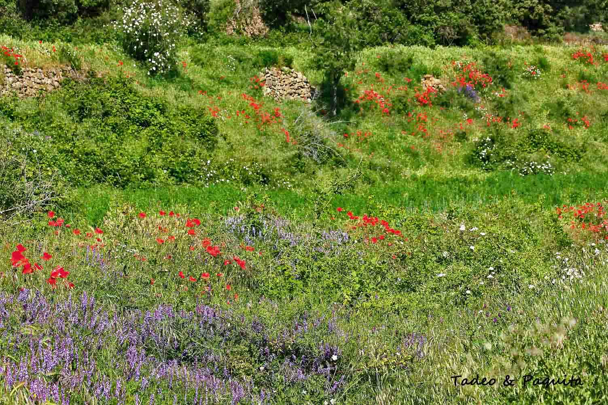

Per molt bell que siga un arbre o un arbust, també ho és la seua flor. La seua funció és la de reproduir-se i formar noves plantes: les pol·linitzen diversos tipus d'insectes i d'ocells, i el vent en dispersa les llavors.

Les diferents flors estan agrupades per ordre alfabètic en el catàleg que segueix, i cadascuna porta el nom de la família a què pertany.

## Les famílies

- **Amaril·lidàcies.** Plantes herbàcies proveïdes d'un bulb.
- **Aristoloquiàcies.** Herbes i plantes llenyoses, sovint enfiladisses.
- **Asfodelàcies.** Plantes de flors carnoses; les seues flors acolorides són pol·linitzades per ocells i insectes.
- **Asparagàcies.** Arbres, arbustos, herbes o plantes arrosetades.
- **Asteràcies.** Anomenades també compostes. Plantes o arbustos amb les fulles disposades en roseta basal, oposades o alternes. Les flors són menudes, i és una de les famílies de plantes més grans i variades: entre elles hi ha plantes comestibles (l'encisam, l'escarola), medicinals (la camamil·la, l'àrnica) i altres que s'usen en jardineria.
- **Boraginàcies.** Plantes majoritàriament herbàcies; solen estar cobertes de pèls rígids i punxants, i tenen cinc membranes que formen plecs cap a l'interior, com si dels dits d'un guant es tractara.
- **Caprifoliàcies.** Generalment són arbustos o arbres menuts, sovint lianes; rarament són herbes.
- **Cariofil·làcies.** Herbàcies, de tiges erectes o penjants; presenten nusos engrossits, amb fulles simples i senceres.
- **Cistàcies.** Herbàcies o arbustos, perennes i també anuals, amb fulles compostes i algunes vegades simples. Les seues flors, en cimes o raïms, són regulars i hermafrodites.
- **Convolvulàcies.** La família de les campànules o glòria del matí, també de les corretjoles. La majoria són plantes enfiladisses.
- **Euforbiàcies.** Una de les famílies més variables, distribuïda per tot el món.
- **Fabàcies.** Reuneix arbres, arbustos i herbes, perennes o anuals.
- **Gencianàcies.** Plantes herbàcies, anuals i perennes, i alguns arbustos, sovint rizomatosos. Fulles oposades en general, sense estípules. Flors bisexuals, regulars, disposades en cimes.
- **Geraniàcies.** Herbàcies o arbustives. Algunes espècies poden ser aromàtiques.
- **Iridàcies.** Majoritàriament plantes herbàcies, normalment amb rizomes i òrgans com bulbs i corms. Flors bisexuals.
- **Liliàcies.** Plantes perennes. Es caracteritzen per una gran heterogeneïtat de formes, a vegades herbàcies i proveïdes de bulbs o rizomes.
- **Plantaginàcies.** Coneguda per les seues espècies ornamentals.
- **Primulàcies.** Plantes perennes que formen una roseta de fulles al final de l'hivern i floreixen quan comença el bon temps, a la primavera.
- **Ranunculàcies.** Plantes herbàcies, de tiges molt ramificades i a vegades volubles.
- **Rosàcies.** Plantes generalment perennes, des d'herbàcies fins a arbòries. Fulles alternes.
- **Umbel·líferes.** Família de plantes dicotiledònies amb les tiges estriades i buides per dins, fulles amb pecíols embeinadors i flors sense sèpals, disposades en umbel·la. La carlota, l'api i el julivert pertanyen a les umbel·líferes.
