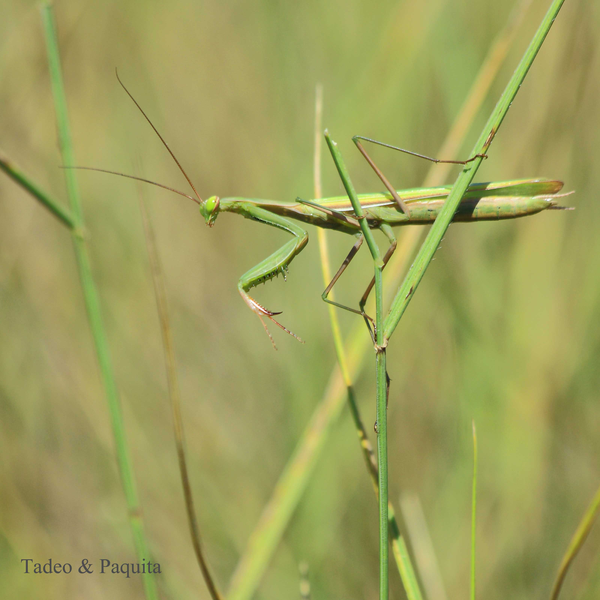
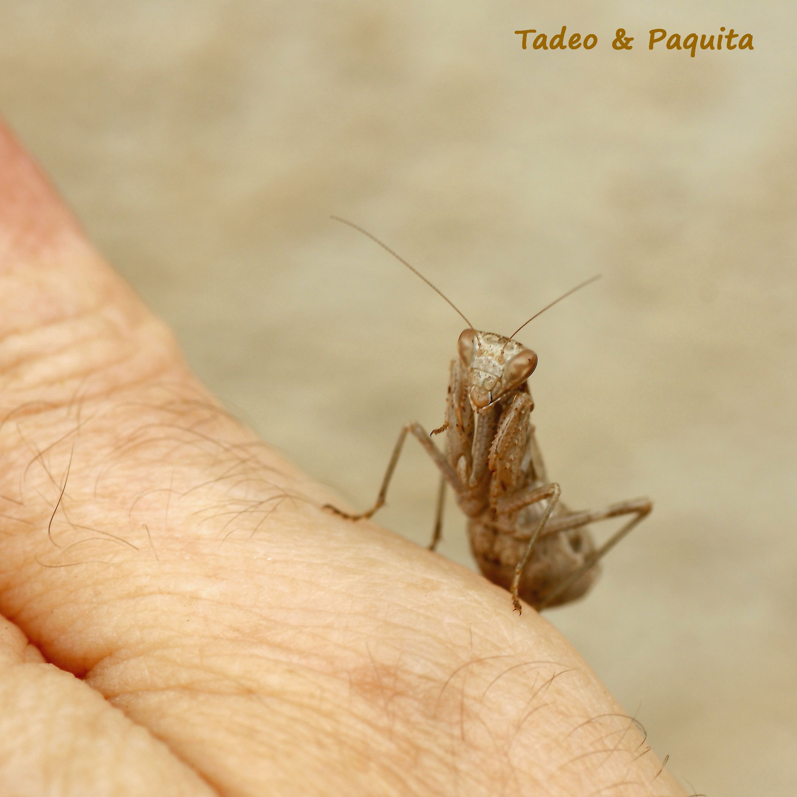
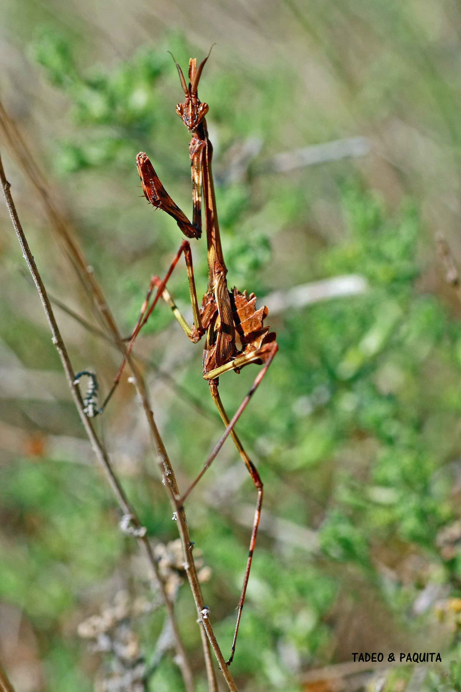
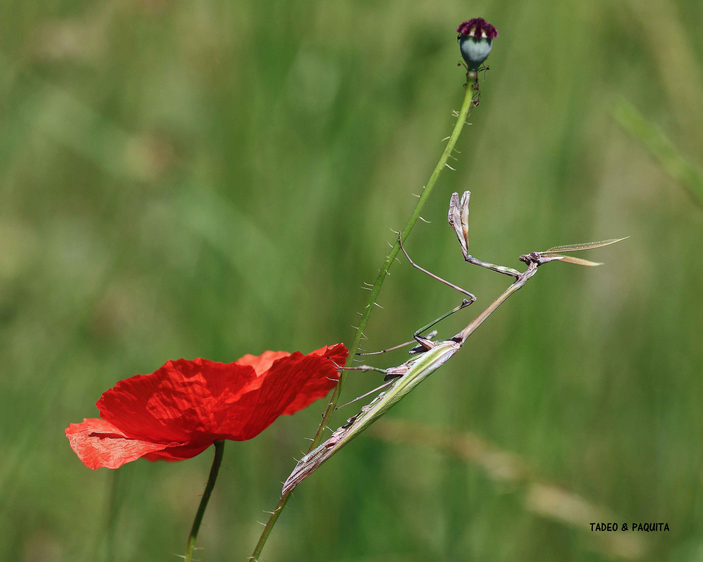

Els mantodeus o pregadéus són insectes que identifiquem a primera vista pel seu aspecte característic. Han evolucionat de manera que confonen els depredadors adaptant-se a les formes del seu medi. Tenen el cap molt mòbil, potes anteriors prensores, adequades per a capturar les preses, i antenes curtes, generalment molt fines. Viuen en zones de matoll sec. L'orde comprén unes 2.000 espècies.

L'*Empusa pennata* o mantis pal és més gran. Porta el nom d'un espectre de la mitologia grega que, amb el seu aspecte de jove bella, encobria els seus instints sanguinaris.

