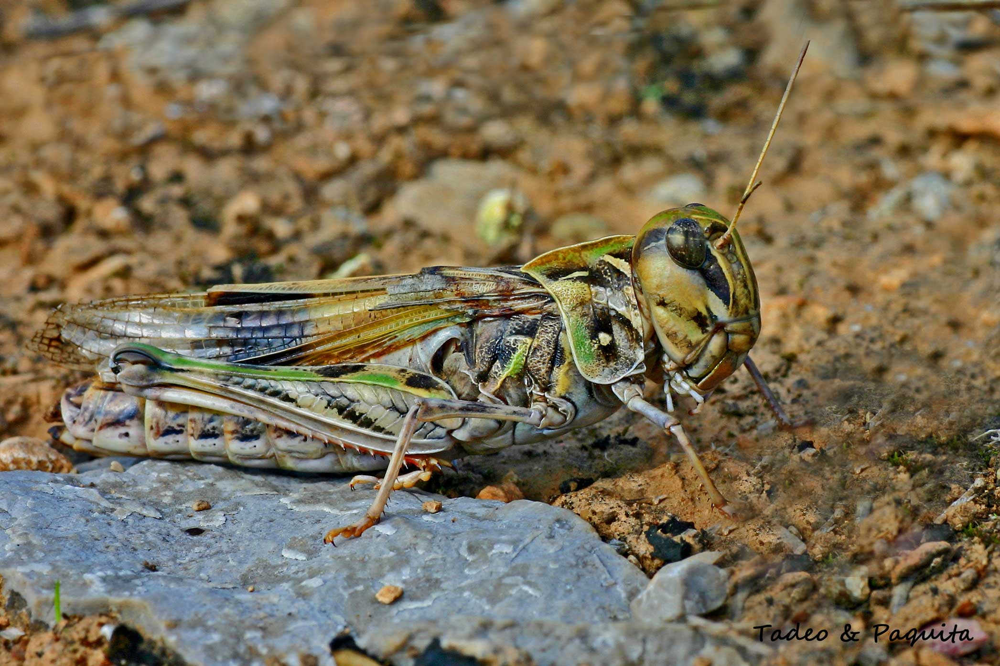
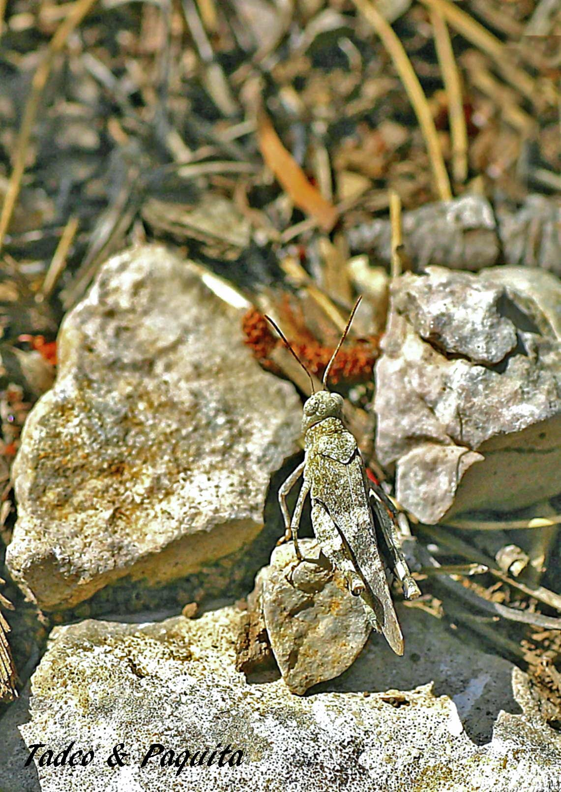
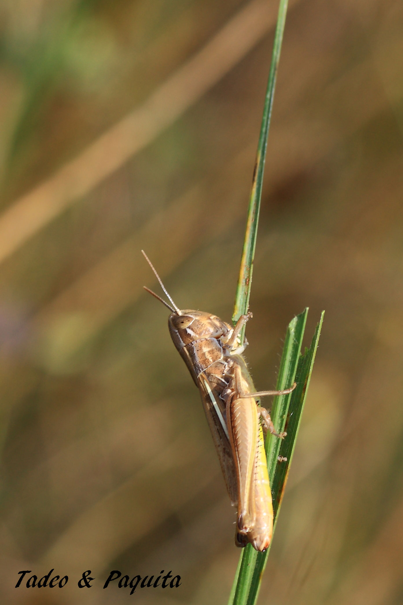
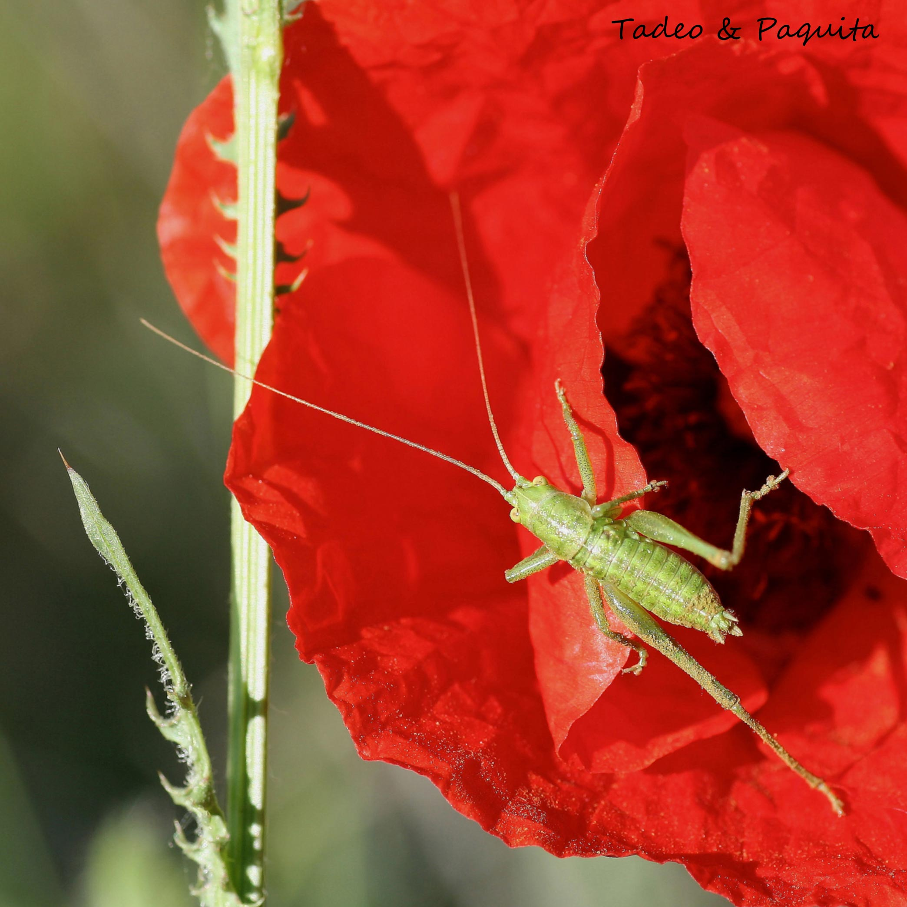
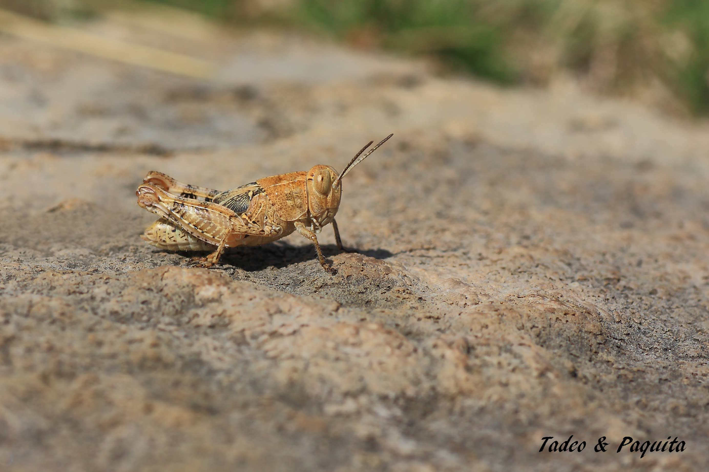
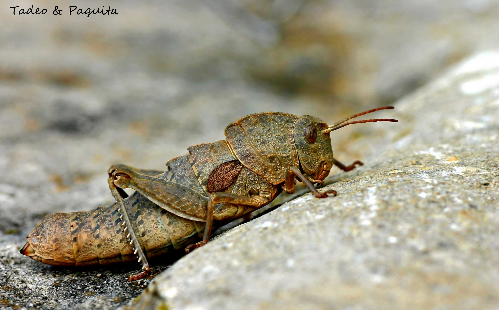
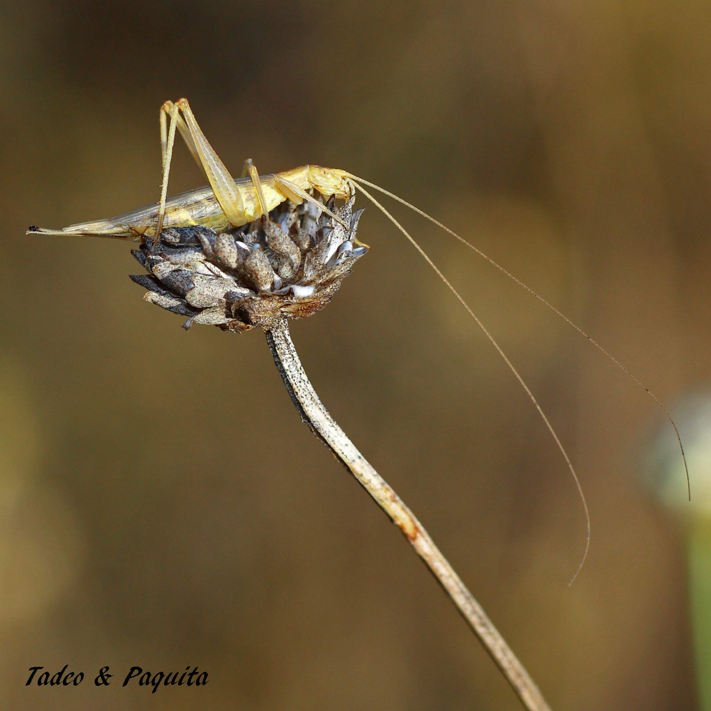
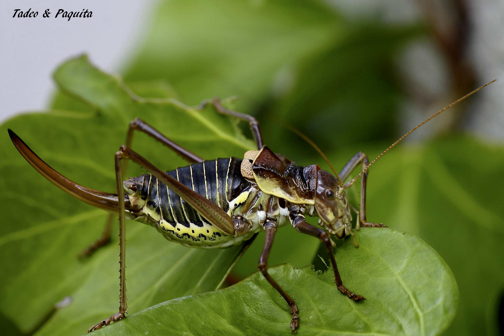

En aquest orde s'agrupen les llagostes, els grills, els llagosts i el grill talp o cadell; aquest últim és un insecte subterrani que s'alimenta d'arrels i colls de plantes.

La major part tenen costums vegetarians, encara que també hi ha espècies omnívores. Es troben en la majoria dels hàbitats terrestres. Són insectes amb metamorfosi incompleta: passen per tres fases, ou, nimfa i adult.

## Llagostes

Llagostes i grills s'assemblen molt, encara que els grills tenen el cos més rabassut. Són insectes amb gran capacitat de salt: cobreixen distàncies molt més grans que la longitud del seu cos. De grandària mitjana a gran, tenen el cap gros, ulls compostos i aparell bucal mastegador; generalment tenen dos parells d'ales, anteriors i posteriors. Presenten òrgans auditius situats a l'abdomen. El so mai s'origina a la boca: l'aconsegueixen amb estriduladors. L'estridulació és la producció de so, el grinyol que s'origina en fregar les potes contra les ales. Solen ser d'activitat diürna, i les seues antenes són curtes.

Aquests insectes poden ser solitaris o ajuntar-se en grups més o menys grans. En els casos més extrems són gregaris, com els llagosts —nom que reben diverses espècies de llagostes—, i constitueixen a vegades una plaga per als cultius.

Necessiten unes hores de sol al matí per a estar actius. Són insectes inofensius per a l'ésser humà, a diferència del centpeus, certes aranyes o les vespes.

## Grills

La major part de les espècies de grills tenen activitat crepuscular i nocturna, i antenes llargues que a vegades superen la longitud del cos. El seu aparell auditiu es troba a les potes, a diferència de les llagostes. El so que produeix el grill l'aconsegueix fregant les ales anteriors; l'impertinent «cri, cri» és part fonamental de la reproducció, entre altres coses per a atraure la femella.

## El grill de matoll

*Steropleurus perezi*. Algunes espècies de grill de matoll són herbívores, mentre que altres són depredadores i s'alimenten d'altres insectes. Són molt territorials.

