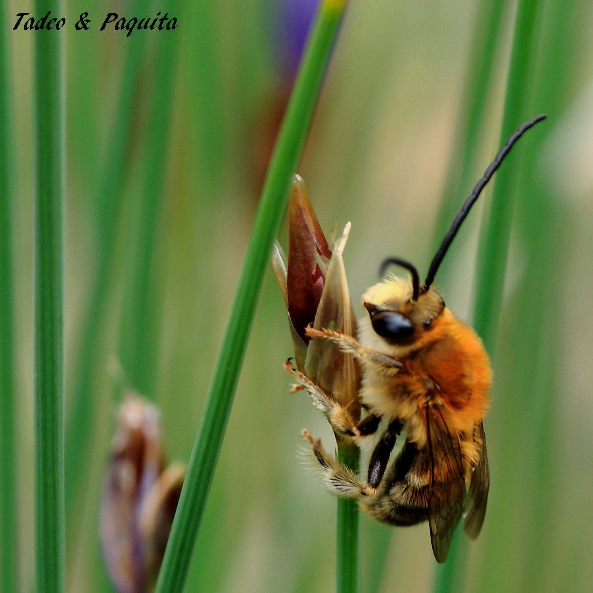
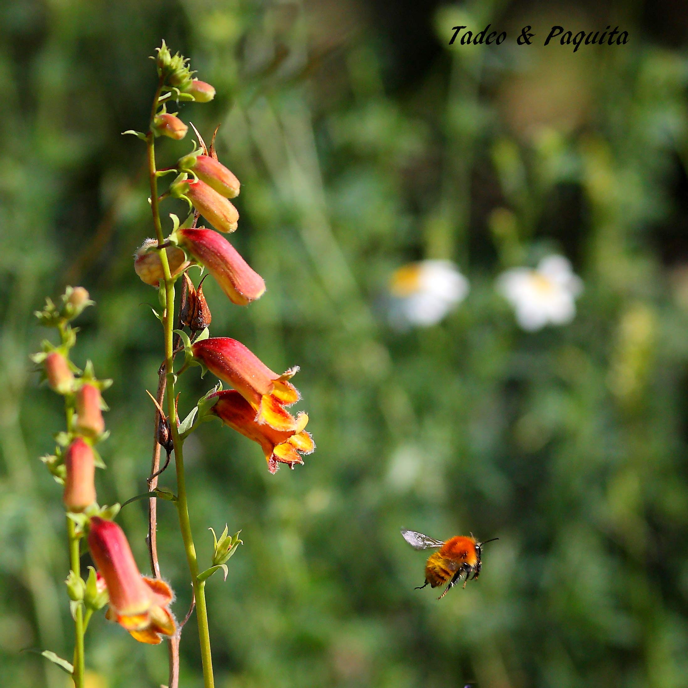
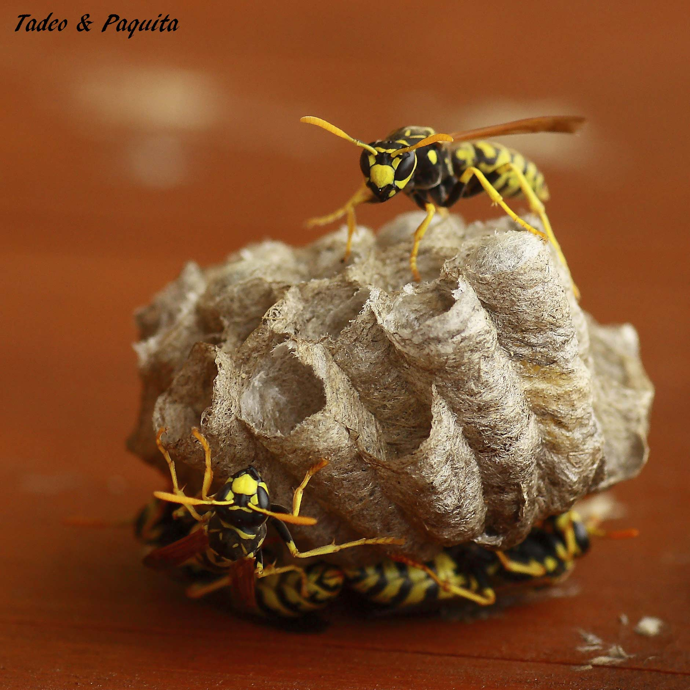
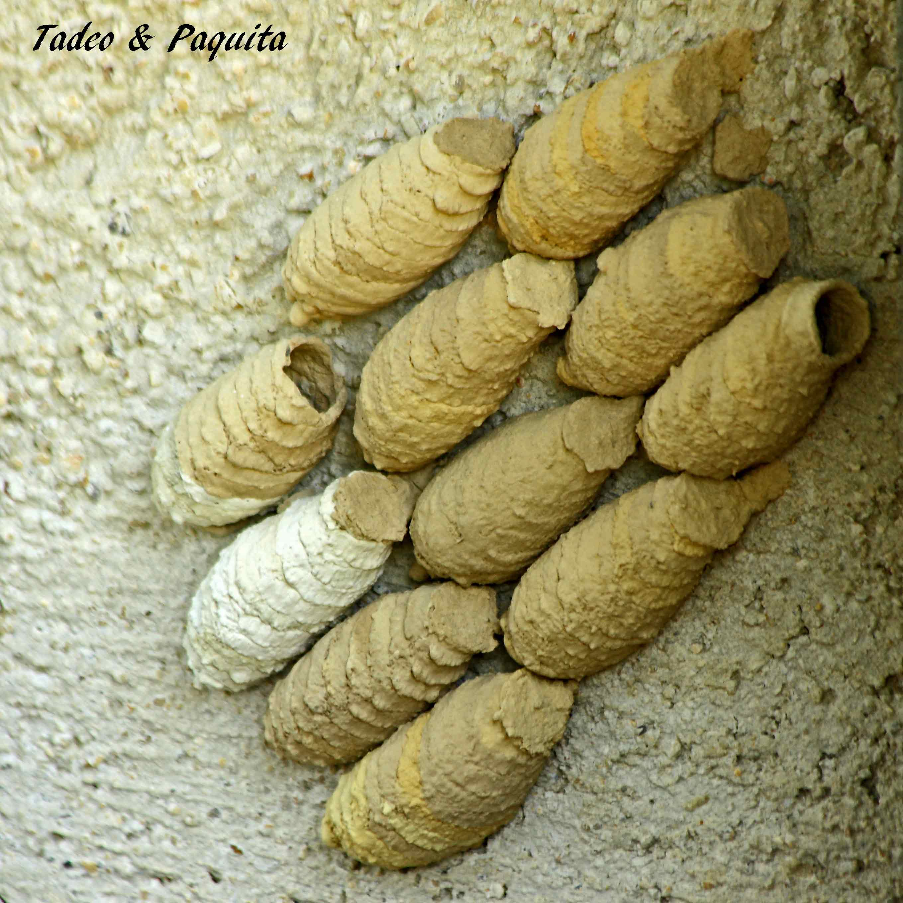
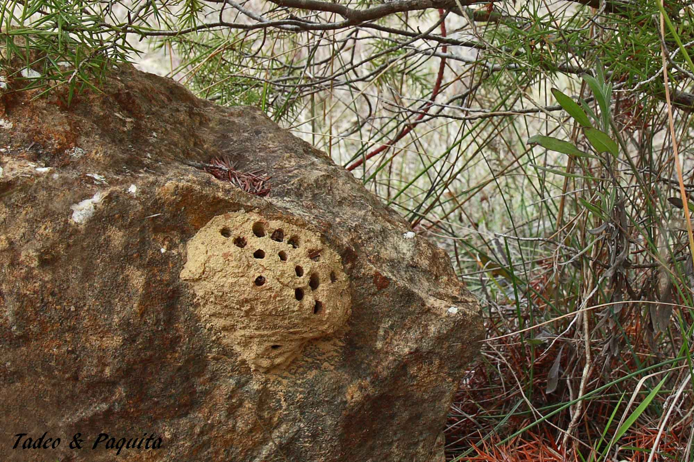
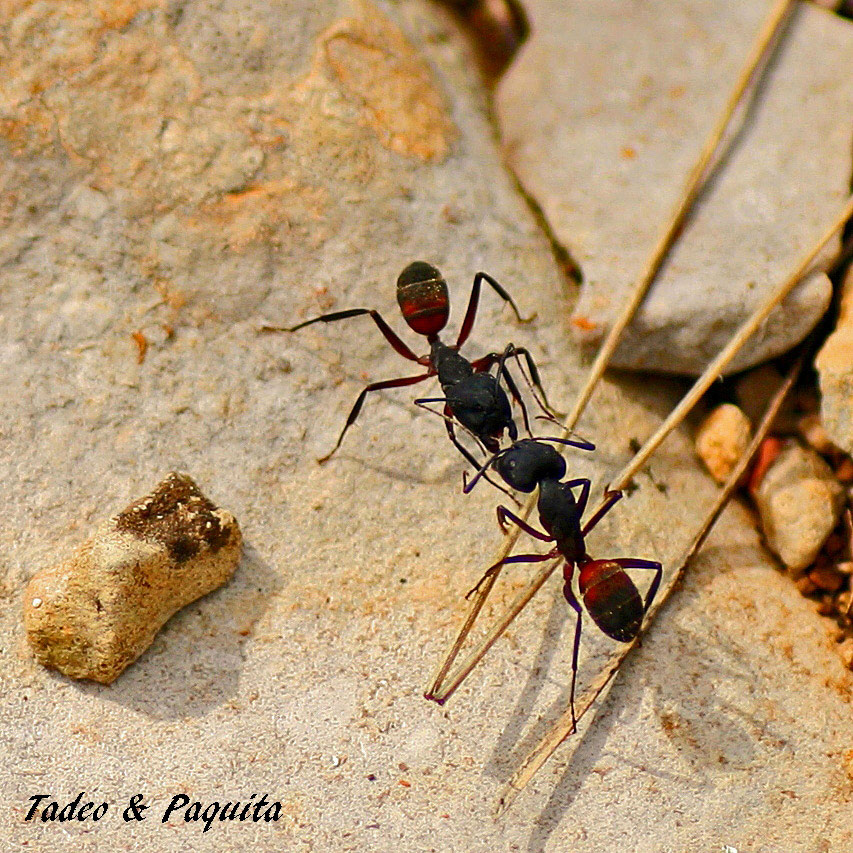

Las abejas, las avispas y las hormigas, llamadas himenópteros, son insectos sociales y un admirable ejemplo de organización. La mayoría de las especies de este orden son muy útiles para el hombre, ya sea como polinizadoras o como controladoras biológicas de plagas.

## Abejas

La abeja de la miel (*abella*) forma sociedades numerosas y duraderas. La sociedad está formada por la reina y sus hijas, que realizan todo el trabajo: hacen la colmena con cera, y en sus celdas la reina va depositando los huevos. La fecundación de la reina tiene lugar una sola vez, y conserva la fertilidad toda su vida. Llega a poner hasta 2.000 huevos diarios a lo largo de una vida que dura de tres a cinco años. Las obreras son las que deciden si de un huevo saldrá un macho o zángano, o bien una obrera. Algunos individuos son vigilantes y protegen la colonia.

Cuando la colonia se encuentra superpoblada, una reina y algunas obreras forman un enjambre. Mientras las abejas exploradoras buscan un lugar donde establecer la nueva colonia, el enjambre descansa.

## Abejorros

.")

Al grupo de las abejas pertenecen los abejorros (*Bombus*). También alimentan a sus larvas con polen y miel, pero es una sociedad en la que la reina dominante no duda en utilizar la agresión física.

## Avispas

*Vespes*. Las sociedades de las avispas están formadas por la madre y su descendencia, todas hijas. Los machos aparecen cuando la sociedad está madura, y solo tienen la función de fecundar a las hembras, tras lo cual mueren. Son alimentados por las obreras.

Las sociedades de las avispas son temporales y se deshacen en otoño; antes, machos y hembras realizan el vuelo nupcial para la fecundación. Los machos mueren y las reinas pasan el invierno en letargo, hasta que en primavera inician un nuevo nido.

Las avispas alfareras son una subfamilia de las avispas comunes; son solitarias y depredadoras, y se alimentan atacando a las arañas que tejen telarañas y a las orugas. Se llaman así porque construyen su nido con barro, en forma de vasija o de tubos de órgano, y lo adhieren a tallos o muros. Se producen dos o tres generaciones al año.

## Hormigas

*Formigues*. Las hormigas son especies sociales. El tamaño y la forma varían de una especie a otra. Una de sus características son las antenas articuladas y la protuberancia que poseen en el delgado pedículo que conecta el tórax con el abdomen. Su sociedad también está formada por la reina madre —aquí puede haber varias reinas— y sus hijas, que forman nidos muy numerosos. Son animales terrestres: hacen sus nidos en el suelo y también en los troncos de los árboles. A diferencia de los otros himenópteros, las obreras carecen de alas.

## Hormigas león

.")

Las llamadas hormigas león pertenecen al orden de los neurópteros —que significa «alas con nervios»— y deben su nombre a que sus presas son mayoritariamente hormigas. Las larvas tienen un aspecto feroz, y también lo es su forma de atrapar a las víctimas: viven enterradas en la arena, en el fondo de un embudo, y los pequeños insectos que caen en él no pueden escapar y son atrapados por sus mandíbulas.

Las adultas se asemejan a las libélulas, pero no tienen su capacidad de vuelo, y se distinguen por sus largas y robustas antenas.
