Los árboles son los seres vivos que alcanzan la edad más avanzada. Pueden ser árboles, arbustos y plantas trepadoras.

## El arce

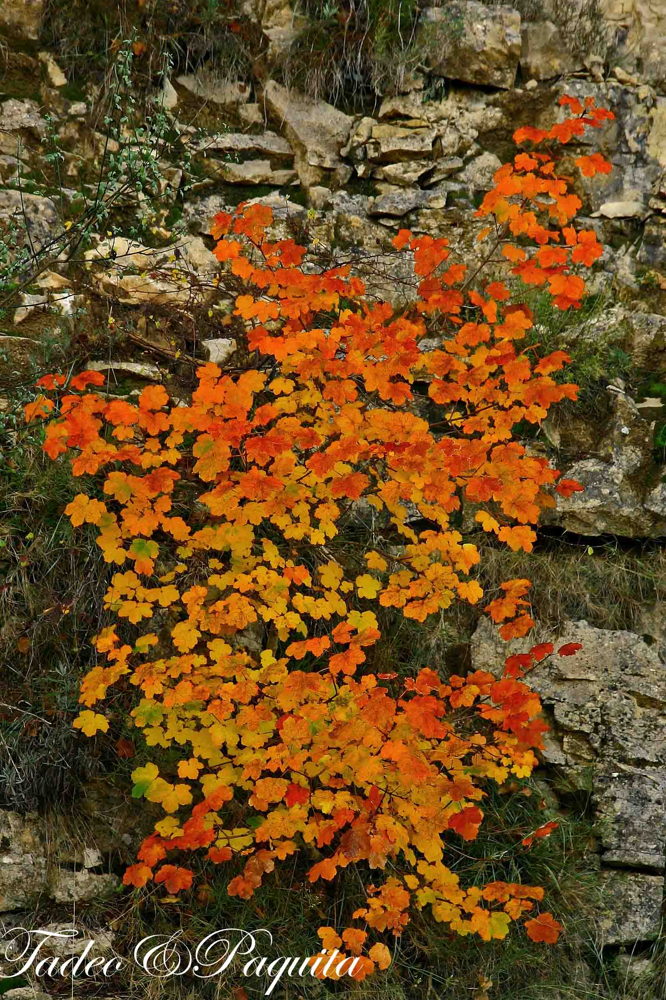

El arce vive disperso entre hayas y robles. Su madera es dura, salpicada de manchas; tiene las hojas sencillas, lobuladas y angulosas. No se ven muchos por esta zona, salvo cerca de los márgenes de la Rambla Celumbres, entre las rocas. Cuando llega el otoño, su color dorado, en distintas tonalidades de ocre, lo hace inconfundible.

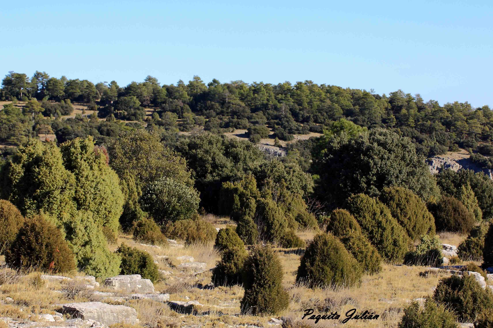

Aquí se aprecian, en poco espacio, los árboles más comunes de la zona: sabinas enanas, a su lado el enebro, carrascas y, al fondo, los pinos.

## Pino albar

Por las dos márgenes de la Rambla Celumbres, y a poca distancia unos de otros, se ven pinos laricios y pinos albares. Estos últimos están en la falda de la Roca Parda y la Roca Roja. Se puede caminar muy bien por el bosque, sin arbustos, con los pinos alineados y rectos; en otoño se pueden encontrar hongos y setas. Su corteza es grisácea y, en la parte superior, de color marrón anaranjado.

## Pino laricio

El pino laricio tiene la corteza blanquecina, la madera más densa y resistente, y más cantidad de resina. El ejemplar de la foto tiene cinco troncos unidos en la base —mirando fotografías he encontrado tres generaciones de mi familia posando al lado de este árbol, y desde la infancia siempre me ha parecido que está igual—. Por la misma rambla hay ejemplares de dos o tres troncos, también unidos en la base; posiblemente el biotopo de la zona sea el motivo.

.")
.")

## Encina y carrasca

Es un árbol corpulento, de crecimiento lento. Sus hojas son perennes, espinosas, aunque también pueden ser dentadas o de margen liso. Las flores son de dos tipos, masculinas y femeninas, y ambas están en el mismo árbol: las masculinas producen el polen y las femeninas, una vez polinizadas, se transforman en la bellota. La madera de la encina es dura y nudosa, difícil de trabajar; antiguamente se utilizaba para obtener carbón. La carrasca tiene las hojas ovadas, más anchas que la encina, y las bellotas generalmente dulces.

.")

La bellota es el fruto de la encina, la carrasca y el roble. Está protegida por una caperuza o cúpula leñosa. Machacando el fruto se obtiene una harina con la que algunos pueblos se alimentaban.

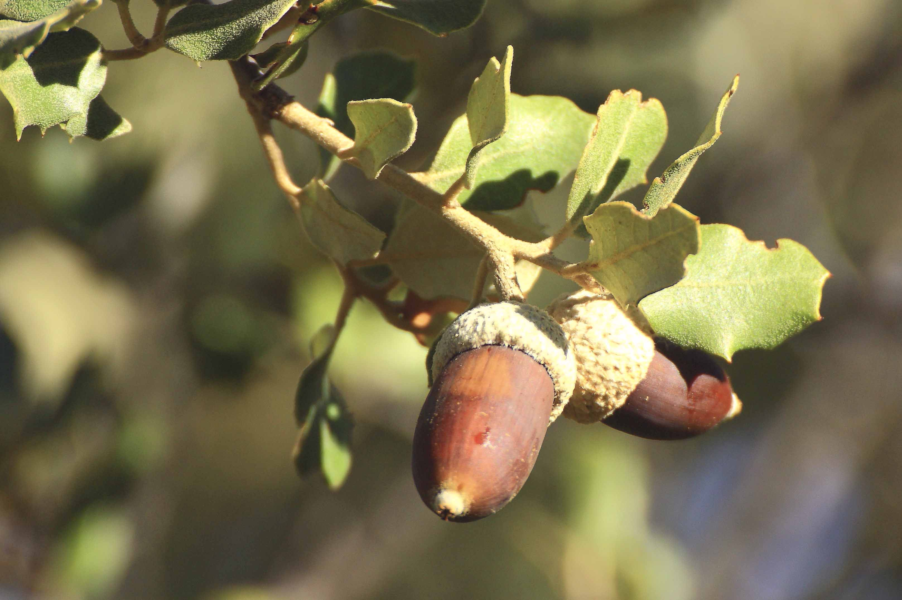
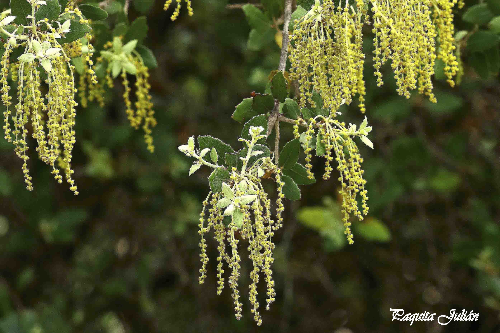

## Roble

Sus hojas caducas son pequeñas y coriáceas, cubiertas de densos pelos estrellados por la parte inferior y con pequeños dientes regulares y agudos en el margen. Se caracteriza por sus flores masculinas en amentos largos y péndulos, y por sus flores femeninas solitarias. Su fruto es una bellota parecida a la de la encina, pero con el cabillo que la une a la rama mucho más largo.

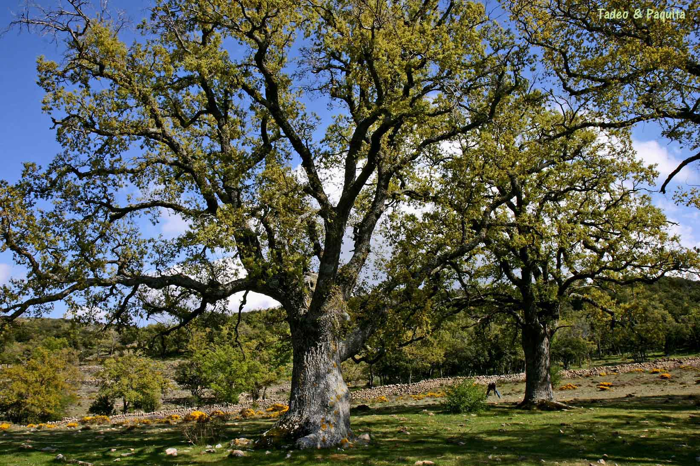

El roble tiene mecanismos de defensa contra los parásitos. Las agallas o abogallas son crecimientos del tejido de tipo tumoral que produce la planta ante un parásito, aislándolo así del resto de la planta. Las agallas, además, suministran alimento y refugio a los parásitos, generalmente larvas de insectos, a los que permiten vivir durante los periodos de caída de las hojas, en otoño e invierno.

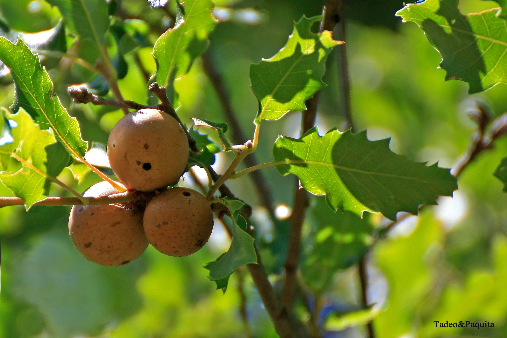

## Quejigo

Es un arbusto, aunque en condiciones óptimas puede alcanzar bastante altura. Su corteza es muy rugosa y de color pardo. Crecen muy juntos, formando una maraña vegetal a veces difícil de cruzar. Es semiperennifolio, con hojas marcescentes: las antiguas se mantienen en las ramas hasta la aparición de las nuevas en primavera. Las hojas tienen forma elíptica, con el borde dentado, y son siempre brillantes por el haz y grisáceas por el envés. Las bellotas maduran en septiembre y se disponen en grupos.

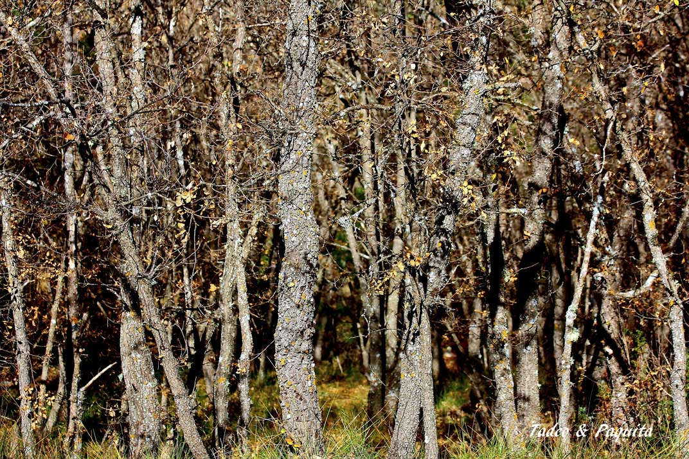

## Avellano

*Avellaner*. Es un arbusto en el que las flores nacen antes que las hojas. En el mismo árbol, separadas, están las flores masculinas y las femeninas. Su hoja es caduca, alterna, simple, no lobulada y dentada. Su fruto forma parte de los «cuatro mendicantes», junto con los higos, las almendras y las uvas pasas; se llaman así porque las cuatro órdenes mendicantes —franciscanos, agustinos, dominicos y carmelitas— solo aceptaban en ofrenda estos frutos.

El fruto es un tipo de almendra que se consume fresca o tostada, y se emplea para la elaboración de pastas y turrones.

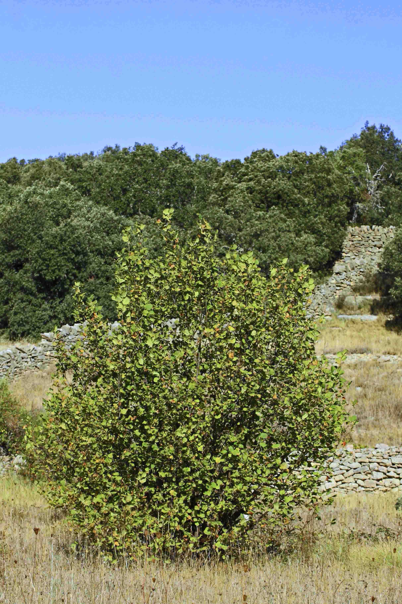
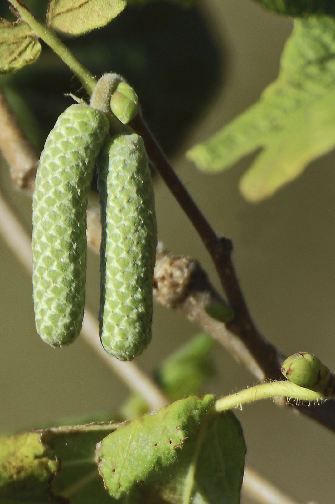

## Olmo

*Om*. Es un árbol de hoja caduca, con hojas relativamente pequeñas y recias, de color verde oscuro. Las flores son rojizas y están reunidas en pequeños grupos. Los frutos están constituidos por una semilla rodeada de un ala delgada y membranosa de color verde claro. El olmo depende del viento para la polinización y para la dispersión de los frutos. Crece en los márgenes de las ramblas y los ríos, donde normalmente hace brisa, y sus hojas se mueven con un susurro inconfundible.

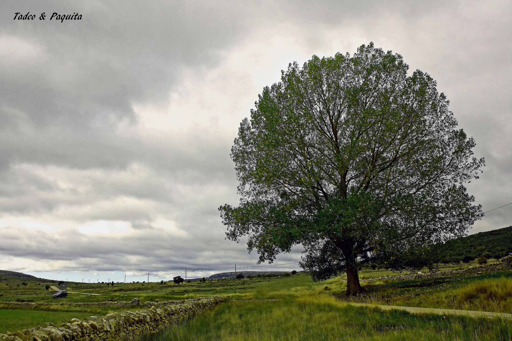

## Serbal

*Serves*. El serbal tiene hojas dentadas, de elegante contorno, y vive sobre todo en los robledales de la montaña media. Es un árbol muy común en las masías. Sus frutos, las serbas, son redondeados, harinosos y muy ásperos, pero comestibles si se dejan sobremadurar extendidos sobre cañizos. Es un fruto astringente.

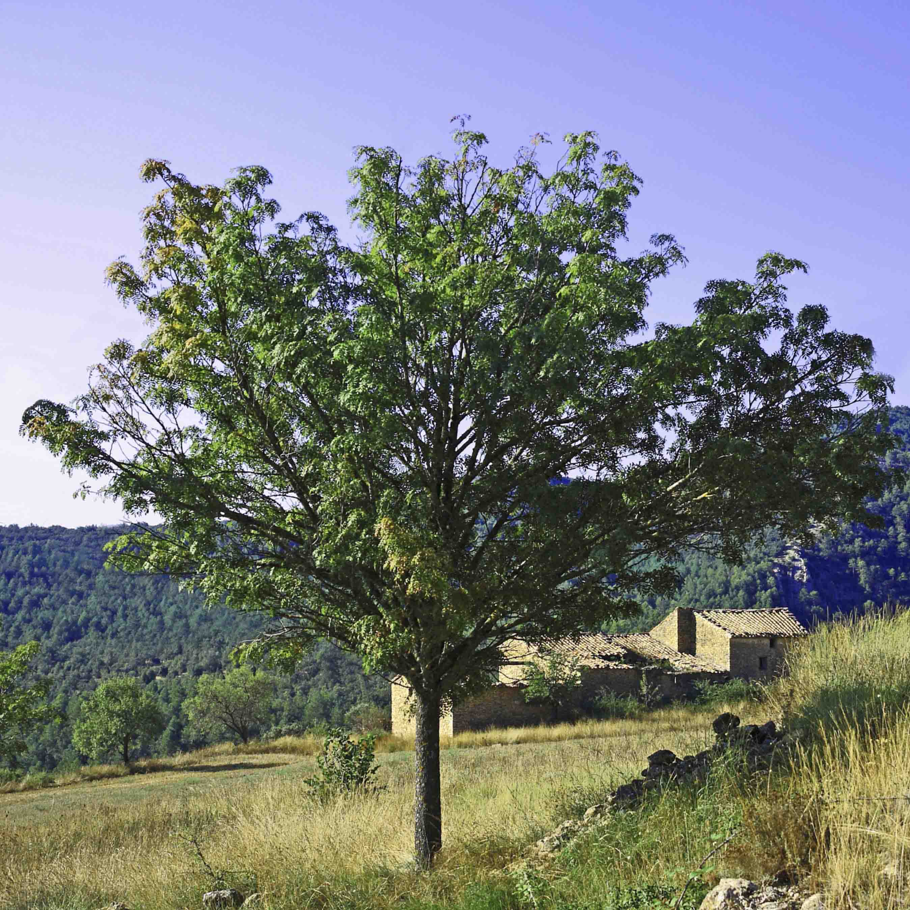
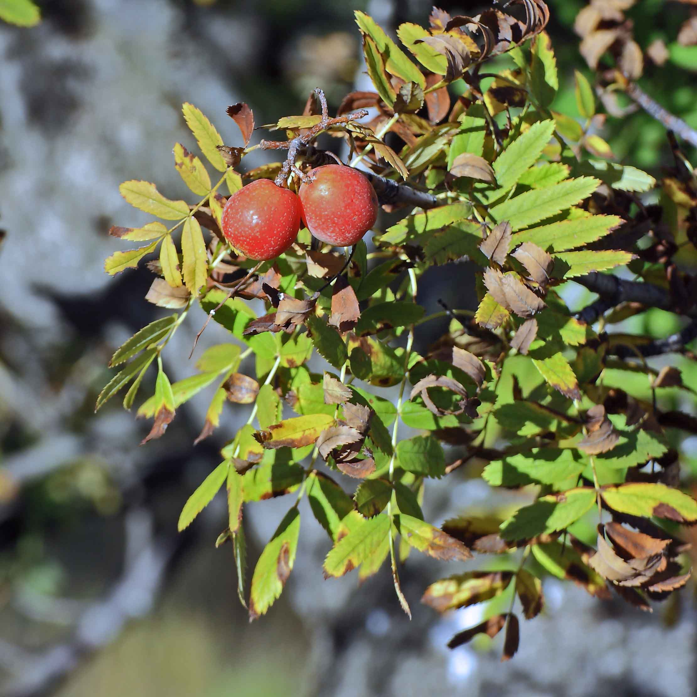
