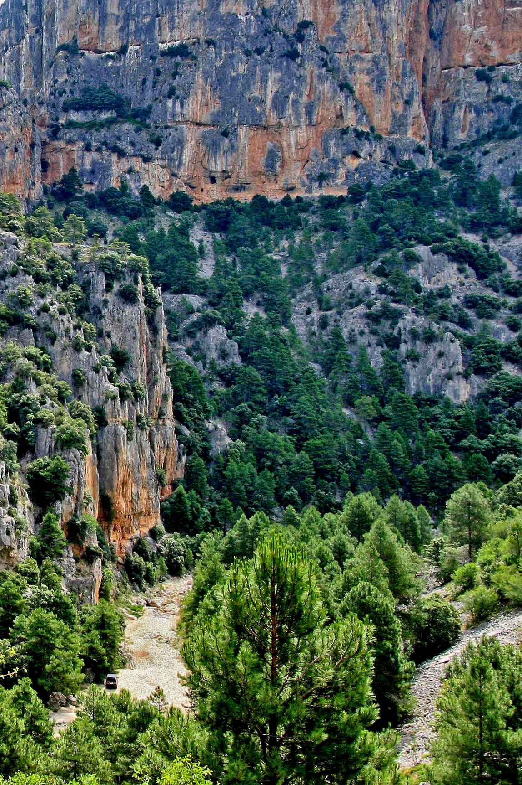
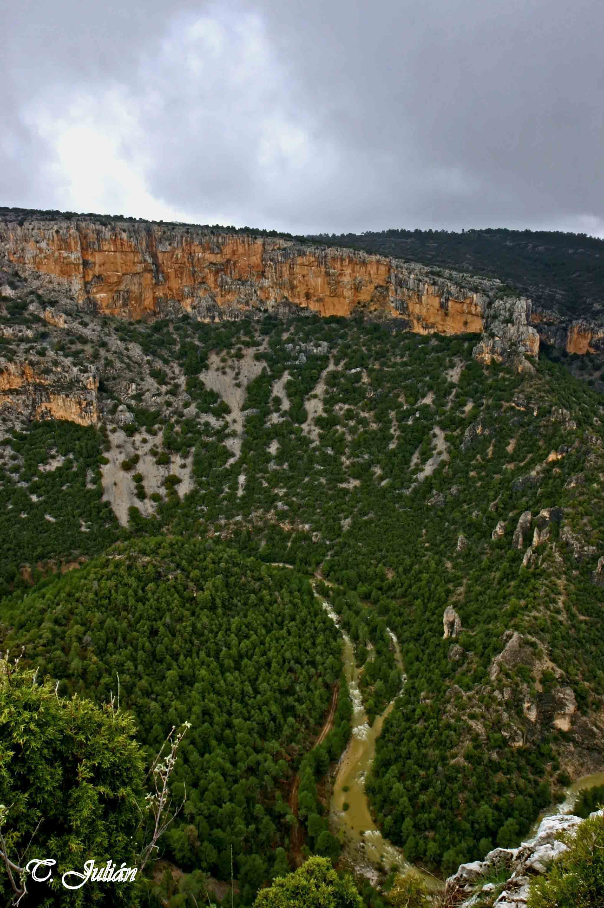
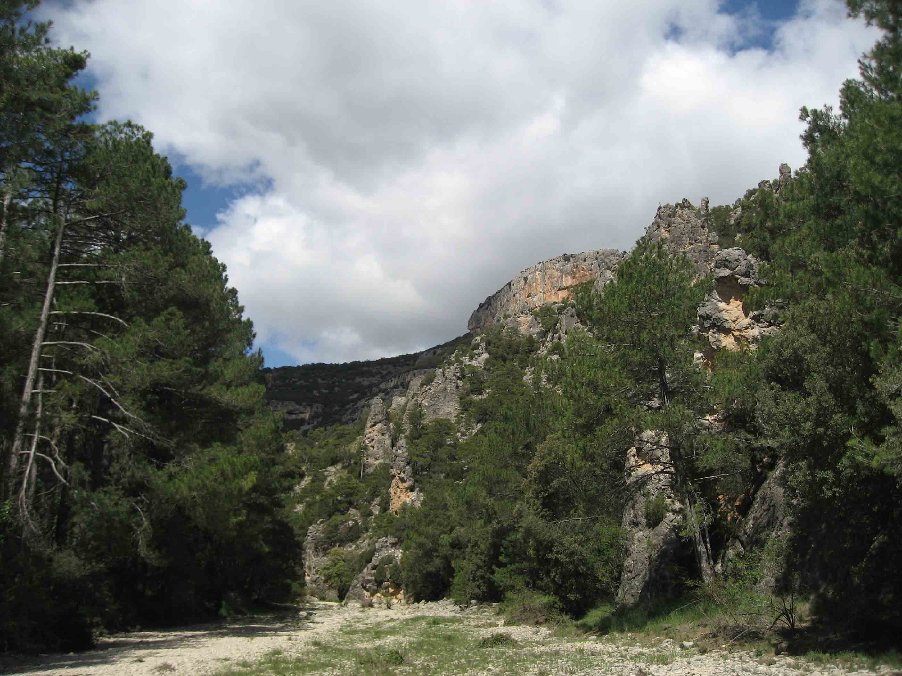
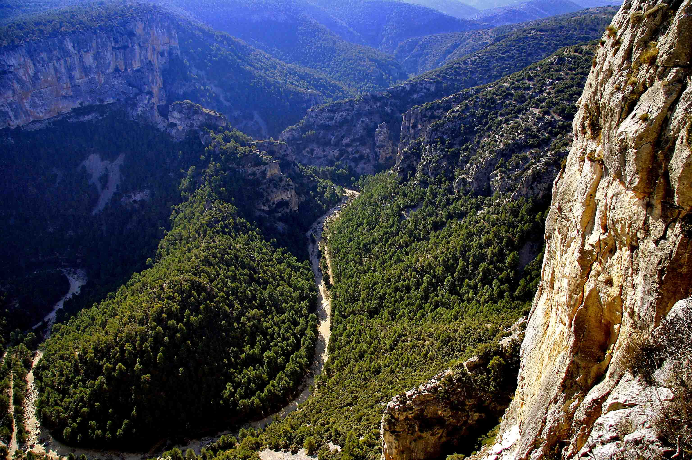

El Paraje Natural Municipal Rambla Celumbres se encuentra en la comarca dels Ports (Castellón). Lo componen parte de los términos municipales de Castellfort, Portell de Morella y Cinctorres, y es uno de los más extensos de los parajes naturales municipales de la Comunidad Valenciana, con un total de 1.194,40 hectáreas.

Se calcula que hay unas 10.000 especies distintas de plantas, de las que 6.500 son autóctonas y 1.500 endémicas. También abunda la fauna: animales invertebrados, vertebrados y microorganismos.

Para apreciar lo abruptas que son la Roca Parda y la Roca Roja, nada mejor que acercarse a ellas por la Rambla Celumbres. Esta rambla pocas veces lleva agua, pero cuando llueve el paisaje es distinto del que estamos acostumbrados a ver: los grises y ocres de las rocas brillan, el verde de los árboles es luminoso; nada que ver con cuando todo está seco y requemado por la sequía y el sol.

En la Rambla Celumbres se encuentran los materiales más antiguos de la zona, del Jurásico y del Terciario. Su formación es rocosa, de dolomías calcáreas: en ellas penetraron fluidos ricos en magnesio que las transformaron químicamente, perdiendo el carbonato de calcio y ganando magnesio. La erosión de sus materiales visibles y la sedimentación son las gravas, la arena y la arcilla que arrastran sus aguas.

La parte derecha, la Roca Roja, pertenece al término municipal de Portell, y la Roca Parda, a la izquierda, al de Cinctorres.

