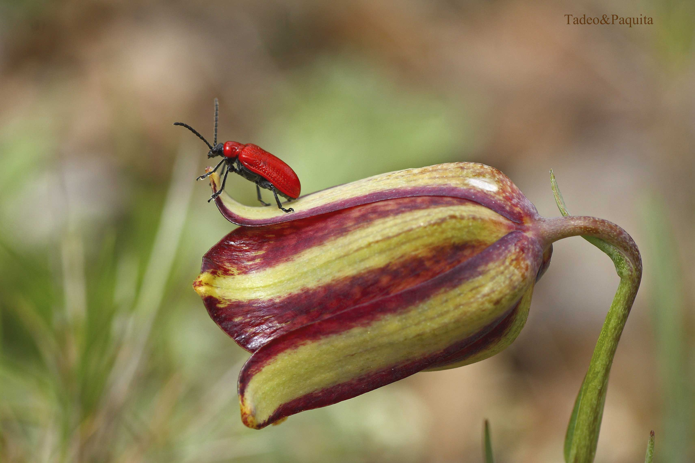
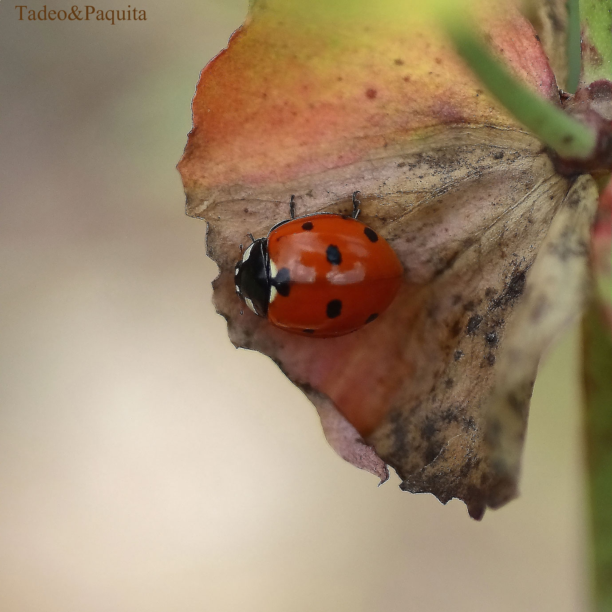
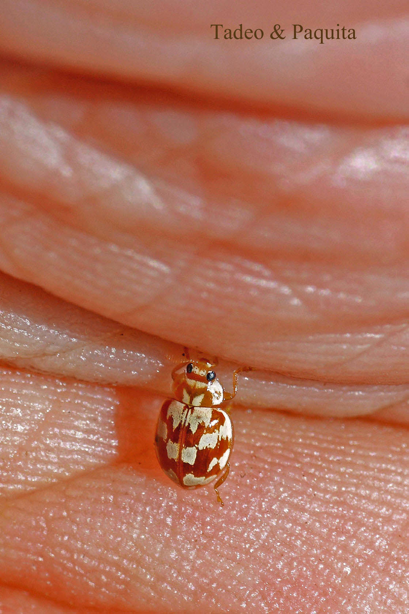
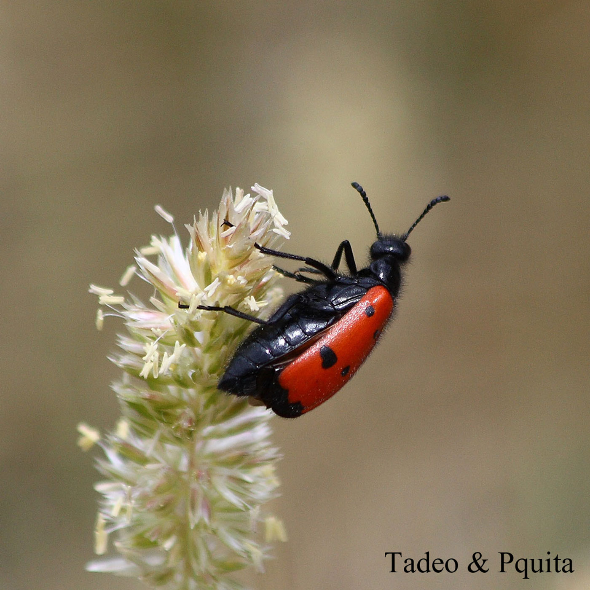
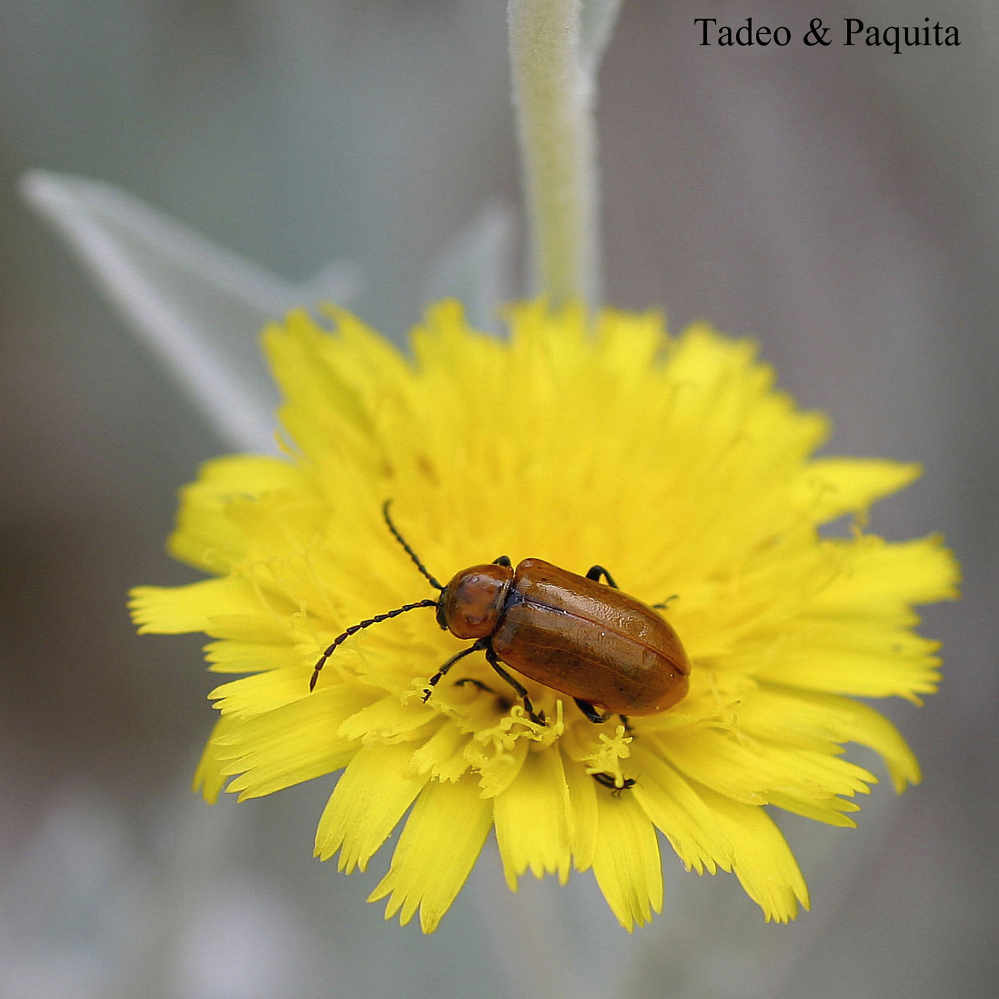
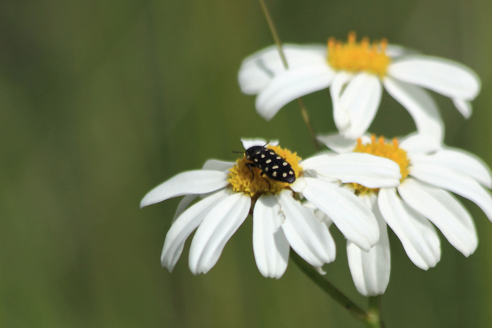

Entre los insectos, las mariquitas o coccinélidos gozan de la estima del hombre en todos los países: se alimentan de insectos tan perjudiciales como los pulgones y, en general, son muy beneficiosas para la agricultura. Las múltiples denominaciones populares de estos insectos demuestran su notoriedad.

Su nombre se remonta a la Edad Media, época en la que se les puso bajo la advocación de la Virgen María: se las llamó «escarabajos de Nuestra Señora»; en Italia se conocen como «gallinitas de Nuestra Señora», en Alemania como «ovejitas de Dios», en Inglaterra como «avecillas de la Virgen» y en España como mariquitas. Todos los ejemplares adultos se aletargan durante el invierno: se pueden encontrar enterrados bajo matorrales secos o entre las grietas de las encinas, amontonados unos encima de otros en gran número en sus refugios invernales.

## Myrrha octodecimguttata

Escarabajo de la familia de los coccinélidos, como las mariquitas. En esta zona de la comarca dels Ports es muy raro de ver; de hecho, ha sido la primera vez que lo he visto y fotografiado.

## Lachnaia tristigma

Conocido vulgarmente como escarabajo de seis puntos. Pertenece a la familia Chrysomelidae; no es como las mariquitas, aunque por los colores lo parezca.

## Exosoma lusitanicum

El último día que salimos al campo, en muchas flores amarillas había un ejemplar libando, en las que resaltaba mucho su color cobrizo.

## Acmaeodera degener

Llamado también escarabajo de catorce puntos, es muy vistoso y poco apreciado, pues se alimenta de la madera del roble y de la encina. Resalta mucho cuando está entre flores de diversos colores.

