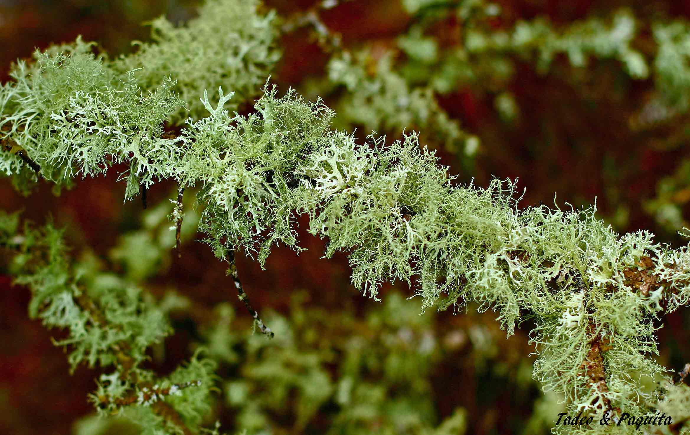

Los líquenes se agrupan dentro de las plantas inferiores, y están compuestos por organismos muy enigmáticos: la unión de un alga y un hongo forma un liquen. Estos dos organismos no pueden vivir por separado. El alga de la que se compone el liquen absorbe la energía de la luz solar gracias a su clorofila, mientras que el hongo absorbe de los sustratos el agua con lo que lleva disuelto.

El liquen crece como si fuera un solo individuo, y así se le atribuye una sola denominación específica. El hongo es el que domina y forma casi todo el cuerpo del liquen, dándole al crecer su forma y su color. El alga se instala bajo la superficie del liquen; así es como recibe la luz que necesita para realizar la fotosíntesis, y el hongo le proporciona la humedad necesaria.

Una característica de los líquenes es su sensibilidad atmosférica. Cada especie tolera unos límites muy estrechos de sustancias contaminantes, por lo que su ausencia o su presencia permiten conocer la carga atmosférica de productos contaminantes.

## Líquenes crustáceos

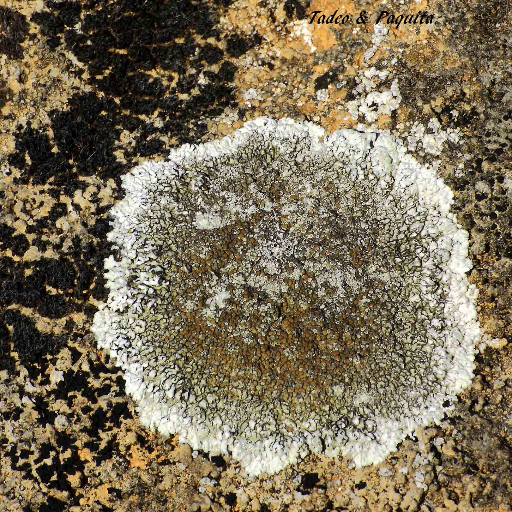
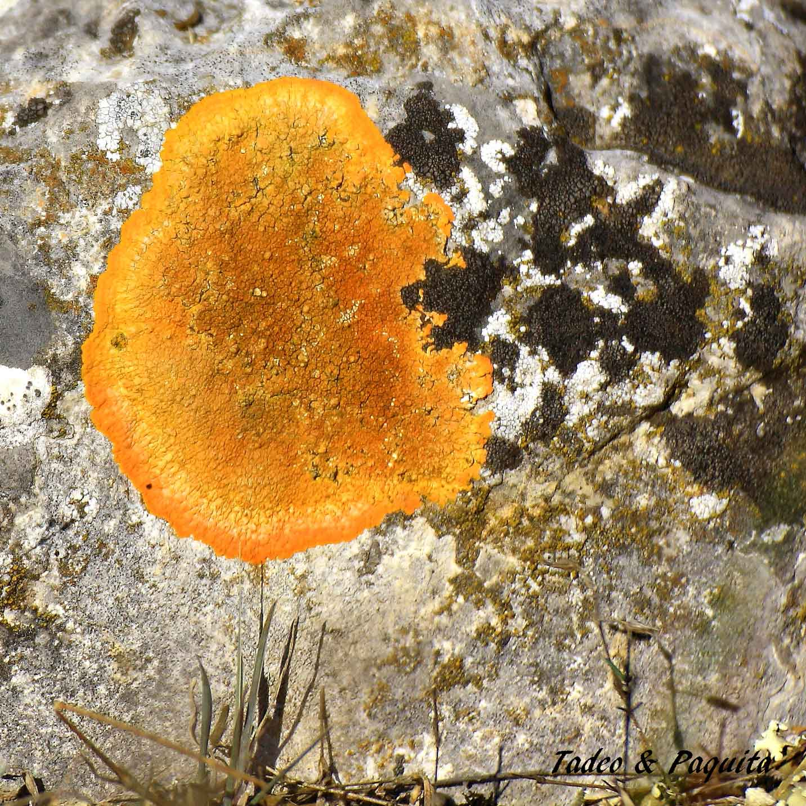

Son los más abundantes. Viven fuertemente sujetos al sustrato (rocas), y también sobre superficies leñosas y maderas muertas. Los tipos de líquenes son variables: cada especie de liquen se corresponde con un hongo distinto.

## Líquenes fruticulosos

Se unen al sustrato por un único punto, y en ocasiones se extienden mucho. Tienen distintas formas, casi siempre alargadas, con ramas y hojas diferentes y de variado color.

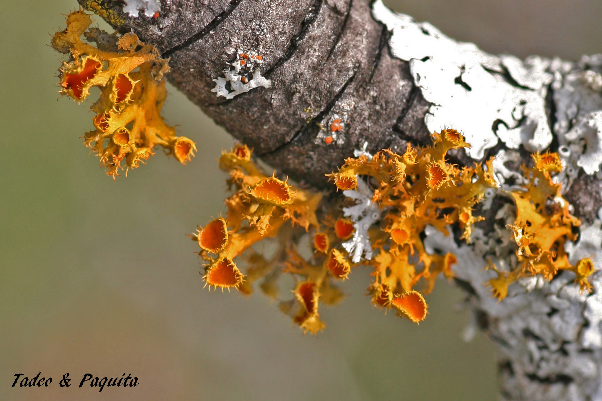

*Teloschistes chrysophthalmus*: su color anaranjado resalta sobre las ramas de roble o de encina donde se encuentra. Es uno de los más bonitos.

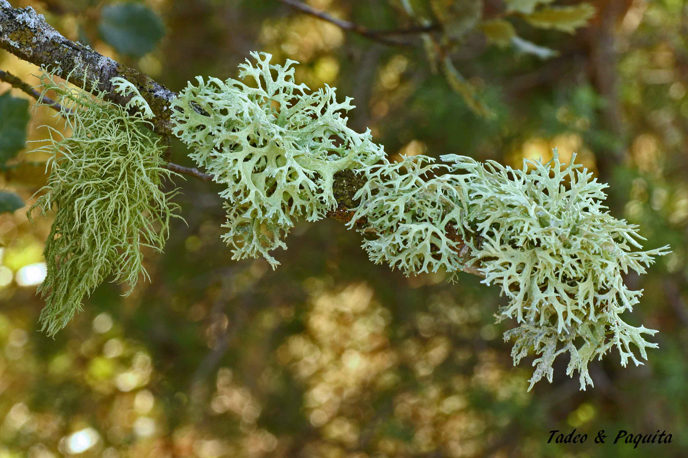

## Líquenes gelatinosos

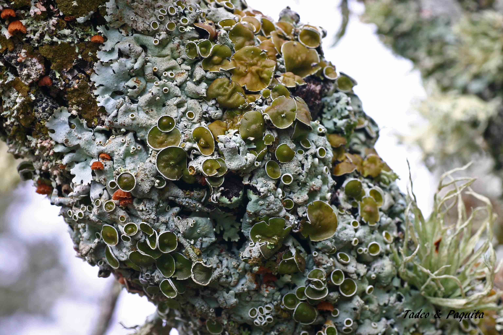
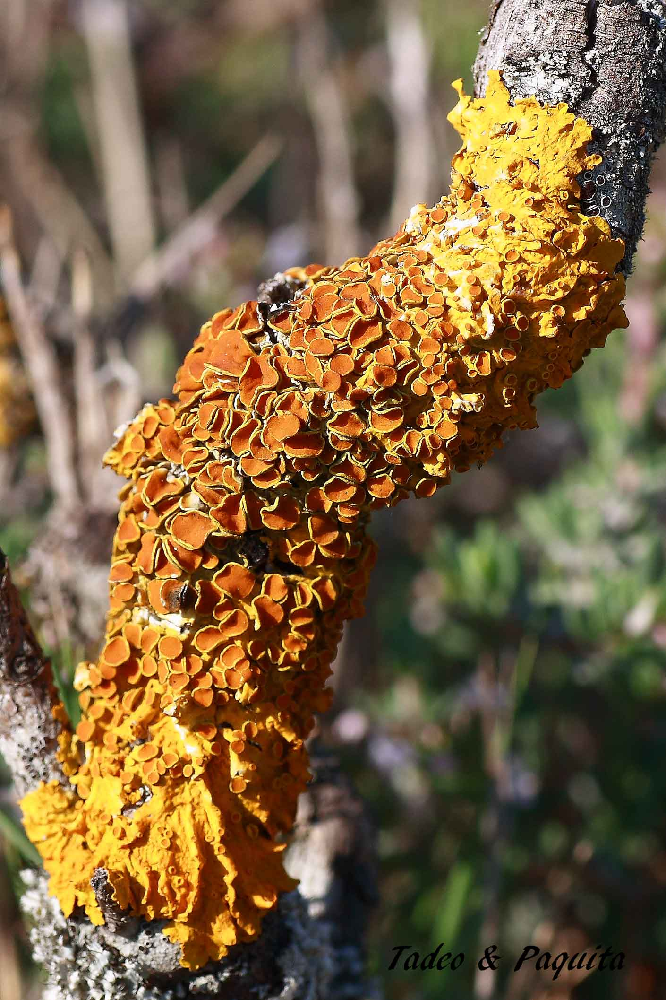

Estos líquenes, cuando están húmedos, tienen una estructura gelatinosa y pulposa, y parecen flexibles.

## Líquenes foliáceos

Son líquenes de tipo laminar. Se extienden sobre el sustrato mediante un conjunto de ricinas.

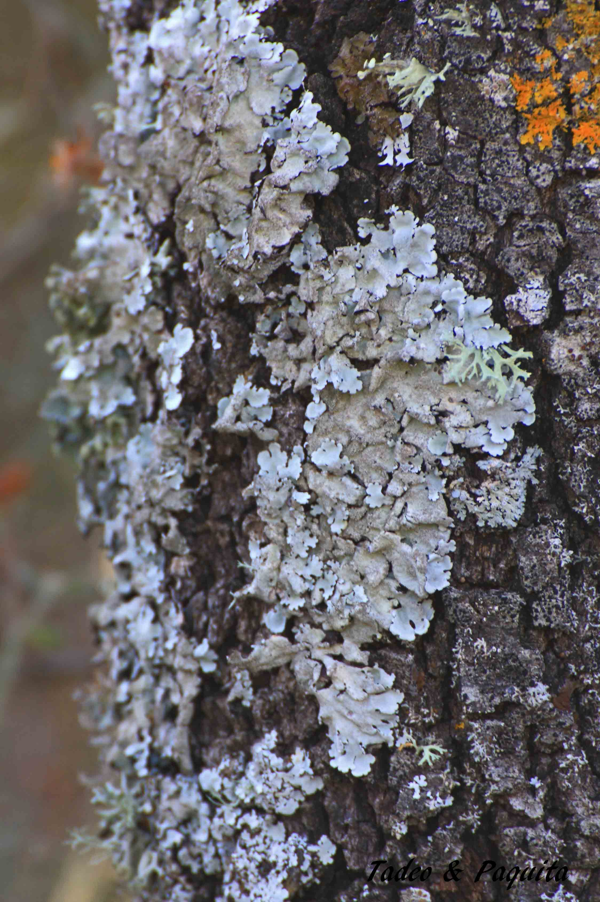
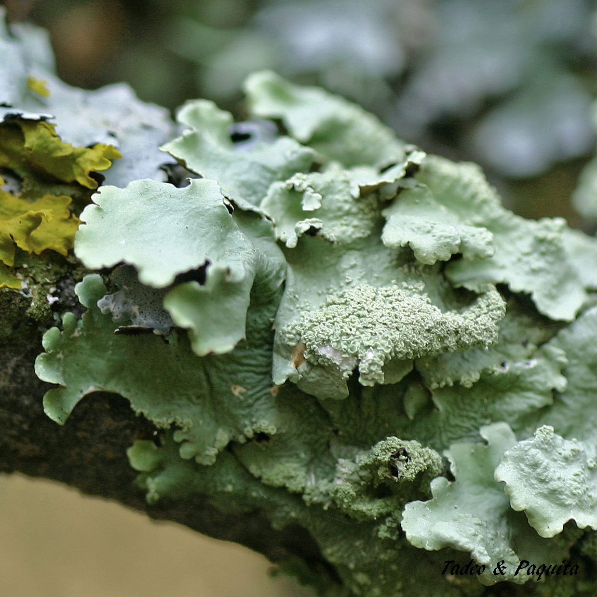

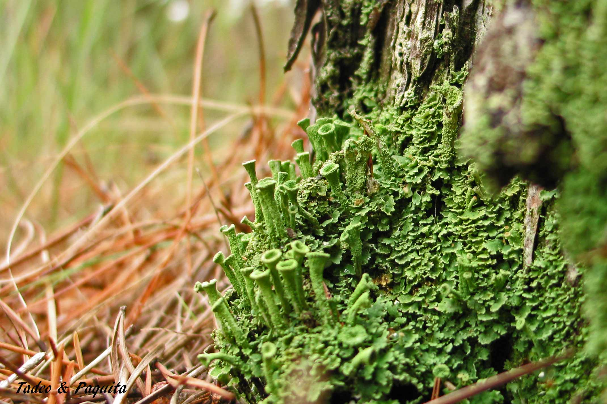
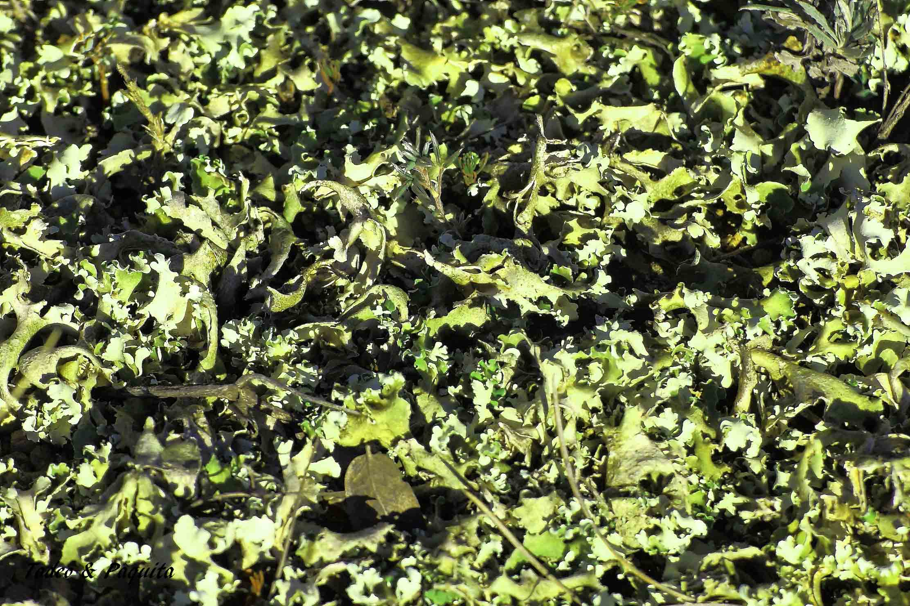
