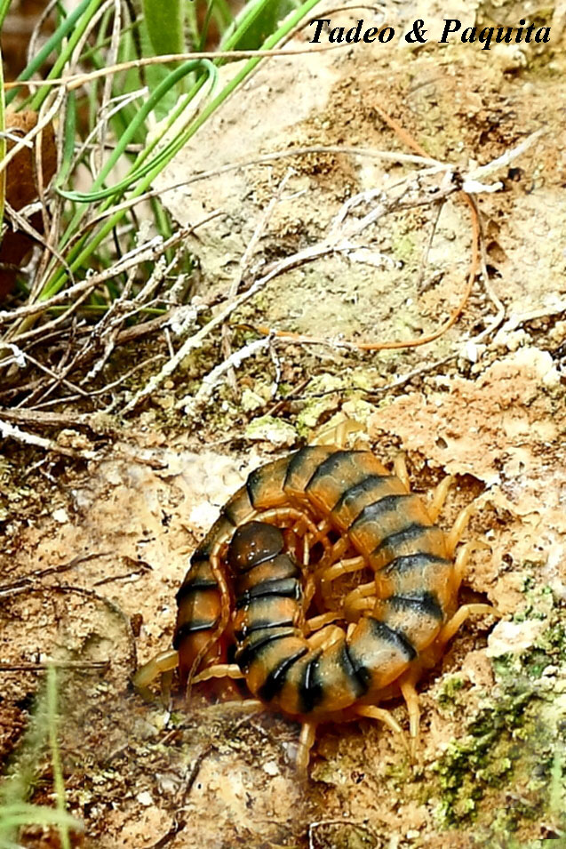
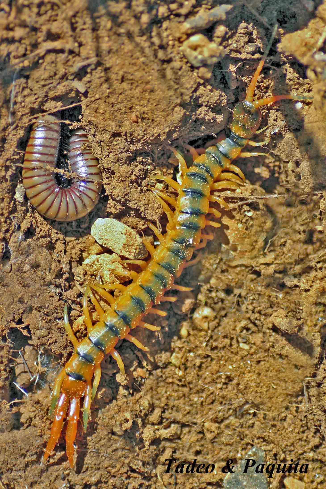
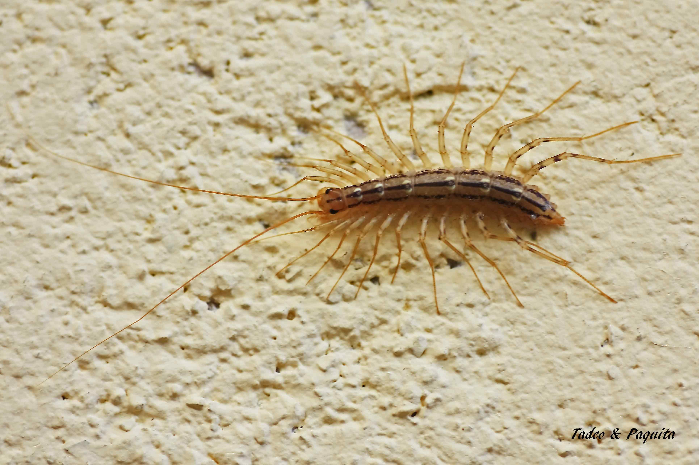

Los miriápodos son los primeros artrópodos mandibulados. No han desarrollado la capa cérea de los arácnidos y los insectos, por lo que pierden agua por evaporación: tienen que hacer vida nocturna y pasan el día debajo de las piedras. Presentan numerosos pares de patas articuladas, como las de los arácnidos, para caminar por el suelo.

## Escolopendra

Ciempiés. El primer par de patas se transforma en una uña venenosa, en relación con su hábito depredador.

## Scutigera coleoptrata

En el exterior vive en lugares frescos y húmedos: en las grietas de las rocas, bajo la hojarasca y en las cortezas de los árboles. También se encuentra en las casas, donde busca lugares húmedos como sótanos y baños.
