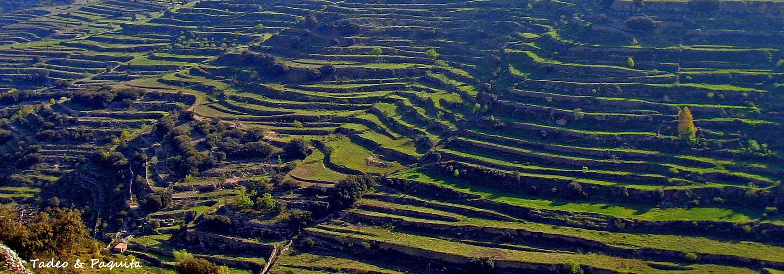
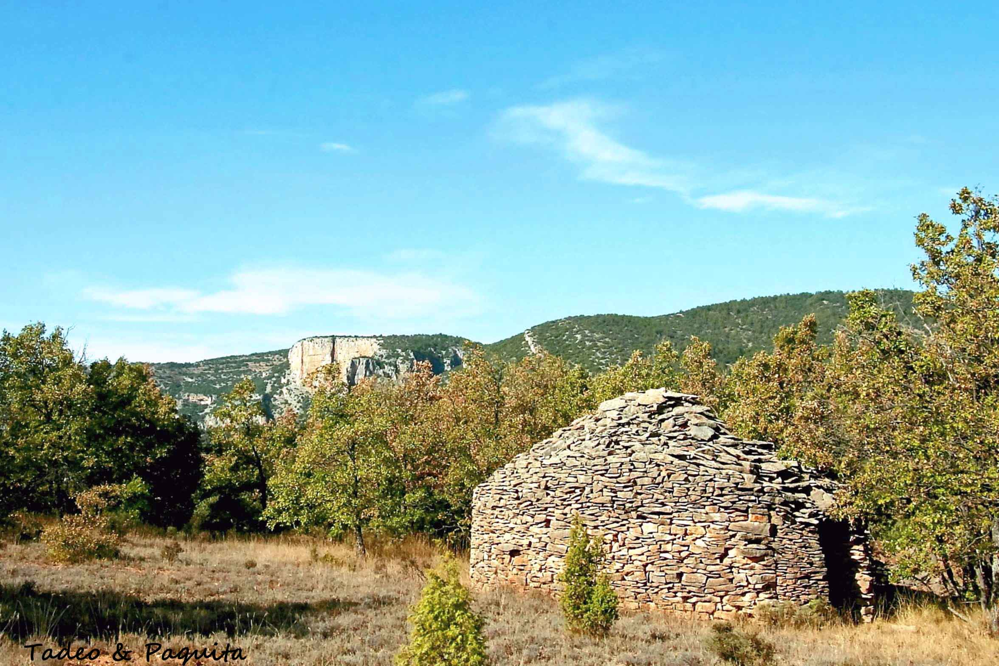
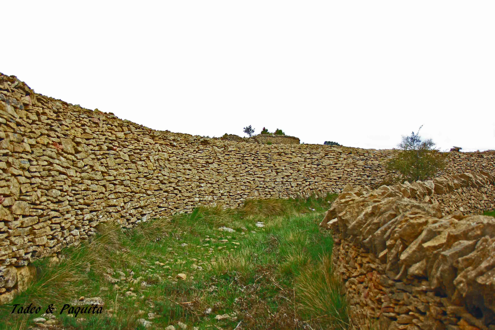
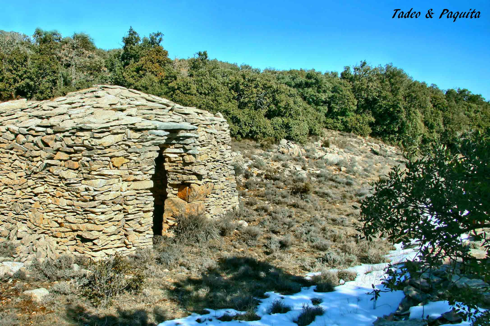
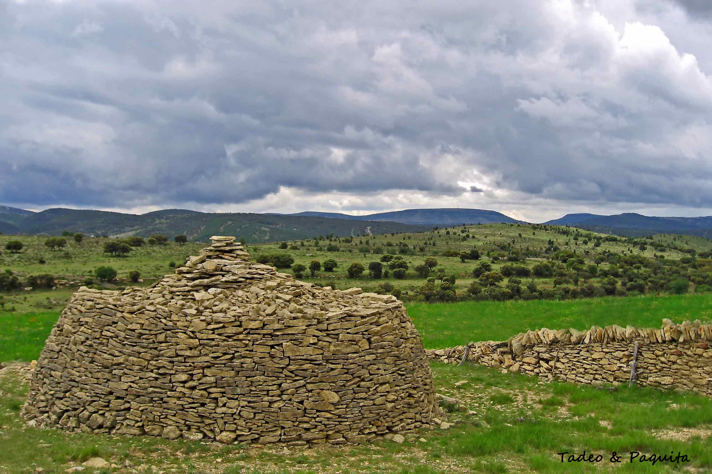
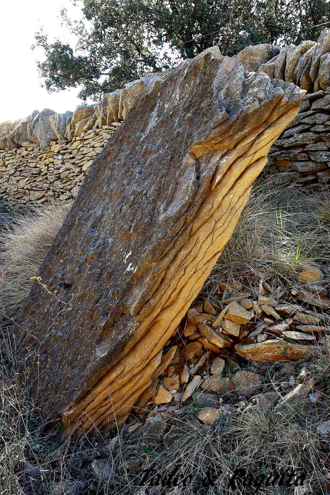
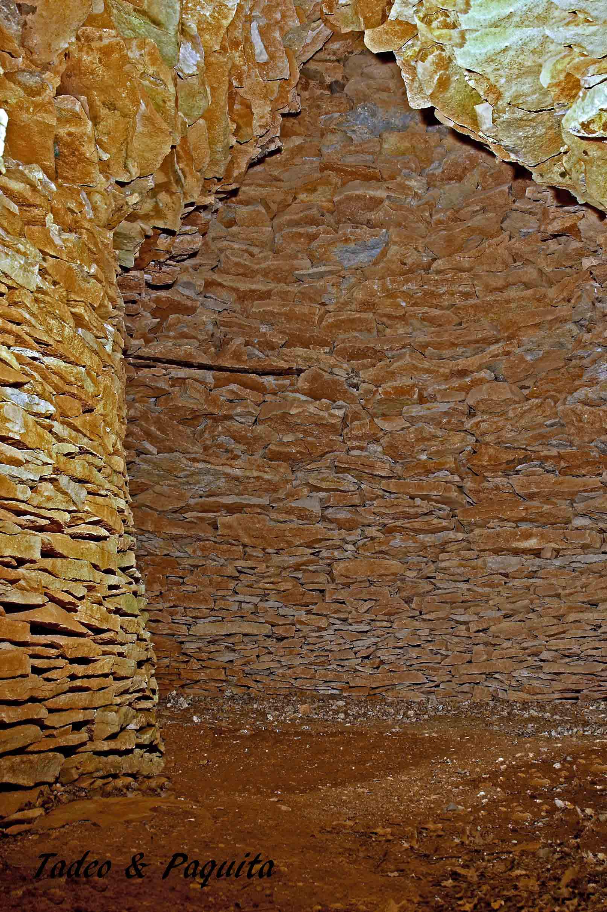
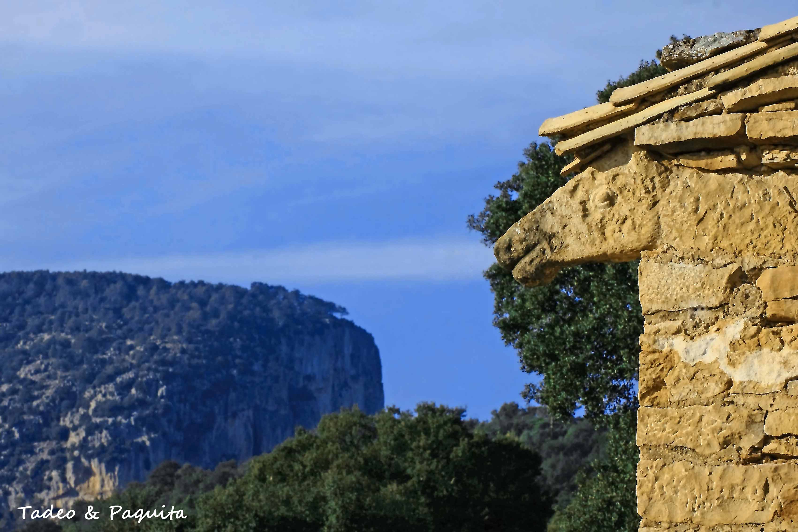

Las paredes y los refugios de piedra seca también suman a la biodiversidad de la zona.

Estas construcciones eran necesarias para aumentar la superficie de los campos de cultivo. Con las paredes de piedra seca, llamadas *marges*, se forma un muro que sustenta la tierra; de esta manera los campos absorben el agua de la lluvia y las simientes dan su fruto.

Otras veces las paredes son la línea divisoria de caminos y fincas, y sirven para proteger los cultivos del ganado.

Los hombres de esta tierra, con planteamientos sencillos, sirviéndose de la lógica y la observación, con herramientas rudimentarias y la técnica aprendida de sus antepasados, han levantado verdaderas obras arquitectónicas con la única materia prima extraída de la misma tierra: la humilde piedra.

Los diferentes modelos de barracas se deben a las necesidades del lugar. Algunas, más pequeñas, sirven de refugio ante las inclemencias del tiempo, como tormentas y aguaceros; otras, más grandes, se utilizan también como refugio y como lugar donde guardar las herramientas del campo.

Son construcciones que se integran en el paisaje, dando naturalidad y servicio al lugar donde se encuentran.

