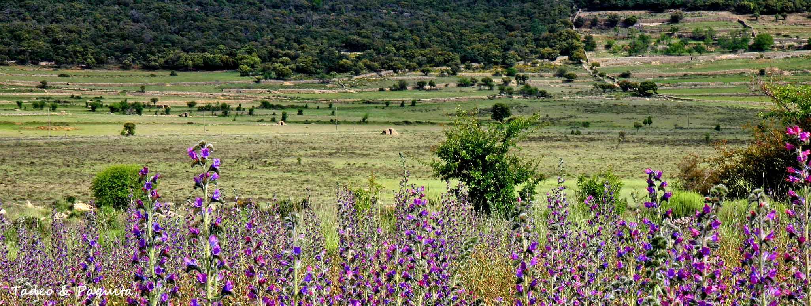

Es una de las cuatro estaciones del año, y la única con nombre femenino: significa «primer verdor».

Este año el invierno ha terminado el día 20 de marzo a las 23:45, con un eclipse de sol que en esta zona no hemos podido ver por la nubosidad de todo el día. Desde el equinoccio de primavera hasta el 21 de junio de 2015 el día se alarga casi tres minutos diarios en la península, y despiertan las plantas que han estado hibernando: inician un periodo de crecimiento y floración, comienza su actividad.

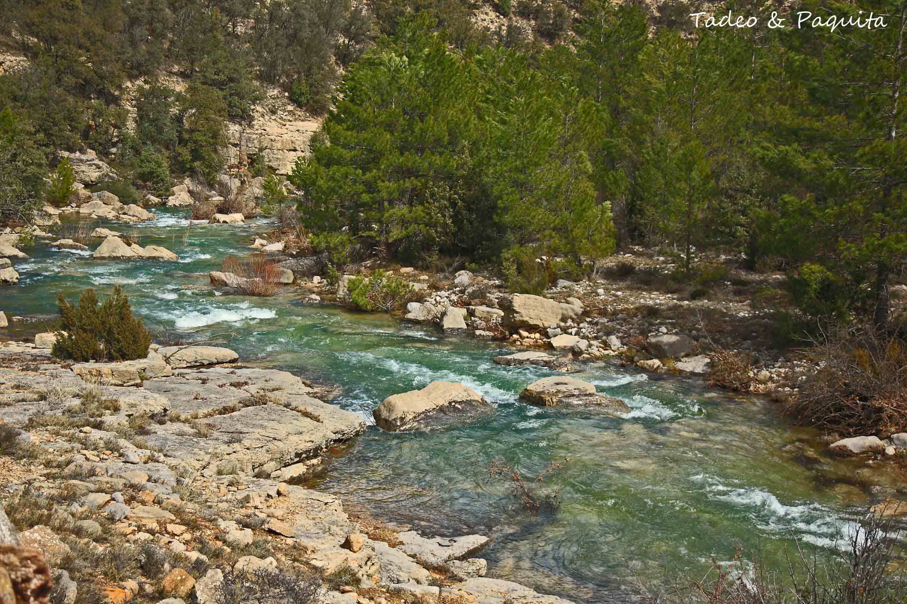
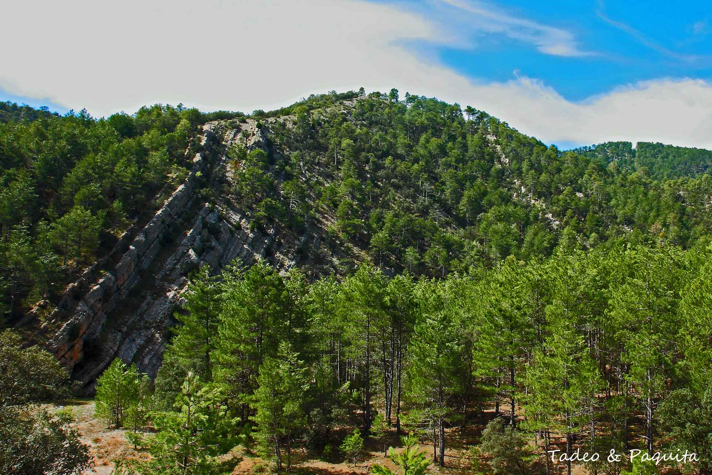

El verde del conjunto que forman árboles, arbustos y todo tipo de vegetación es luminoso, limpio.

A las plantas bulbosas les brotan los tallos y las hojas que perdieron en invierno. Sus bulbos son órganos que están bajo tierra, donde acumulan las reservas nutritivas con las que alimentan la nueva planta.

En los árboles caducos brotan otra vez las hojas, que dan sombra y retienen la humedad. Caminando por el campo se aprecia que la tierra está exuberante; cada pocos días cambia el colorido. No sé por qué, en las flores dominan los azules y los amarillos; los campos de almendros en flor son una extensa alfombra blanca o rosa pálido, según el fruto sea marcona o mollar, y en los ribazos y en la tierra de labranza el rojo intenso de las amapolas parece gotas de sangre que dan vida entre el verde de la vegetación. Es un espectáculo que cambia día a día.

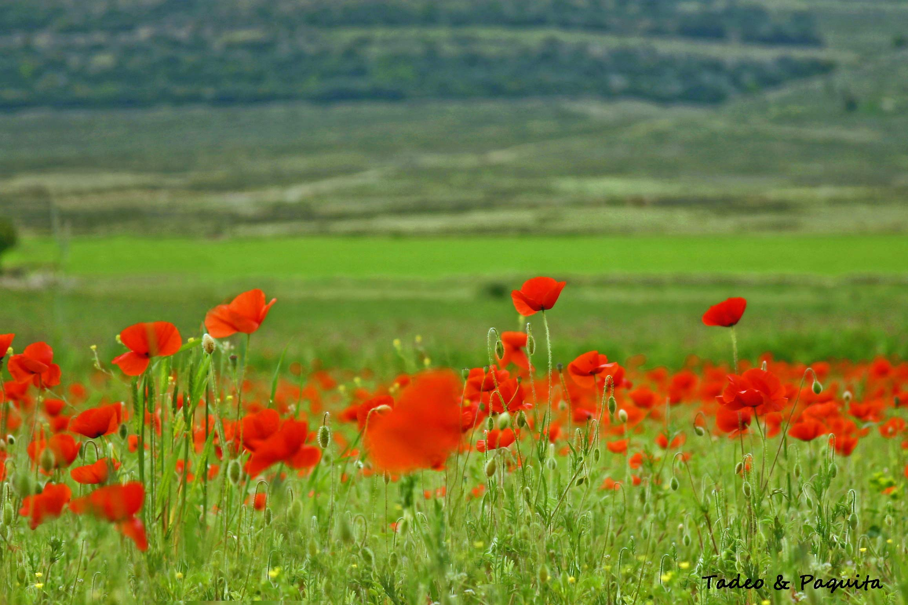
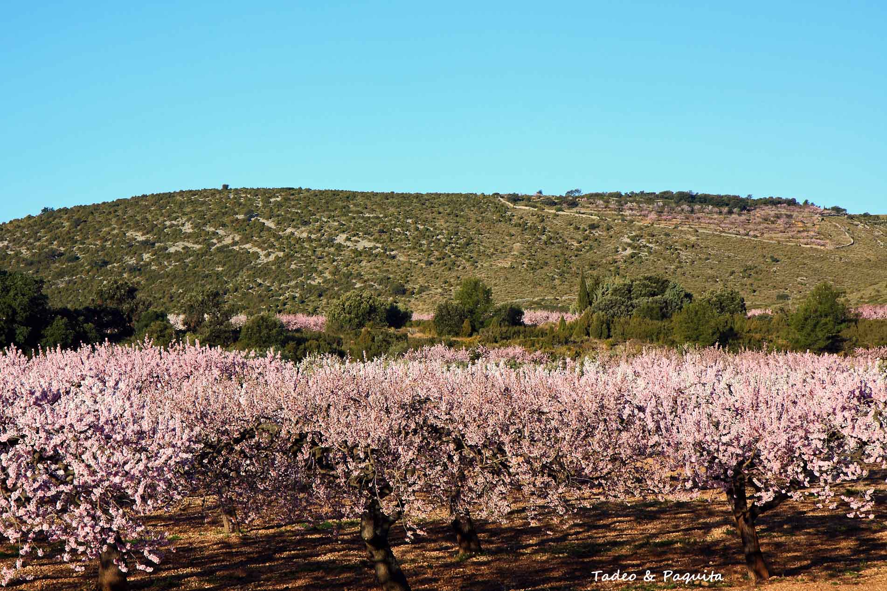
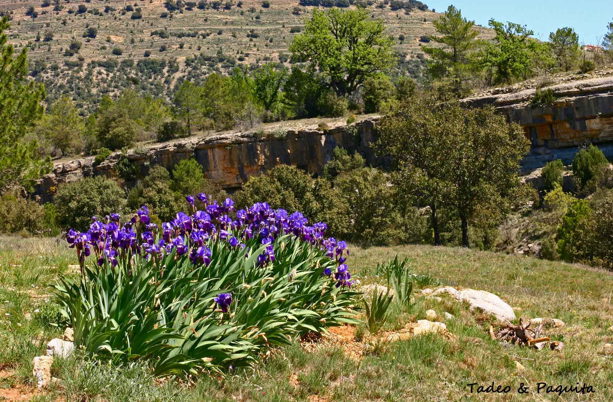

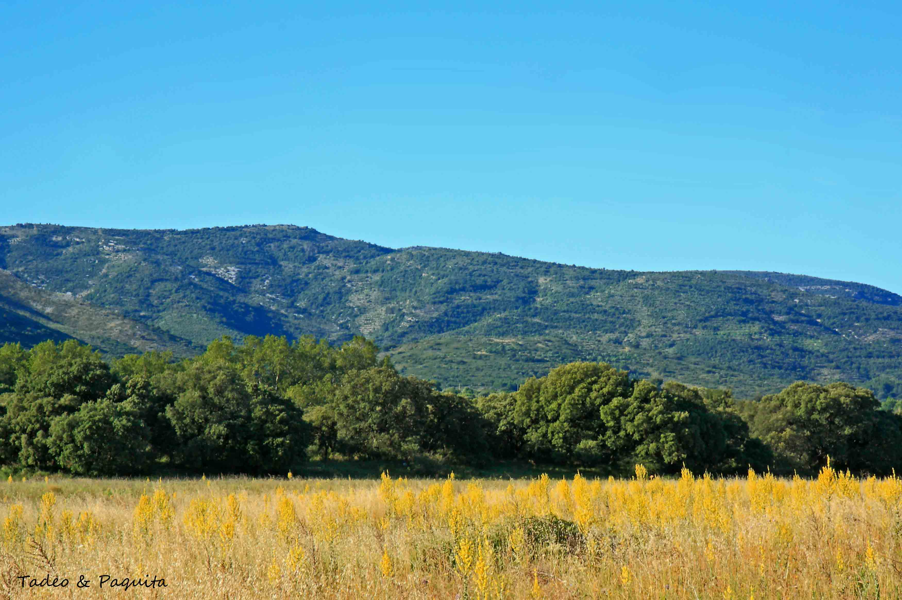
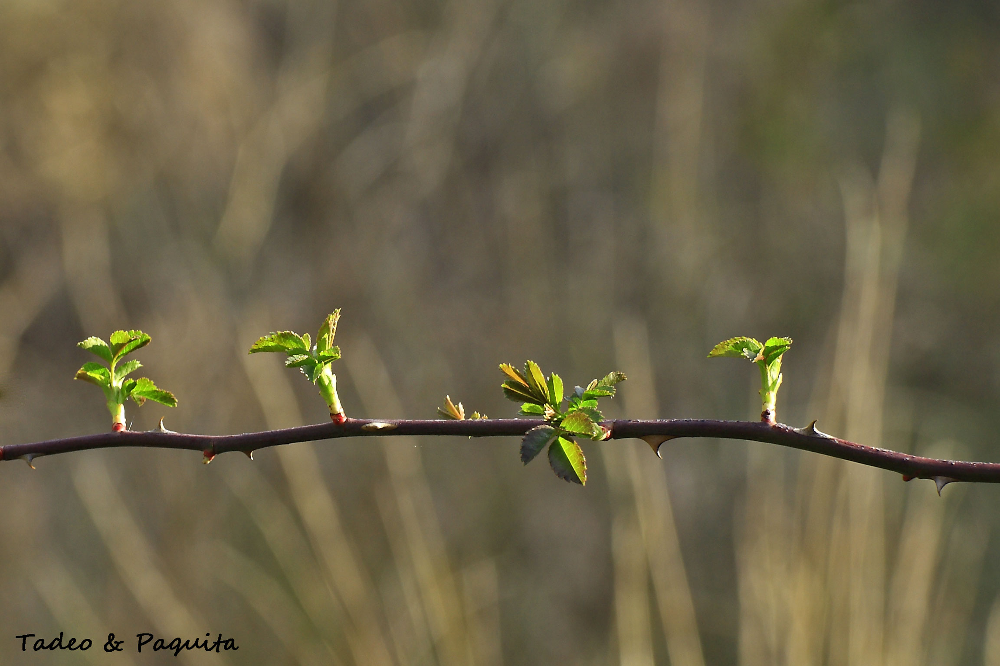
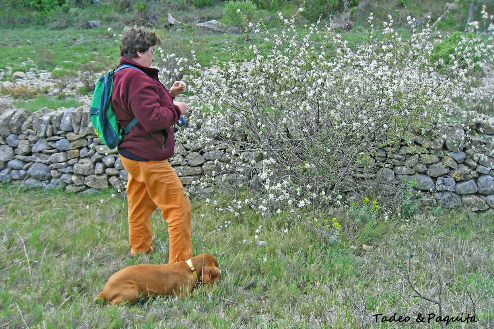

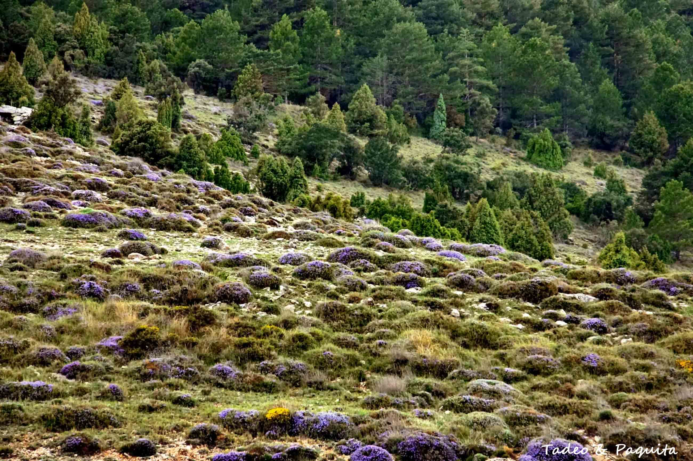
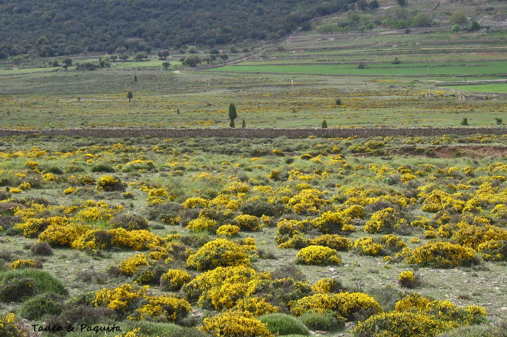
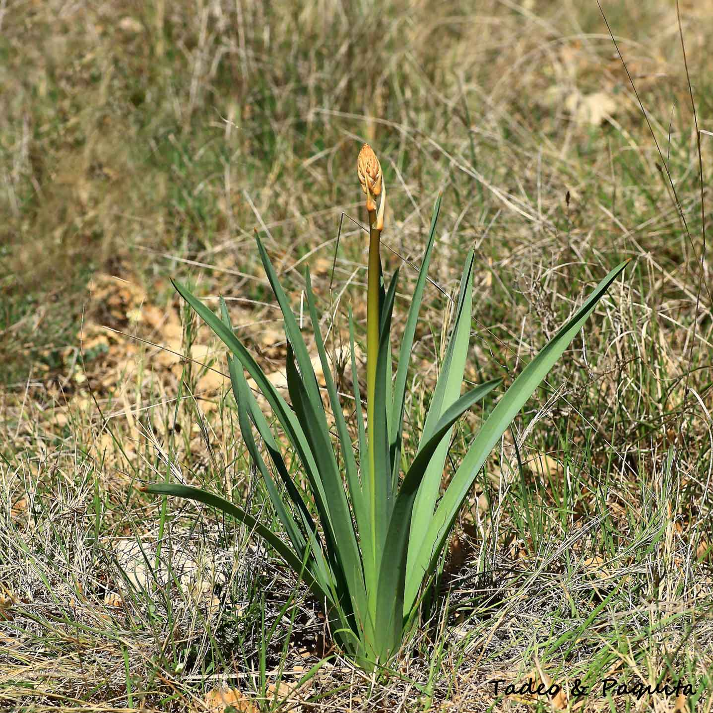
