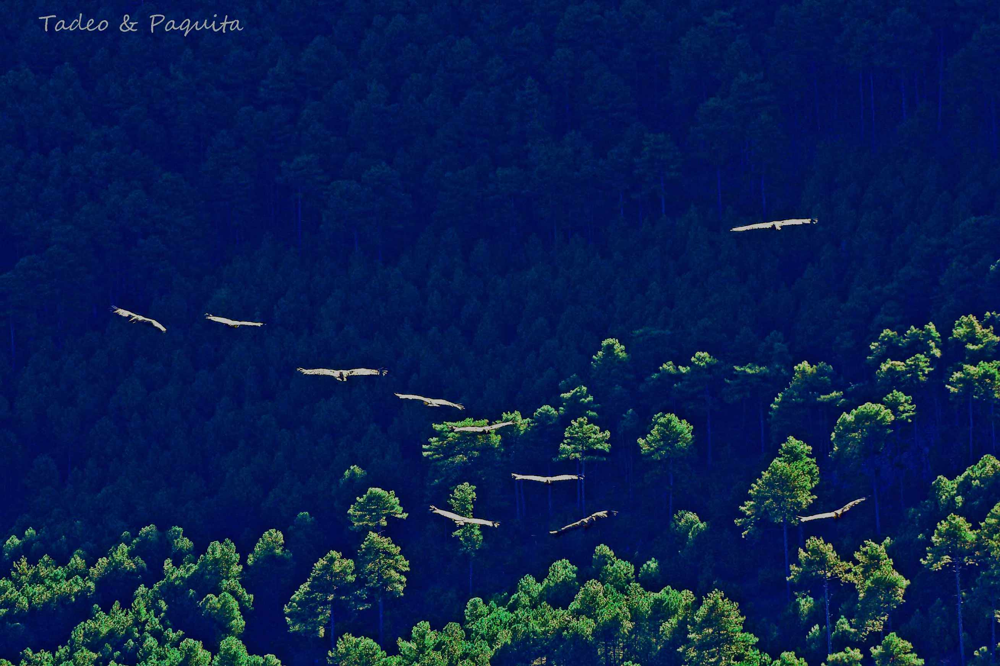
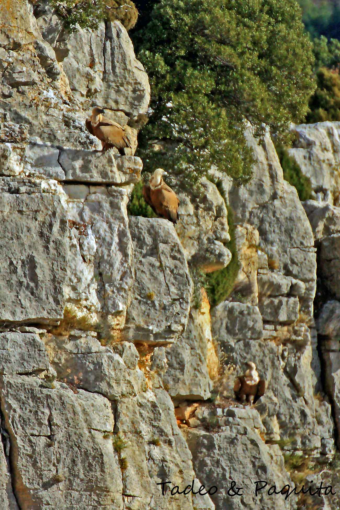
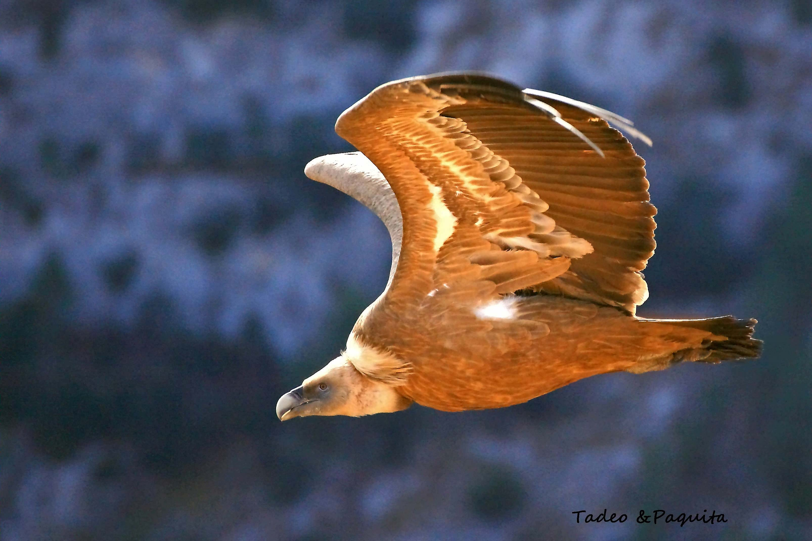
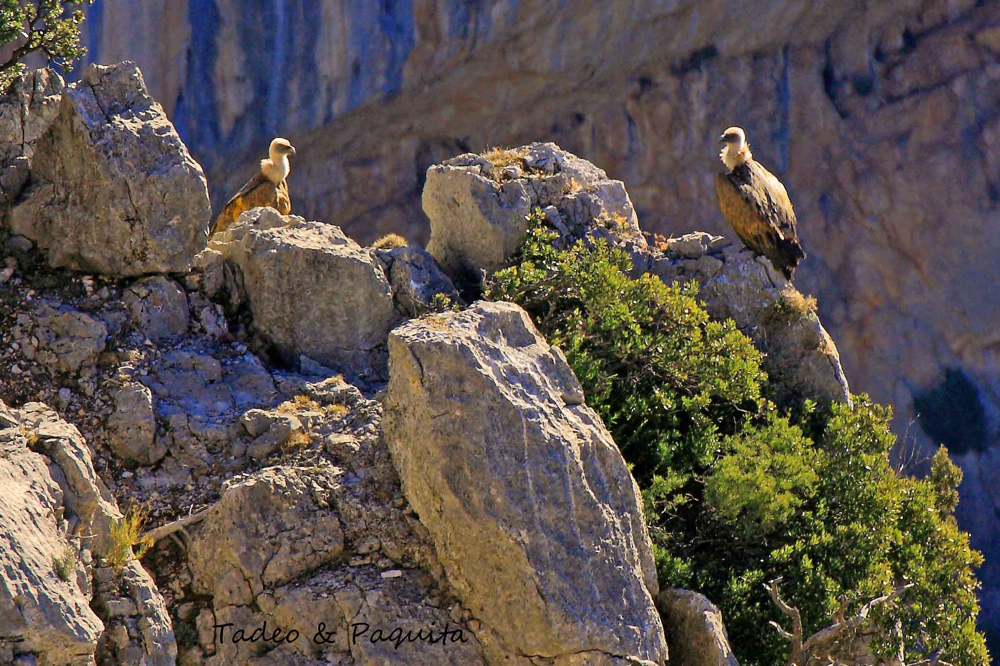
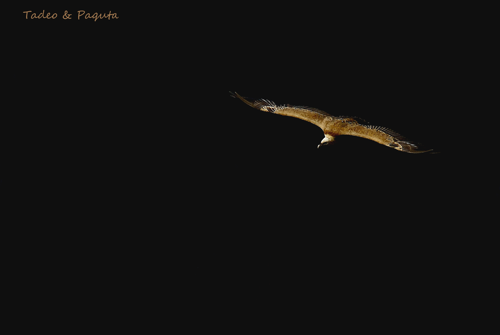
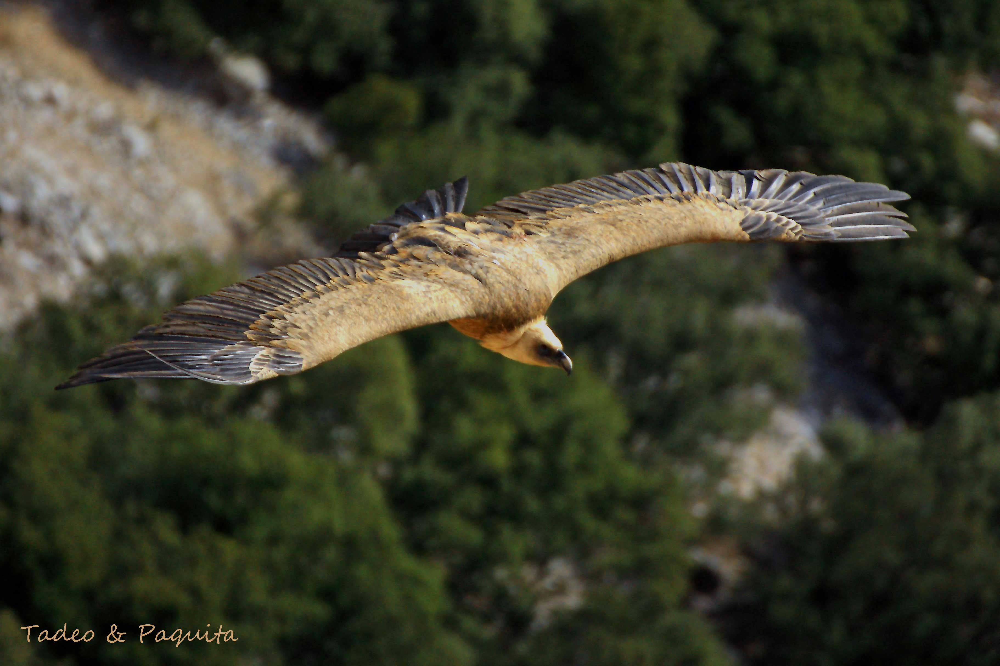
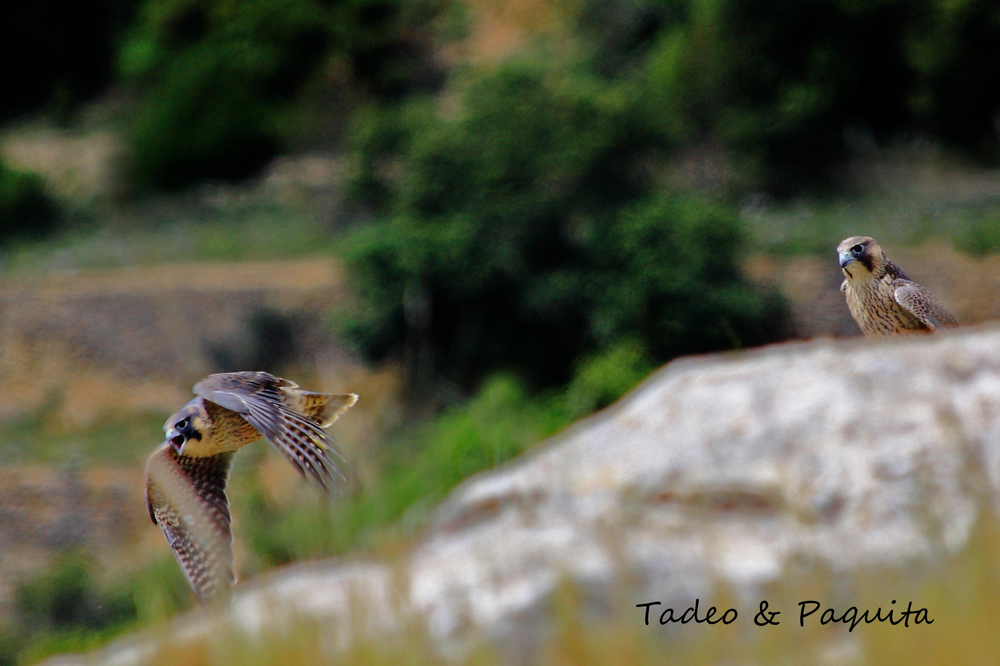
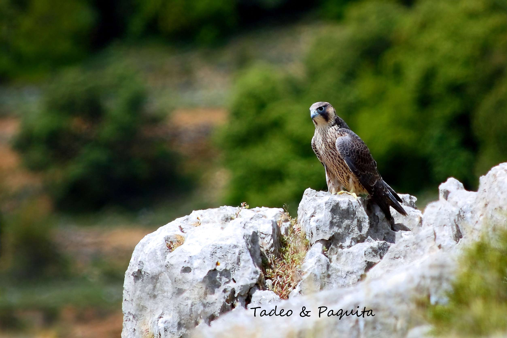

Las rapaces diurnas son aves depredadoras. Están situadas en los lugares más altos de las cadenas montañosas de esta zona. Son cazadoras, y han desarrollado características como una visión excelente para ver a sus presas, mucho más perfecta que la de los hombres. Para capturar y desgarrar a sus presas están dotadas de garras y de picos muy afilados.

Presentan variedad morfológica externa, según el tipo de vida y su alimentación, diversa.

## Buitre leonado

En los cortados calcáreos de la Roca Parda, en la Rambla Celumbres, son comunes las rapaces necrófagas, que se alimentan de carroña y por lo tanto realizan un papel regulador en los ecosistemas en que viven. Es el caso del buitre leonado (*Gyps fulvus*), que se agrupa dentro del orden de los falconiformes, vive en colonias y es una de las mayores rapaces que pueden encontrarse en la península ibérica.

Para conseguir estas fotos, mi hermano Tadeo y yo, Paquita, estuvimos varias mañanas agazapados y cubiertos con una malla de camuflaje en lo más alto del acantilado rocoso, hasta conseguir captar su majestuoso vuelo.

El buitre leonado pasa mucho tiempo planeando sin esfuerzo y sin batir las alas, remontándose en busca de las corrientes térmicas con las que se desplaza. Las alas forman un ángulo recto con su cuerpo.

Es un ave de gran tamaño: sobrepasa los 2,50 metros de envergadura. Tiene la cabeza casi calva, con plumón corto, y una gorguera de plumas alrededor del cuello. El color de su plumaje es parecido al del león, posiblemente de ahí su nombre popular. Es sedentario y gregario.

## Halcón peregrino

Los halcones tienen un aspecto elegante y orgulloso. Sus alas son estilizadas y su cuerpo esbelto; pueden lanzarse con rapidez en picado sobre sus presas, generalmente aves.

En estos picados, los halcones peregrinos consiguen alcanzar velocidades de más de 300 kilómetros por hora. Depositan los huevos en una pequeña oquedad o en una repisa rocosa cubierta, y suelen cambiar de nido cada varios años. Algunas parejas utilizan nidos vacíos de otras aves para poner sus huevos, entre marzo y abril. Es muy agresivo con otras aves de presa.

