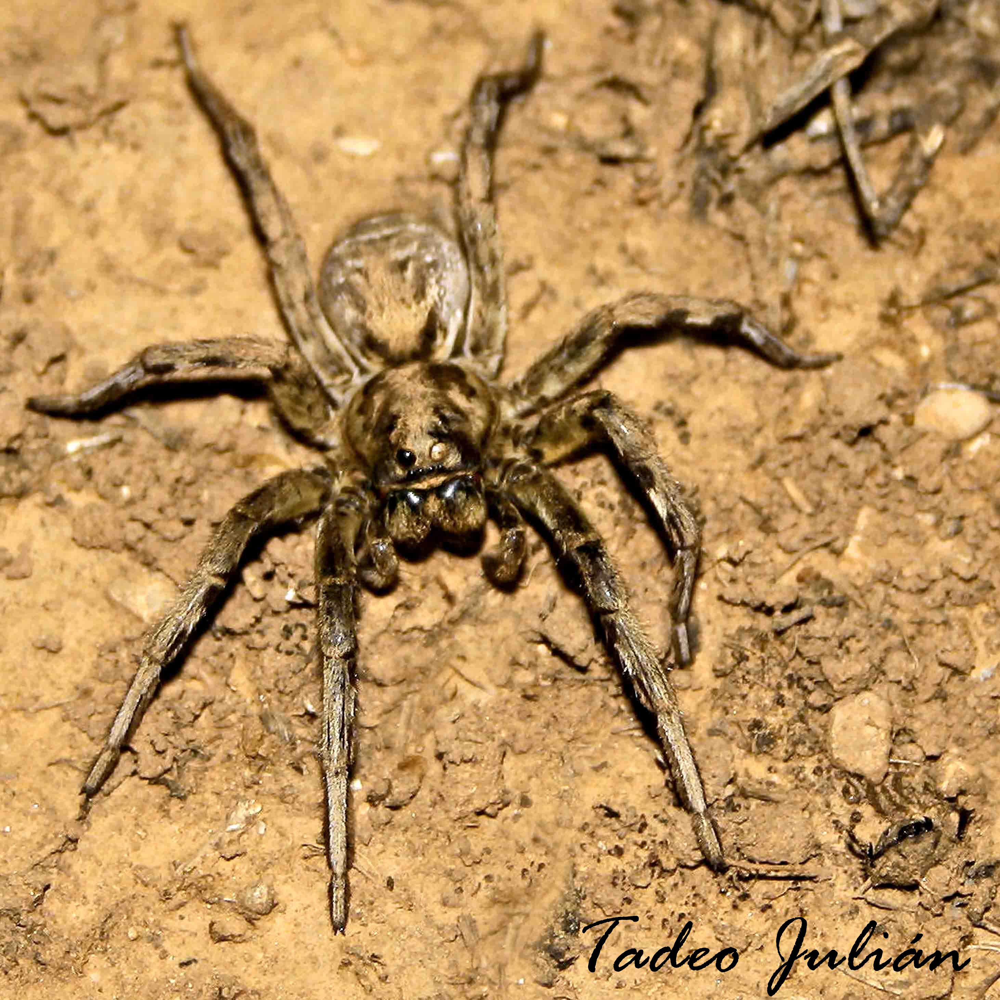

蜘蛛是陆生的捕食性节肢动物：它们吃各种节肢动物，通常比自己小——蟋蟀、苍蝇、蜜蜂、蚱蜢、蛾和蝴蝶。它们埋伏捕猎，靠陷阱或蛛网，甚至一跃而起。吐丝是蜘蛛正常生活的一部分。

它们在腹部第十和第十一节上有纺器——纺器是特化的足——以及好几种分泌不同丝线的腺体。最大的腺体生产所谓的“安全丝”，整张网的骨架就是用它织成的。蛛网是工程学的奇迹：它们能造出质量相同、粗细却随体重而异的丝线，还能织出降落伞状的丝线，用作空中交通工具来迁移，也用来包裹猎物。

有些蜘蛛有八只眼睛，不过大多数用眼睛看得并不清楚。结网的蜘蛛几乎是盲的：它们主要靠触觉和嗅觉。

## 横纹金蛛（“虎蛛”）

横纹金蛛织几何形的网来捕捉猎物，并把猎物裹在网里保存。看这只撞上门来的蚱蜢就知道了。

## 狼蛛

近看，它的脸像狼；它的名字由此而来，也来自它捕猎的方式：它不结网捕猎，而是蹲在自己洞穴的入口处埋伏，洞在多石的地面上。如照片所示，它的洞呈球形，垂直向下，洞壁衬着用丝连结起来的枝条和植物，像一堵墙一样突出地面；这样下雨时水就进不来。雌蛛和雄蛛都用这个洞冬眠。

## 猫蛛

*Oxyopes lineatus*。它靠奔跑和跳跃捕猎。它的视力很强：有六只眼睛。照片里可以看到，它用足上的钳子抓着一只比自己还大的蝉（*Cercopis intermedia*）。

## 蟹蛛

*Misumena vatia*。它的身体像螃蟹。它布置陷阱的方式令人吃惊：它把好几朵小花拼成一朵花，自己藏在花的中央，扮成花蕊。它会变成花的颜色，从而伪装得天衣无缝，等着某只昆虫飞来。它的前两对足更大，用螯肢注入毒液麻痹猎物。

