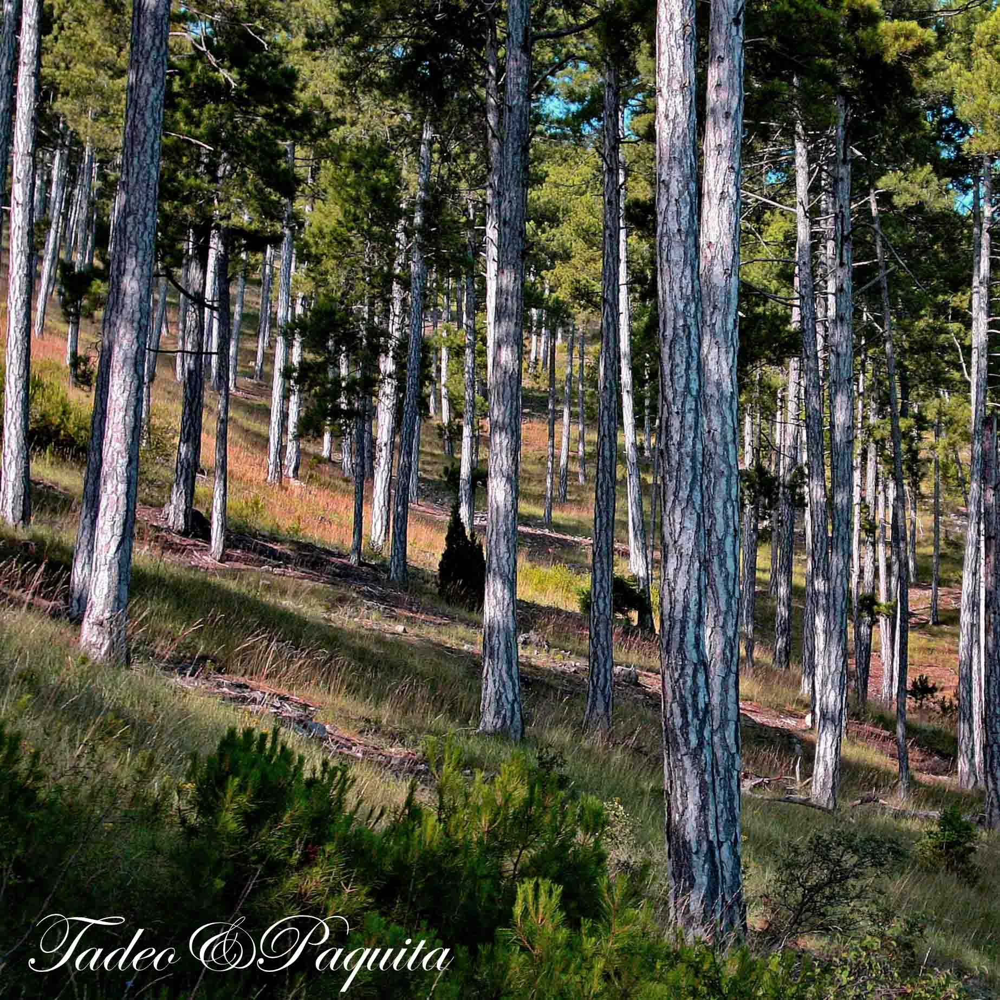
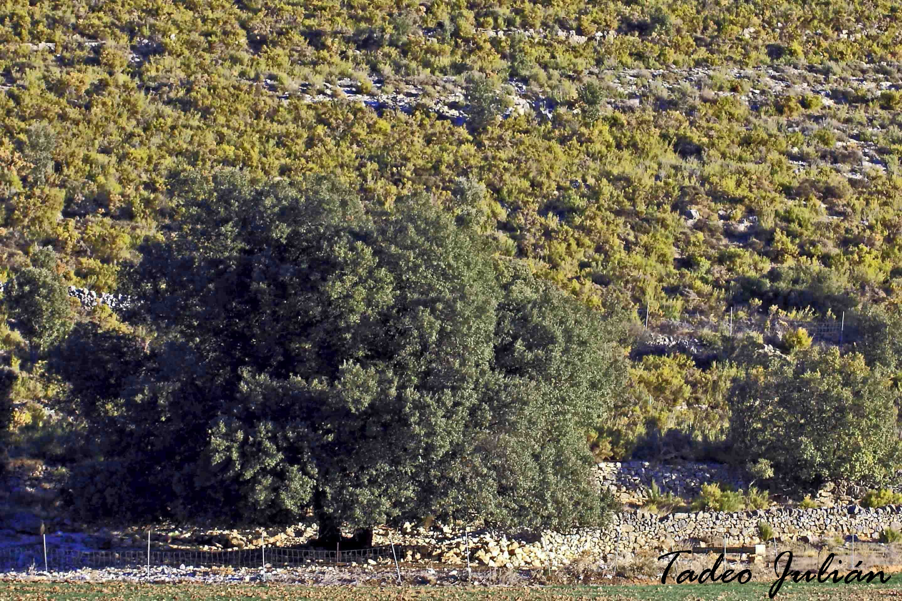

树木是寿命最长的生物。它们可以是乔木、灌木和攀缘植物。

## 槭树

槭树零散地生长在山毛榉和栎树之间。它的木材坚硬，带有斑点；叶子单生，有裂片，棱角分明。这一带不多见，只在塞伦布雷斯干河（Rambla Celumbres）两岸的岩石间才有。秋天一到，它金黄色的、深深浅浅的赭色调，让人一眼就能认出来。

在这一小块地方，可以看到这一带最常见的树：矮小的叉子圆柏，旁边是刺柏，冬青栎，远处是松树。

## 欧洲赤松

在塞伦布雷斯干河的两岸，相隔不远，就能看到欧洲黑松和欧洲赤松。后者长在 Roca Parda 和 Roca Roja 的山脚下。林子里很好走，没有灌木，松树排列整齐、笔直；秋天可以找到真菌和蘑菇。它的树皮呈灰色，上部是橙棕色。

## 欧洲黑松

欧洲黑松树皮发白，木材更致密、更结实，树脂也更多。照片里这一棵，五根树干在基部连在一起——翻看照片，我发现我们家三代人都在这棵树旁边留过影，从小到大，我一直觉得它没有变过。同一条干河里还有两三根树干在基部相连的植株；可能是这一带的生境所致。

## 冬青栎：encina 与 carrasca

这是一种粗壮、生长缓慢的树。叶子常绿，带刺，也可能有齿或全缘。花有雌雄两种，长在同一棵树上：雄花产生花粉，雌花授粉后变成橡子。冬青栎的木材坚硬多节，难以加工；从前用来烧炭。当地叫 *carrasca* 的那种，叶子呈卵形，比 *encina* 更宽，橡子通常是甜的。

橡子是冬青栎和栎树的果实。它由一个木质的壳斗保护着。把果实捣碎，可以得到一种面粉，有些民族曾以此为食。

## 葡萄牙栎

它的落叶小而革质，叶背覆盖着浓密的星状毛，叶缘有细小、规则而尖锐的锯齿。它的特点是雄花排成长而下垂的柔荑花序，雌花单生。果实是与冬青栎相似的橡子，但连接枝条的果柄长得多。

栎树有对付寄生虫的防御机制。虫瘿是植物遇到寄生虫时长出的瘤状组织，把寄生虫与植株的其余部分隔离开来。此外，虫瘿还为寄生虫——通常是昆虫的幼虫——提供食物和庇护，让它们在秋冬落叶期间得以存活。

## Quejigo

这是一种灌木，不过在最佳条件下也能长得相当高。树皮非常粗糙，呈褐色。它们长得很密，形成一片有时难以穿越的植物丛。它是半常绿的，叶子凋而不落：老叶留在枝上，直到春天新叶出现。叶子呈椭圆形，叶缘有齿，叶面总是发亮，叶背发灰。橡子九月成熟，成簇排列。

## 欧榛

*Avellaner*。这是一种先开花、后长叶的灌木。雌花和雄花分开长在同一棵树上。叶子为落叶，互生，单叶，无裂片，有锯齿。它的果实与无花果、扁桃仁和葡萄干一起，并称“四种托钵果”（*cuatro mendicantes*）：之所以这样叫，是因为四个托钵修会——方济各会、奥斯定会、多明我会和加尔默罗会——只接受这四种果实作为供奉。

榛子是一种坚果，可以生吃或烤着吃，也用来做点心和杏仁糖（*turrón*）。

## 榆树

*Om*。这是一种落叶树，叶子较小而结实，呈深绿色。花呈红色，聚成小簇。果实是一粒种子，外面围着一圈薄而膜质的浅绿色翅。榆树依靠风来授粉和传播果实。它生长在干河与河流的岸边，那里通常有微风，叶子随风摆动，发出一种不会认错的沙沙声。

## 花楸

*Serves*。花楸的叶子有锯齿，轮廓优雅，主要生长在中海拔山地的栎树林里。在乡间农庄（*masía*）附近很常见。它的果实圆圆的，粉质，非常涩，但如果摊在苇席上放到过熟，就可以吃。这是一种收敛性的果实。

