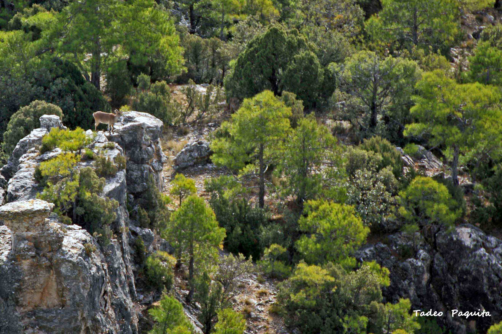
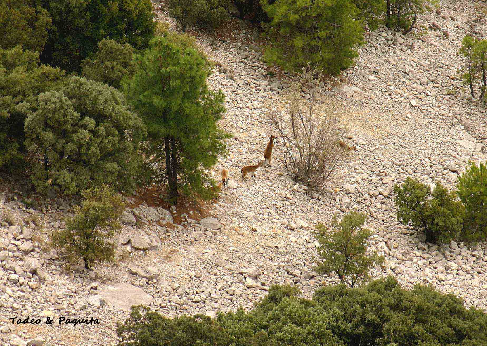
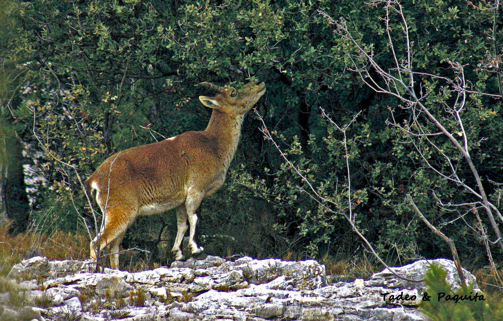
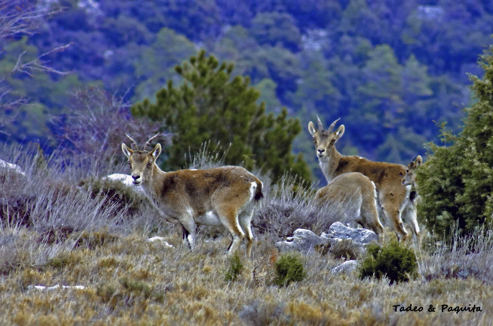
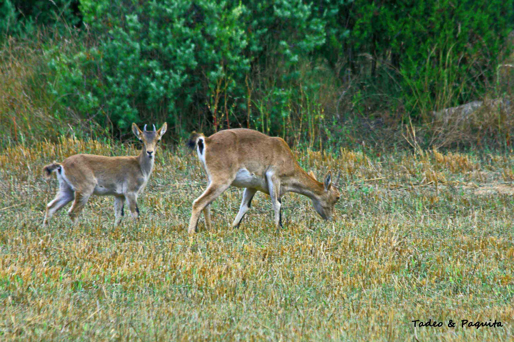
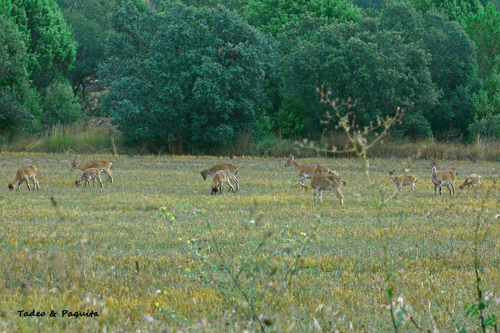
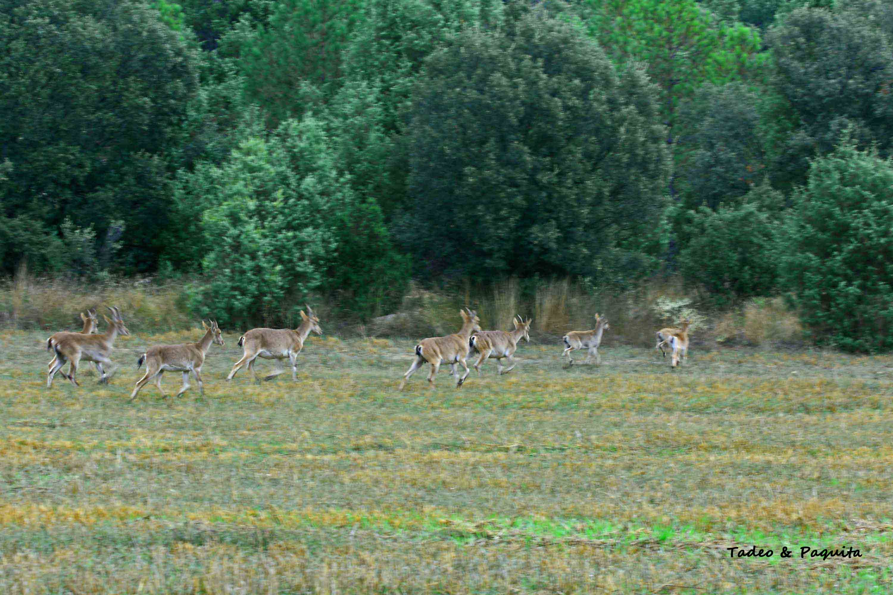
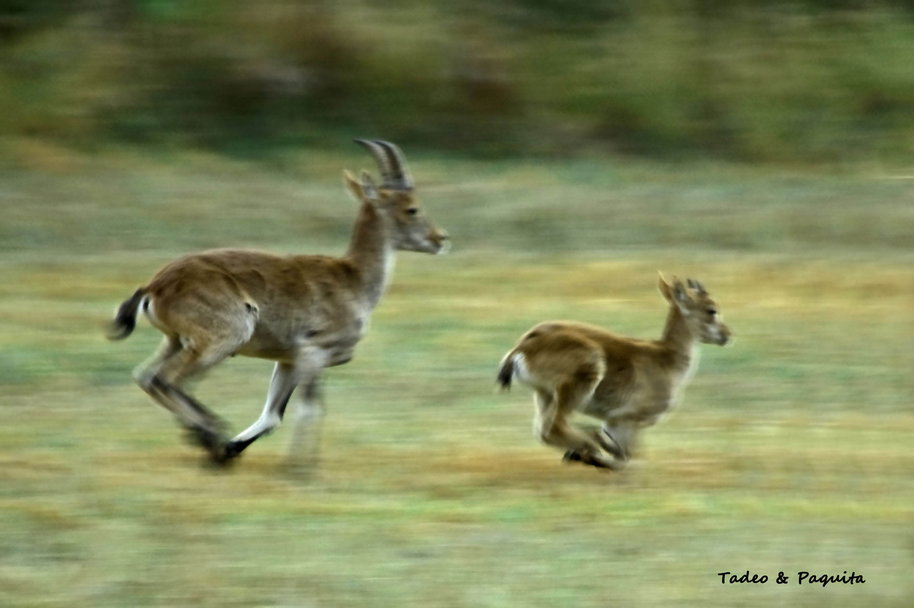

在 Els Ports 地区的乡间公路上行驶，遇到一只西班牙羱羊（本地叫 *cabra hispánica* 或 *cabra montés*）横穿你的路，并不稀奇，惊喜自然免不了；而且根据一年中的时节不同，它们会结成小群，敏捷地攀过峡谷和峭壁，擦着深渊而行。它们以牧草为食，草少的时候，就吃树叶和枝条的嫩尖。

这是一种体格强壮、结实的动物。雄羊更大，它的角也更大，有环纹，向后弯曲。雌羊的角更小、更细。

这是一夫多妻的物种：雄羊独来独往。到了交配季节，它靠近雌羊群——雌羊通常结伴而行。雄羊对其他雄羊很有攻击性，后者在发情期也会应召而来；争斗的胜者留下这群雌羊，交配之后便离开。

妊娠期大约 23 到 24 周，产羔期在四月到七月之间。通常一胎一到两只。小羊如果是雌性，会一直跟着母亲；*xotos*——年轻的雄羊——则不然，它们会离开羊群。

我们观察到，当一群带着小羊的羱羊在吃草时，总有一只在放哨，观察四周，稍有一点危险的信号，全都撒腿就跑。它们的天敌是狐狸、鹰和偷猎者。另一些时候，如果我们静静地观察它们，它们会继续走自己的路：它们有敏锐的生存直觉，知道什么时候有危险。

