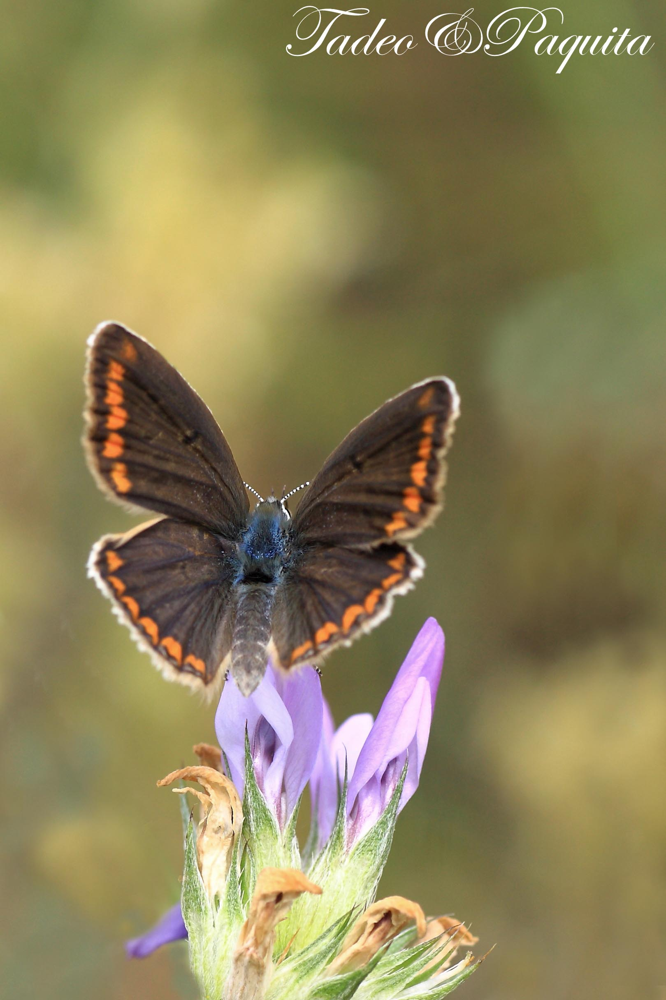
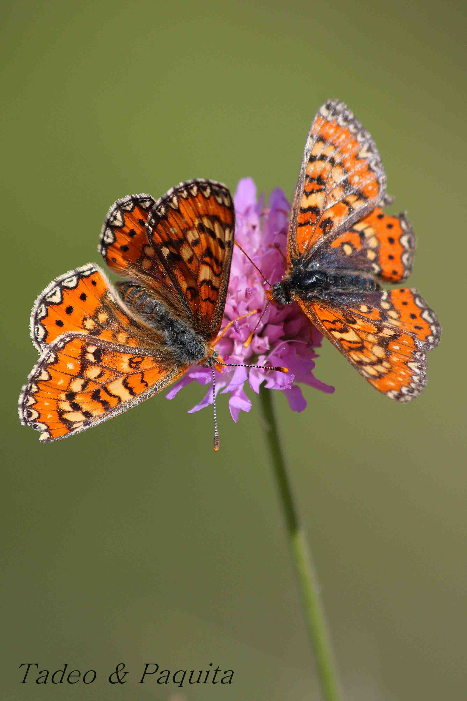
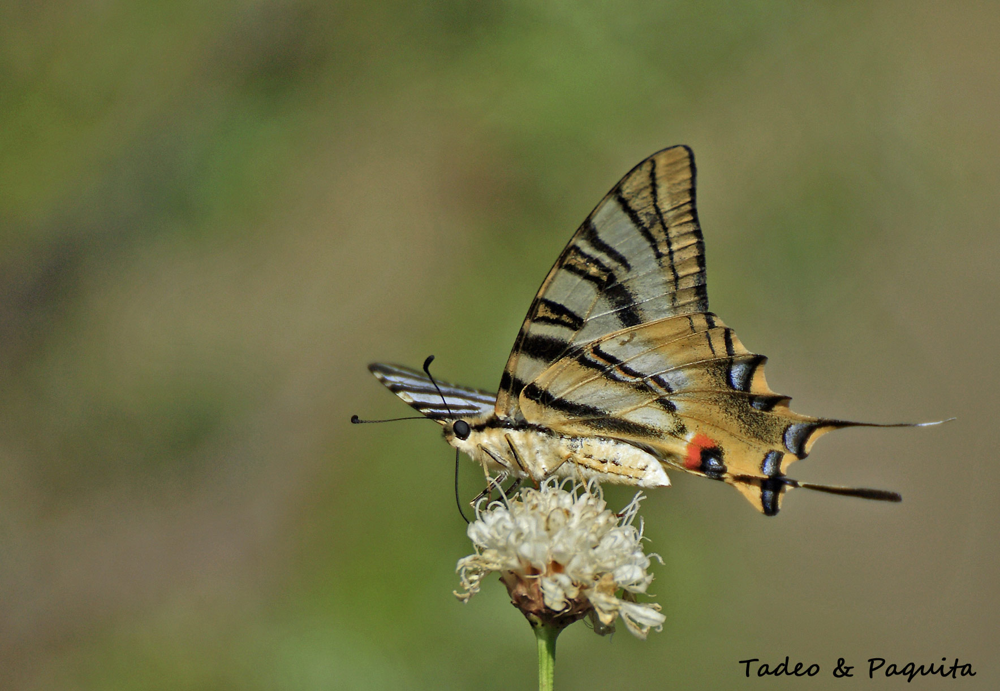
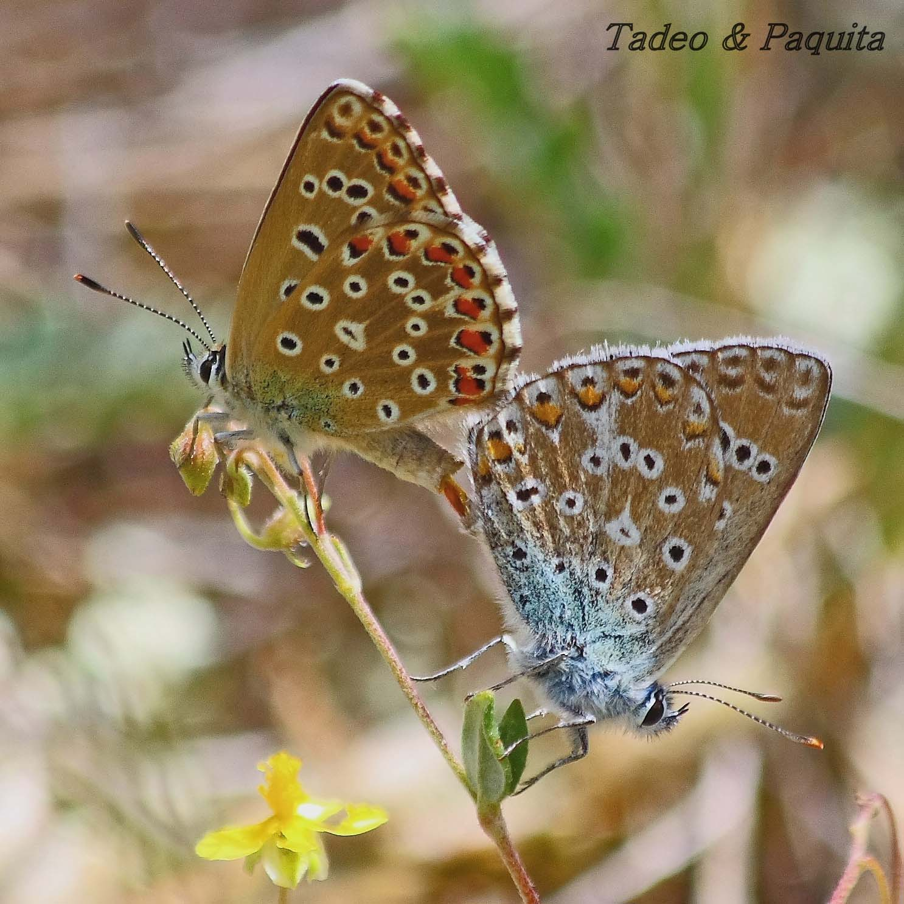
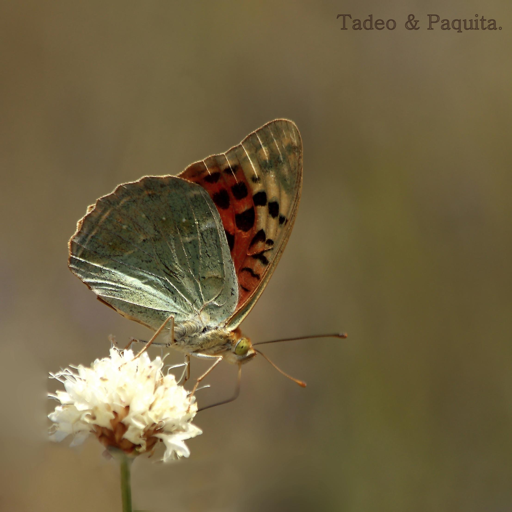

蝴蝶，*papallones*，*palometes*。我们知道蝴蝶是翅膀覆盖着鳞片的昆虫；我喜欢叫它们 *palometes*，就像小时候那样。

昼行的蝴蝶休息时，通常把翅膀合拢，像一面立在身体上的帆。它们与蛾的另一个区别是触角末端呈棒状或槌状。

塞伦布雷斯干河（Rambla Celumbres）里的各个蝴蝶科——弄蝶科、灰蝶科、凤蝶科、粉蝶科和蛱蝶科——当中，数量最多的是蛱蝶科，最少的是弄蝶科。

