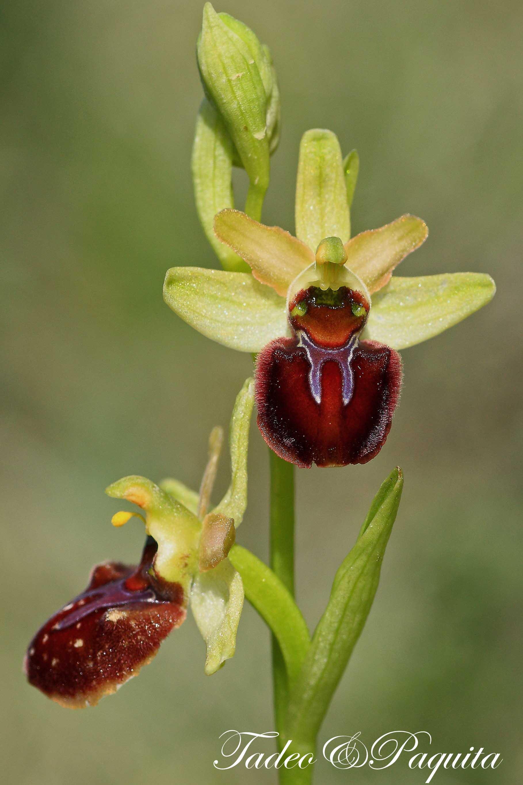
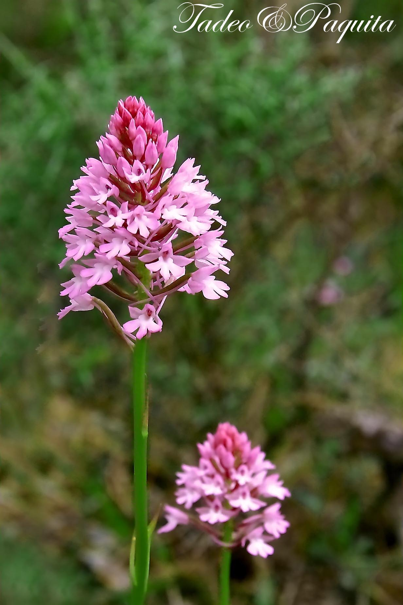
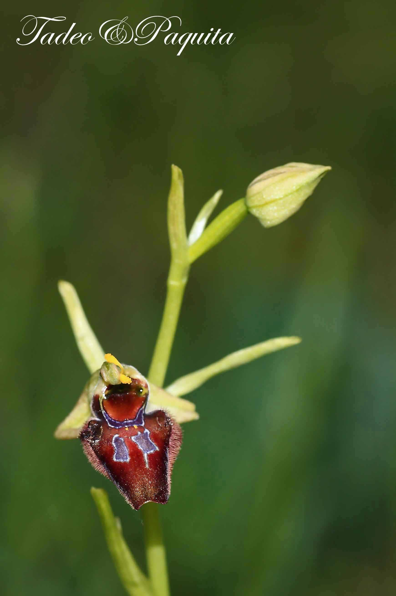
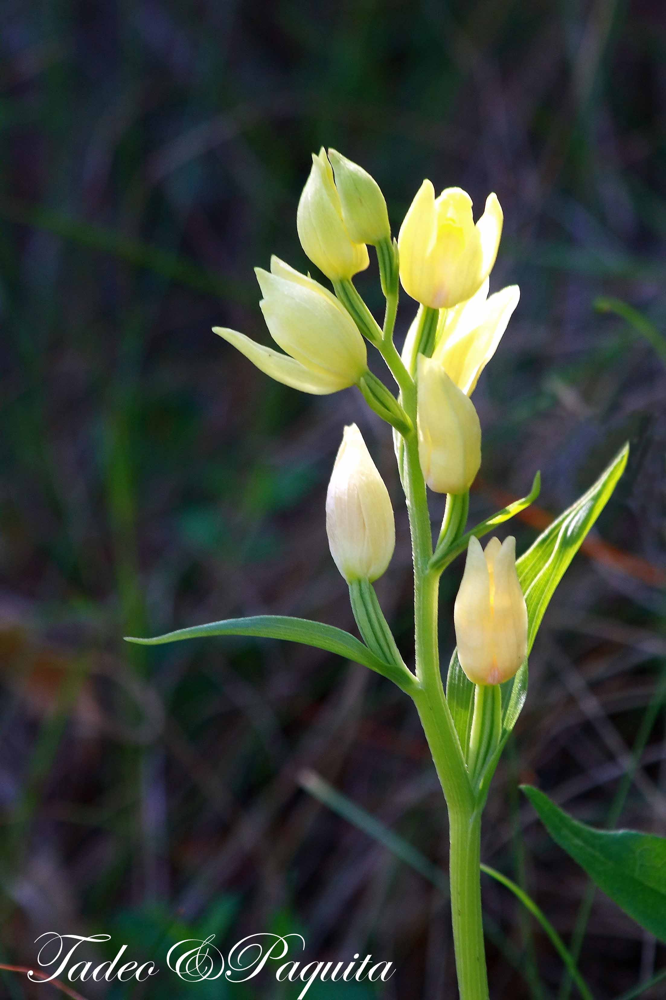
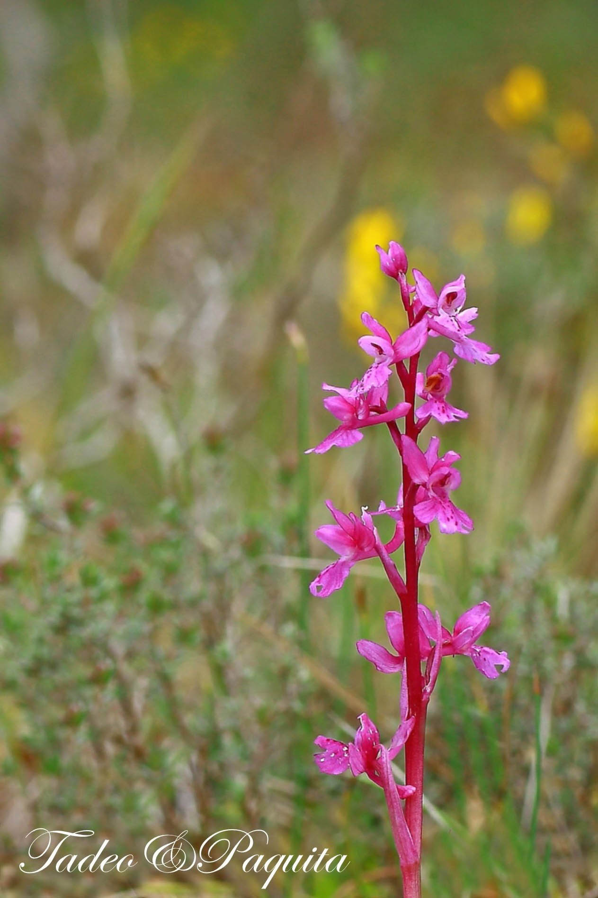

在 Cinctorres 市镇 l'Arribassada 一带的梯田上，土地已经五十年没有耕种了。得益于这一带的小气候，在塞伦布雷斯干河（Rambla Celumbres）岸边，在许多其他特有的开花植物之间，我找到了八种兰花。有些可能不如它们的热带同类艳丽，却可能更加纤巧、含蓄。

兰花是对环境要求很高的植物，是植物界演化的一个范例。它们的构造适应于靠昆虫授粉。某些兰花（眉兰属，*Ophrys*）是陷阱花：它们在气味、触感和颜色上都非常像蜜蜂，当雄蜂试图与花交配时，授粉就完成了。兰花的种子小得像粉尘，只有和某些特殊的真菌结合、由真菌提供养分时才能发芽；反过来，等植株长大以后，真菌会继续寄居在它的根里，做它的客人。

