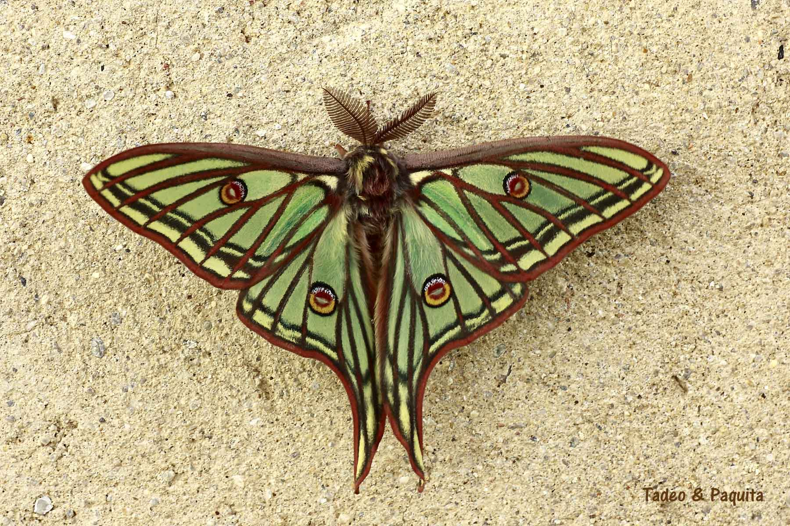
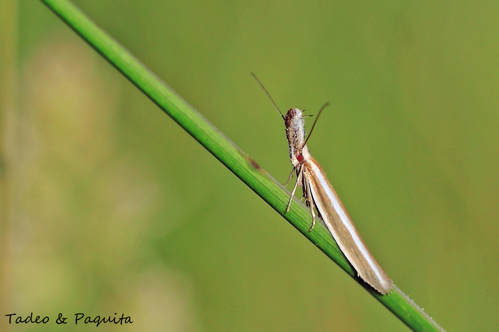
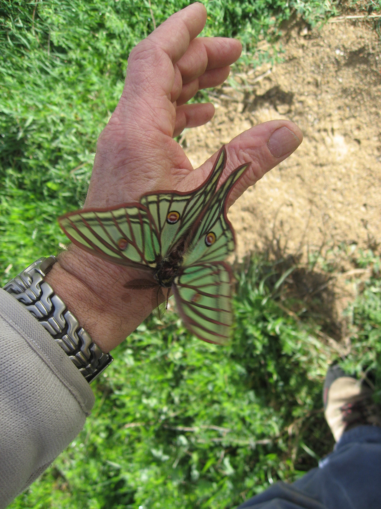
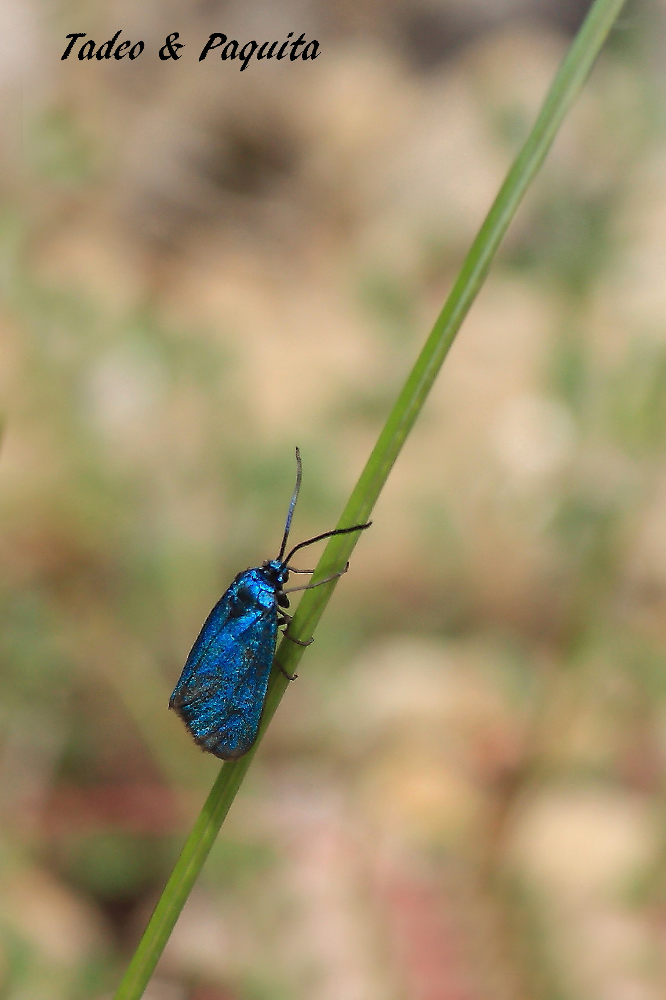
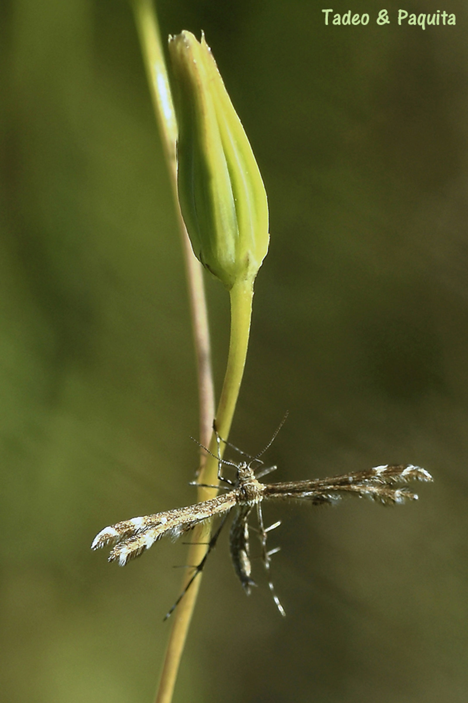
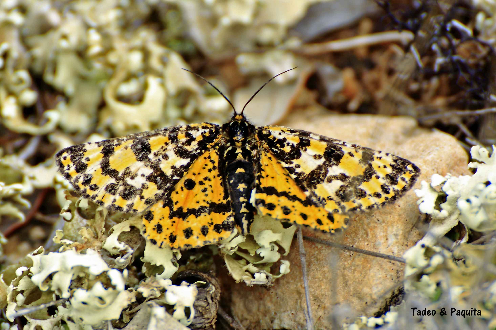
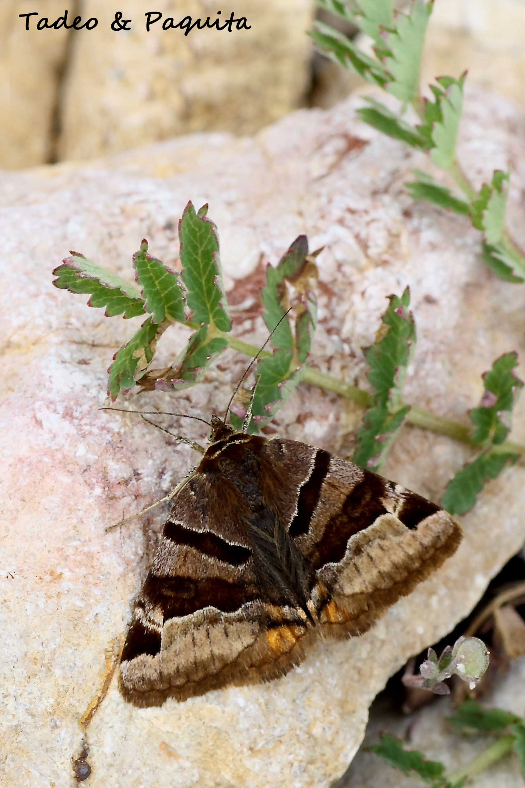
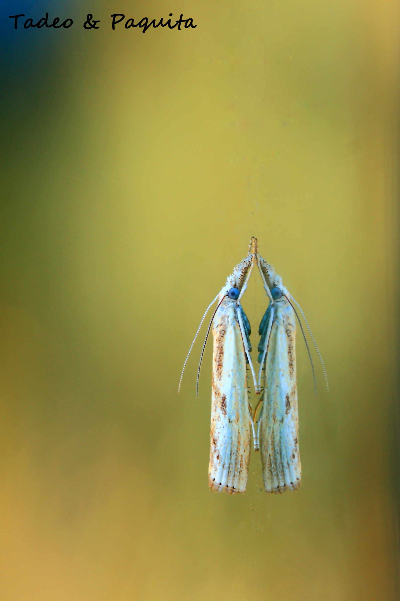
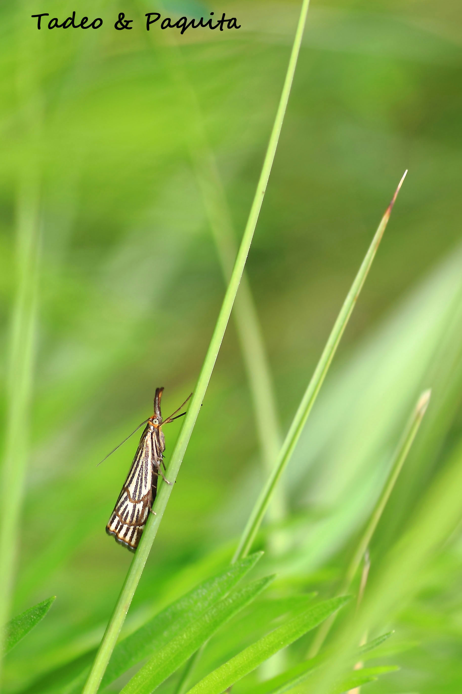

最近几场雨之后，田埂上和荒地里的草长得很高；得小心走路，因为到处都是植物，还有松树和刺柏的幼苗。早上还能给蝴蝶拍上几张照片，可太阳一晒，就很难了。

蛾的触角有各种类型，但从来不像昼行蝴蝶那样呈棒状。夜行的蛾除了习性之外，身体更粗壮，后翅内缘还有一个钩状的延伸。

## Graellsia isabellae

我看到这只蛾的时候是早上七点，在 dels Bassis 泉（Cinctorres）。雨刚停，它和颜色相同的植物混在一起。我的弟弟把它拿起来，我在他手上拍了好几张照片，可以看出它的大小。渐渐地，随着皮肤感受到的热量，它开始动了，太阳照了一小会儿，它便飞了起来。它的美丽和完美令人惊叹。照片里的这只是雄性；雌性的尾巴是圆的。

## Adscita statices

西班牙语也叫 *procris común*。这种醒目的蓝色蛾只出现在干燥的草地上，时间是七月和八月。

## Capperia britanniodactylus

这只有趣而鲜为人知的蛾，我费了不少功夫才认出来；我们以前在这一带没见过它。起初我以为是更为人熟知的“五羽毛蛾”（*penacho de cinco plumas*），但两者毫无关系，因为颜色不同。

## Eurranthis plummistaria

可以在胭脂栎丛和疏朗的松林里见到。相对于身体，它的前翅很大，靠着颜色伪装得很好。我们只拍到了一张，因为在此之前我们并不认识它。

## 其他的蛾

