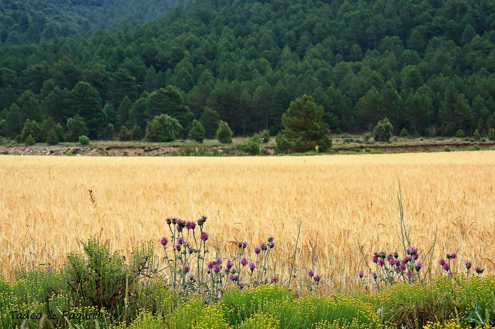
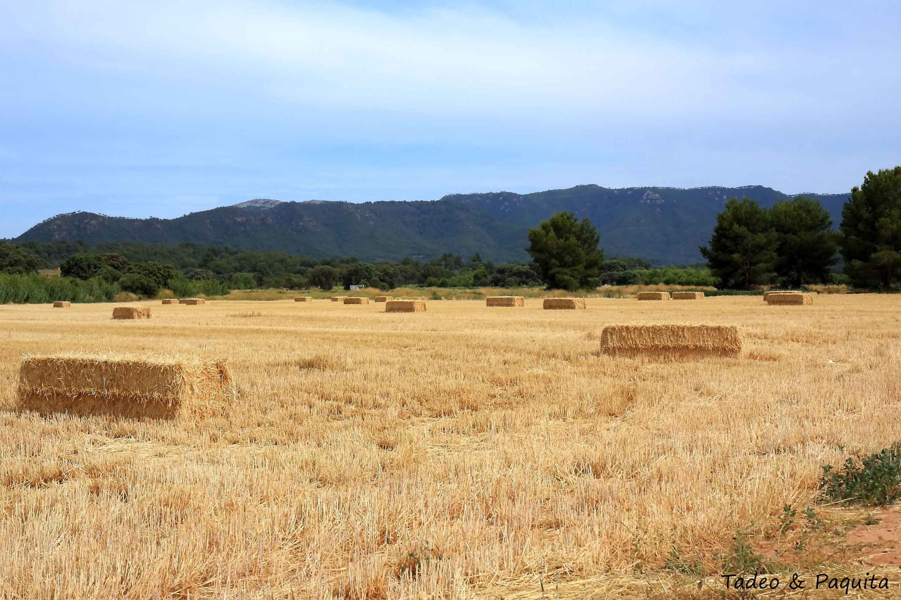
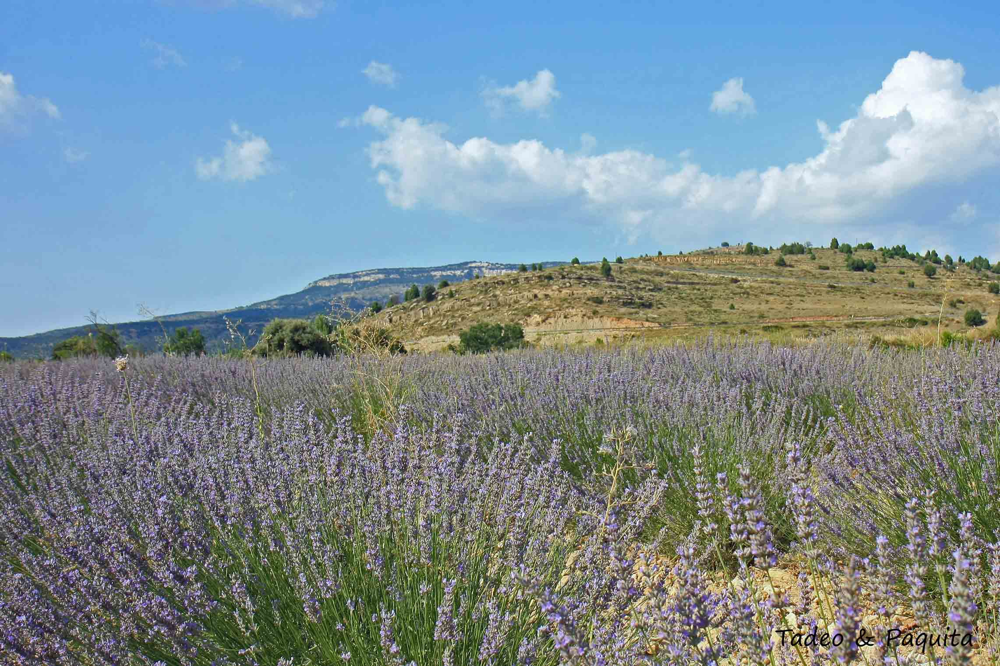
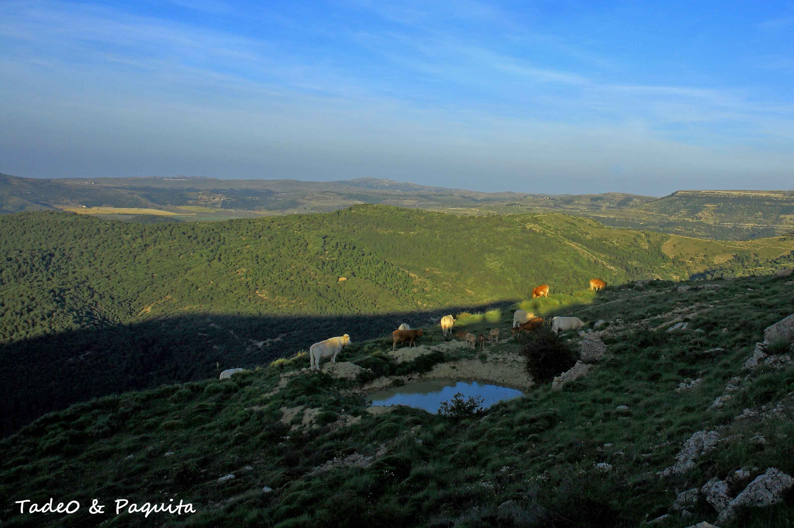
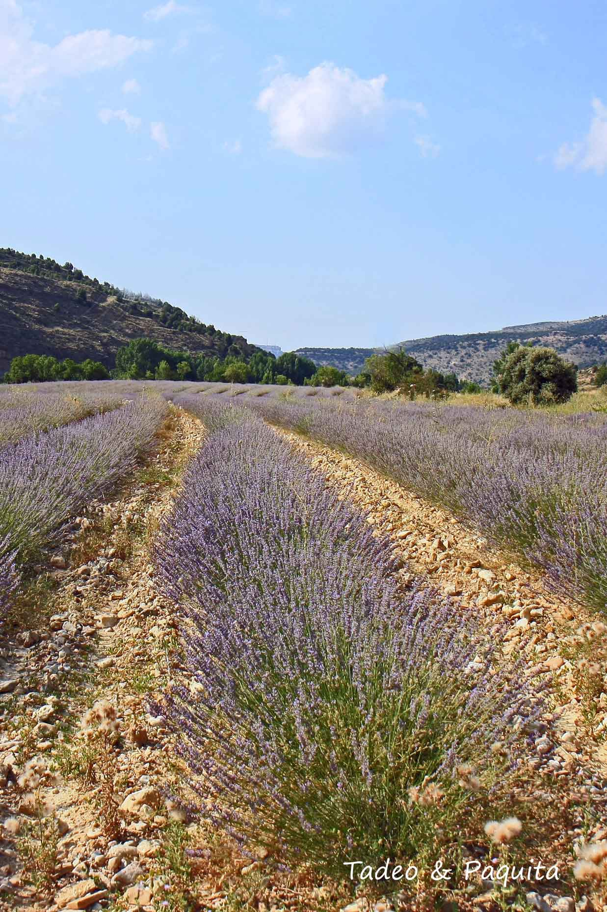
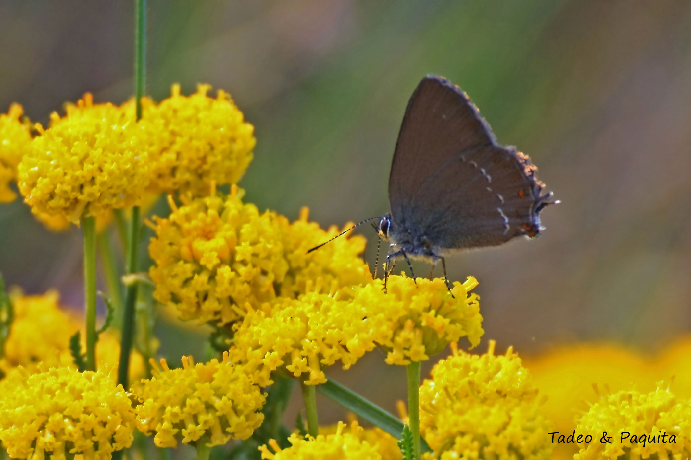
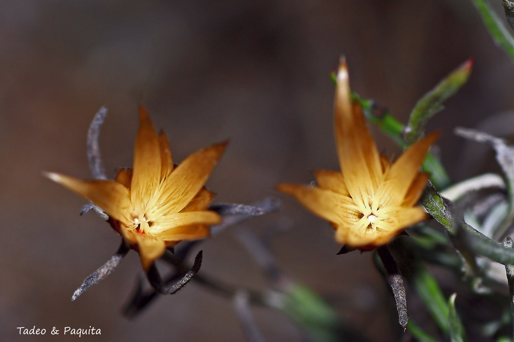
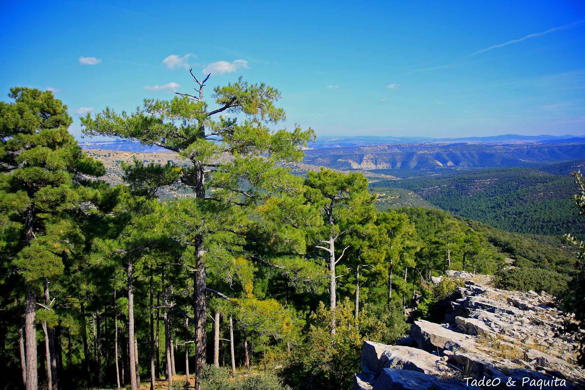

从天文学上讲，夏天这个季节始于夏至——今年是 2015 年 6 月 21 日——终于秋分。

对许多文化来说，夏至不只是庆祝或祈祷的借口，而是关乎生存的大事。它与农业相连，是收获已经到达顶点的提醒。

这个地区过去和现在都以种谷物为主。有了春天的雨水，谷物的收成或多或少会提前一些。如今收割的方式，和不久以前完全不同：那时候手工劳作十分辛苦，收割季从六月或七月开始。

虽然谷物——小麦、大麦和黑麦——依然重要、依然必需，但现在只种在大块的田里，方便联合收割机进出。

这里也收获各种芳香植物，提取的精油由一家合作社出售，以此帮扶这片土地的经济。这里的气候严酷，干旱频繁，只有夏天的雷雨例外，而雷雨有时还会造成破坏。

