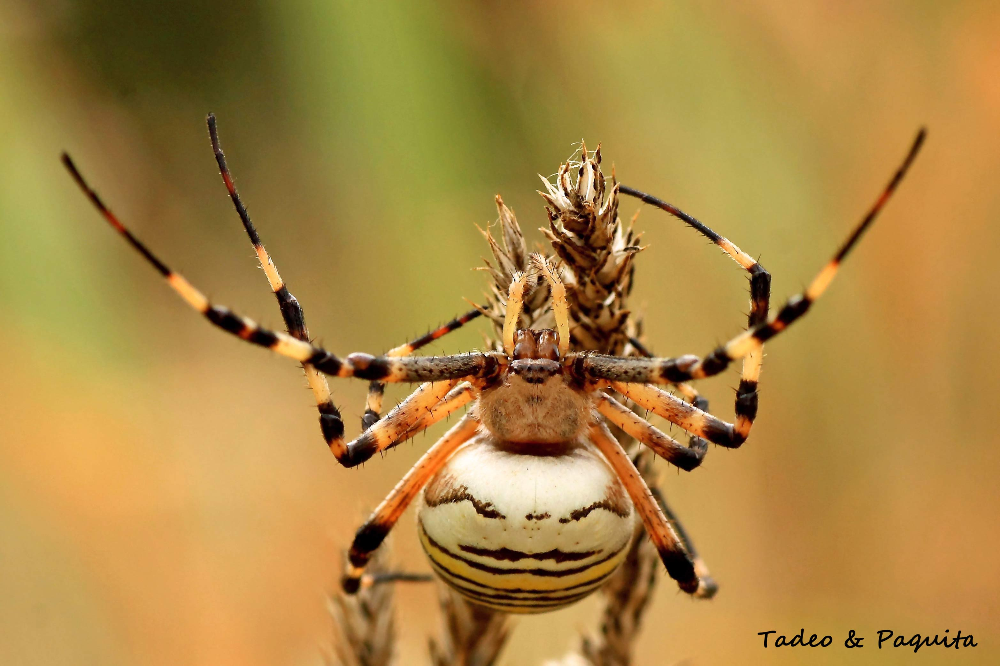
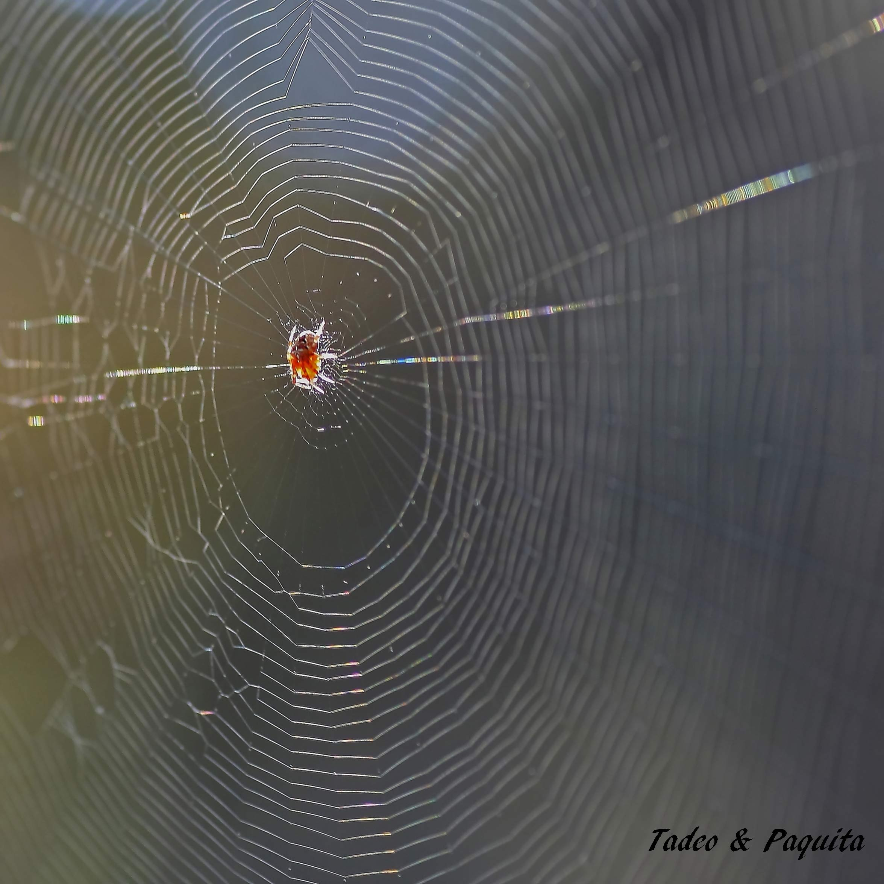
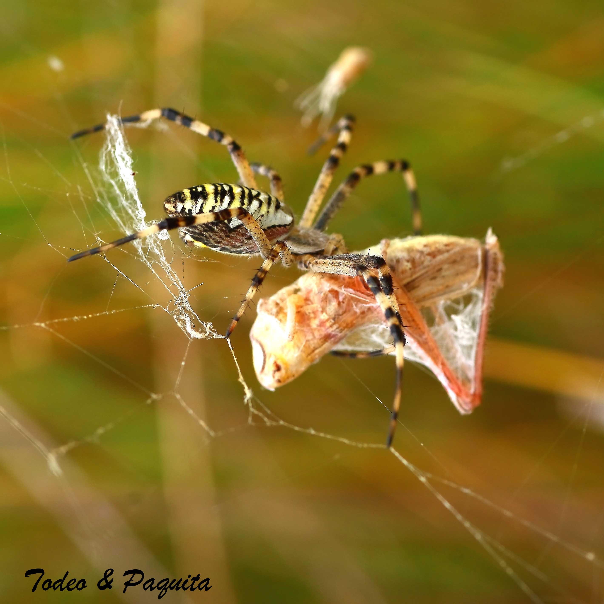
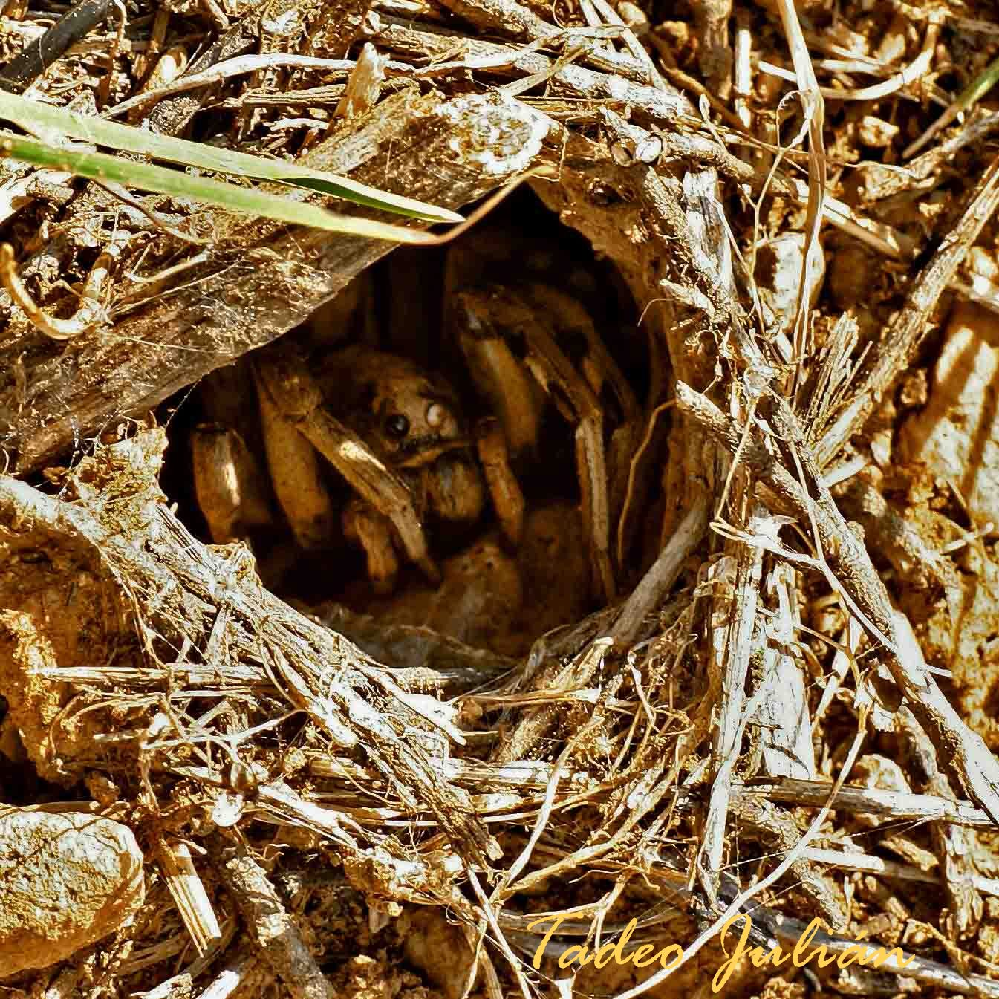
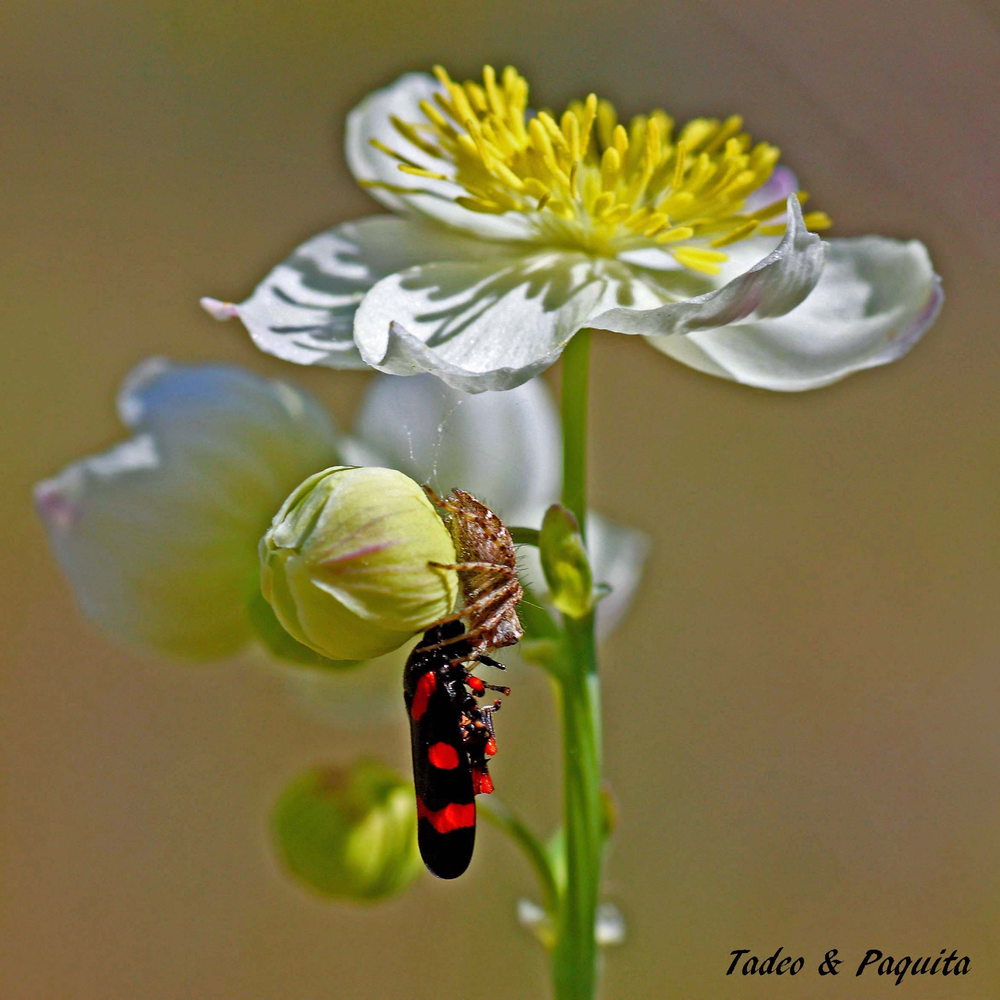
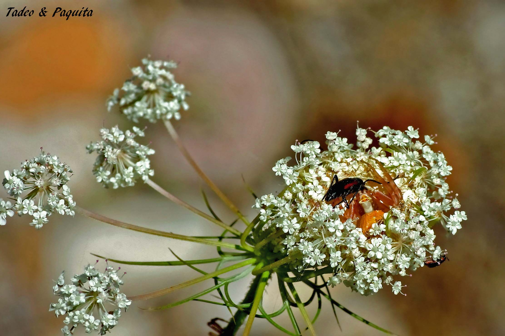

**Arácnidos.** 

Las arañas son artrópodos terrestres, depredadores, comen varias especies de artrópodos, por lo general más pequeños que ellas mismas, grillos,  moscas, abejas,  chapulines (saltamontes)  polillas y  mariposas. Capturan su presa al acecho, por medio de cepos o tela de araña, incluso por el salto. La  producción de seda forma parte de la vida normal de las arañas.

Poseen hileras en los segmentos ventrales 10 y 11, hileras que son patas especializadas y varios tipos de glándulas que segregan distintos hilos de seda. La glándula mayor es la que fabrica la seda llamada de seguridad para tejer todo el entramado. La tela de araña es un prodigio de ingeniería. Fabrican hilos de la misma calidad pero distinto tamaño en función de su peso,  forman hilos en forma de paracaídas que les sirve de transporte aéreo para desplazarse y también para encerrar a sus presas.

Algunas arañas tienen ocho ojos,  aunque la mayoría no puede ver muy bien con ellos. Las arañas tejedoras son casi ciegas. Se guían sobre todo, por el tacto y el olfato.

**Araña tigre.**

la araña tigre , fabrica telas geométricas para la captura de sus presas,  donde las guarda envueltas.  Como muestra  el saltamontes que se puso en su camino.

**Tarántula o araña lobo.**

")

Cuando se  ve de cerca, su cara parece de lobo, por eso su nombre y también  por su forma de cazar, no teje  para atrapa a sus presas, lo hace agazapada en la entrada de su gruta en terreno pedregoso.  Su gruta es de forma esférica y vertical como se ve en la foto, envuelta con ramas y vegetación unida con seda, que sobresale del suelo como una ared, así cuando llueve, no entra agua. Lo mismo la hembra que el macho utilizan la cueva para hibernar.

**Oxyopes lineatus. La araña lince**

Caza a sus presas corriendo y saltando. Su vista es poderosa, tiene seis ojos .En la fotografía se ve como sujeta con las pinzas que tiene en sus patas,   a una cigarra   mayor que ella (Cercopis intermedia).

**Misumena vatia.** Su cuerpo parece un cangrejo Ha preparado la trampa para atrapar a sus víctimas de manera sorprendente. Esta camuflada en el centro de una flor que ella mismo a compuesto uniendo varias  pequeñas flores y  está en el medio como si fuera los estambres, adopta el color de la flor por lo que se camufla  perfectamente  esperando que llegue algún insecto,  tiene los dos pares de patas delanteras mas grandes, y con su mandíbula inyecta el veneno con la que paraliza a sus presas.

