**Scabiosa.** Resiste a las plagas . Pueden ser de color azul ,rojo ,lila, violeta y rosa.

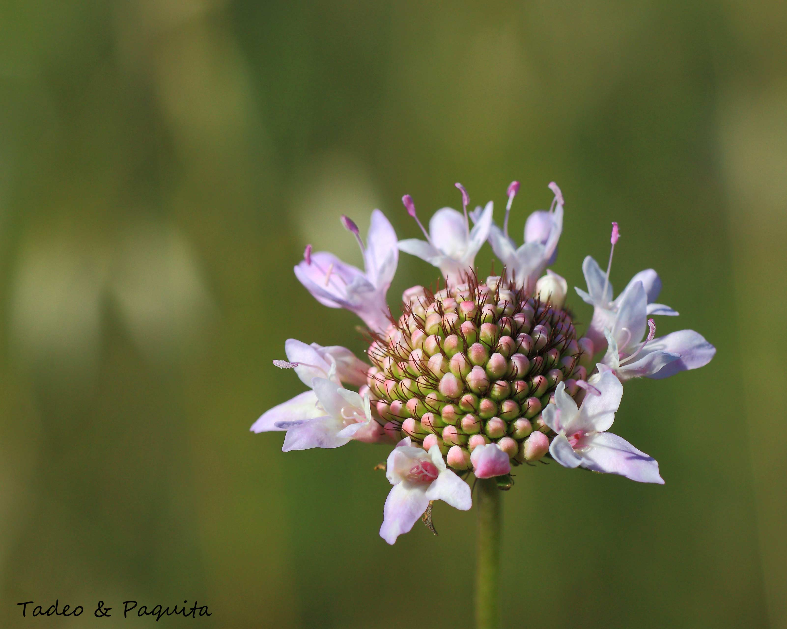

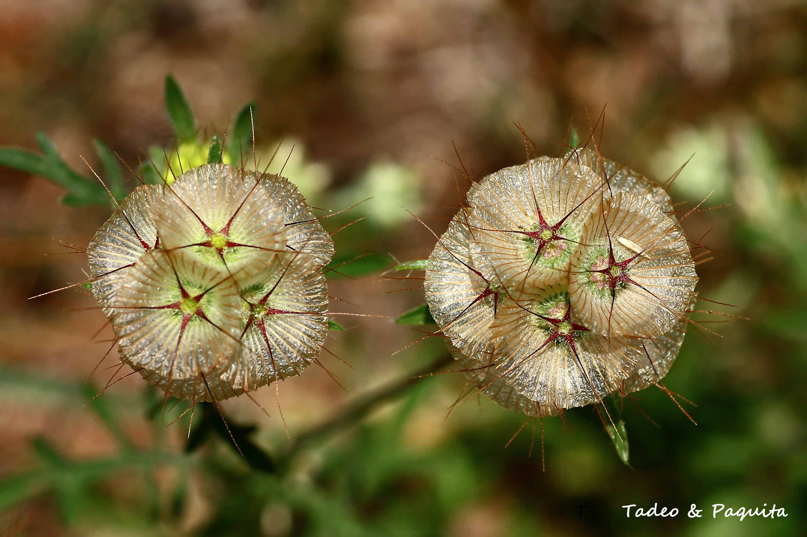

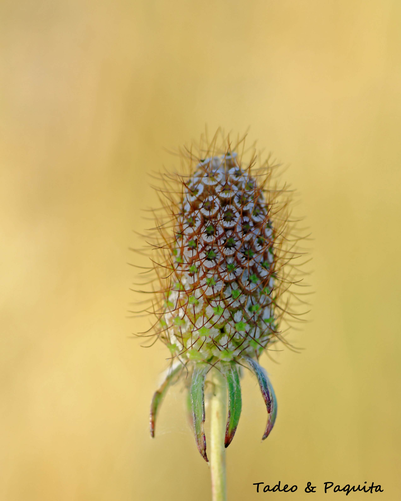

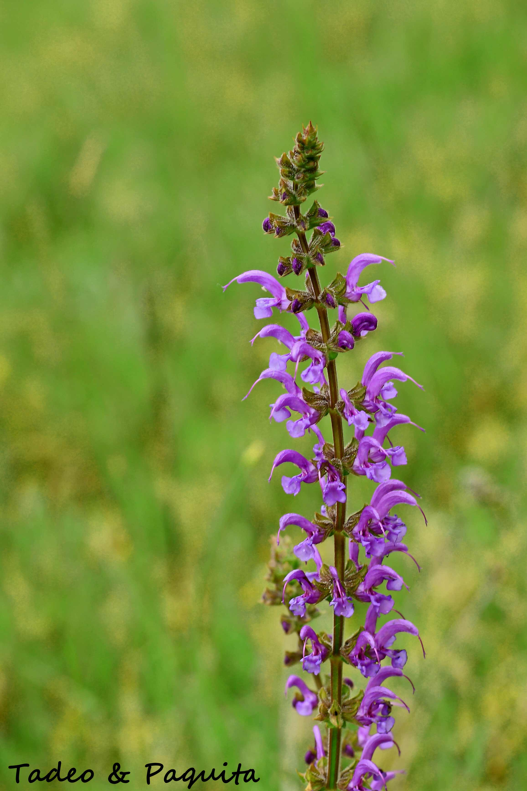

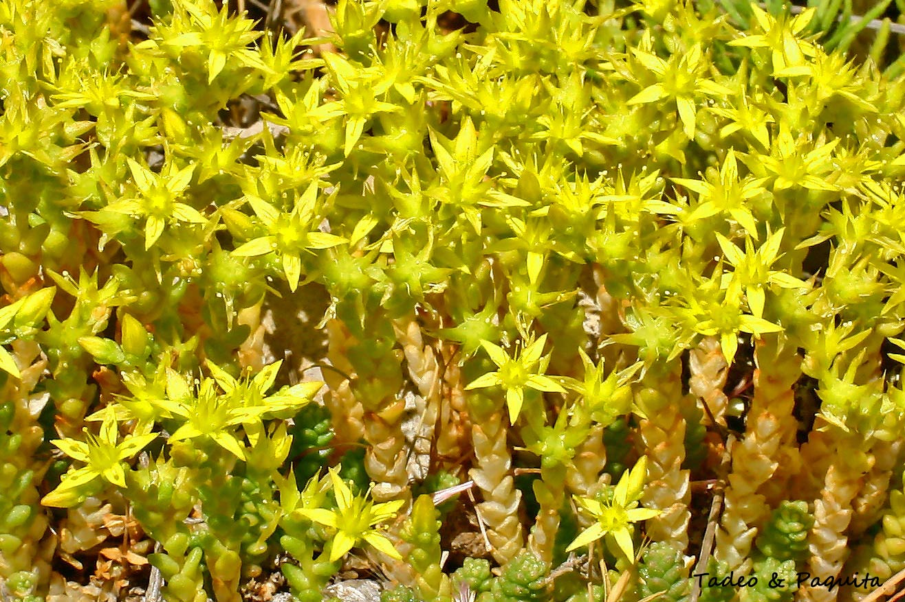

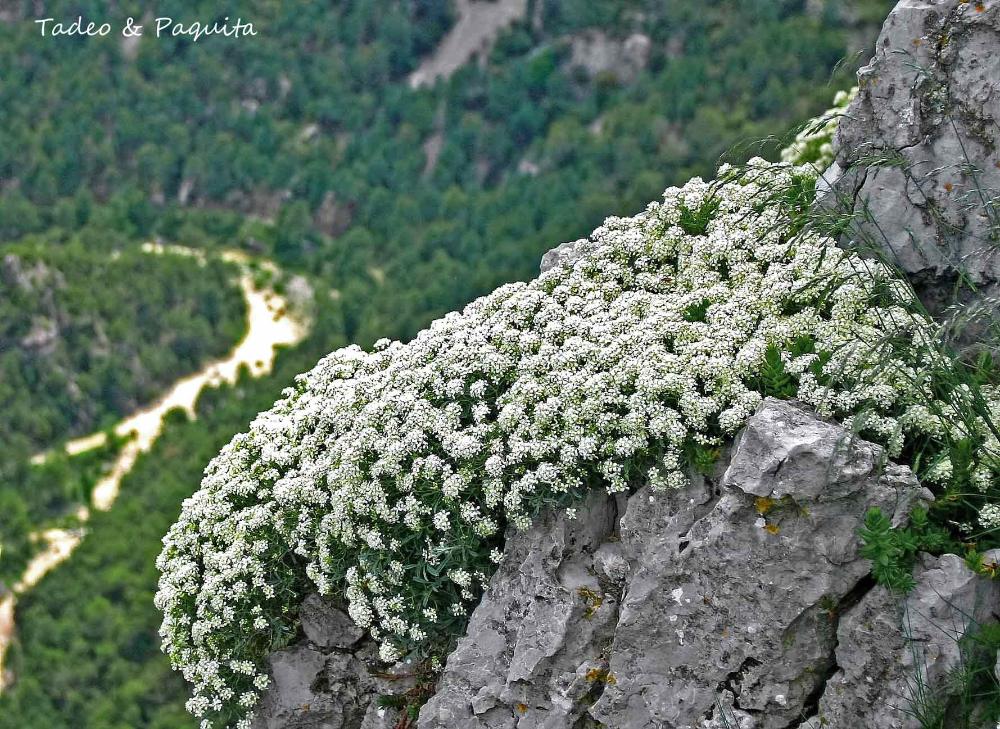

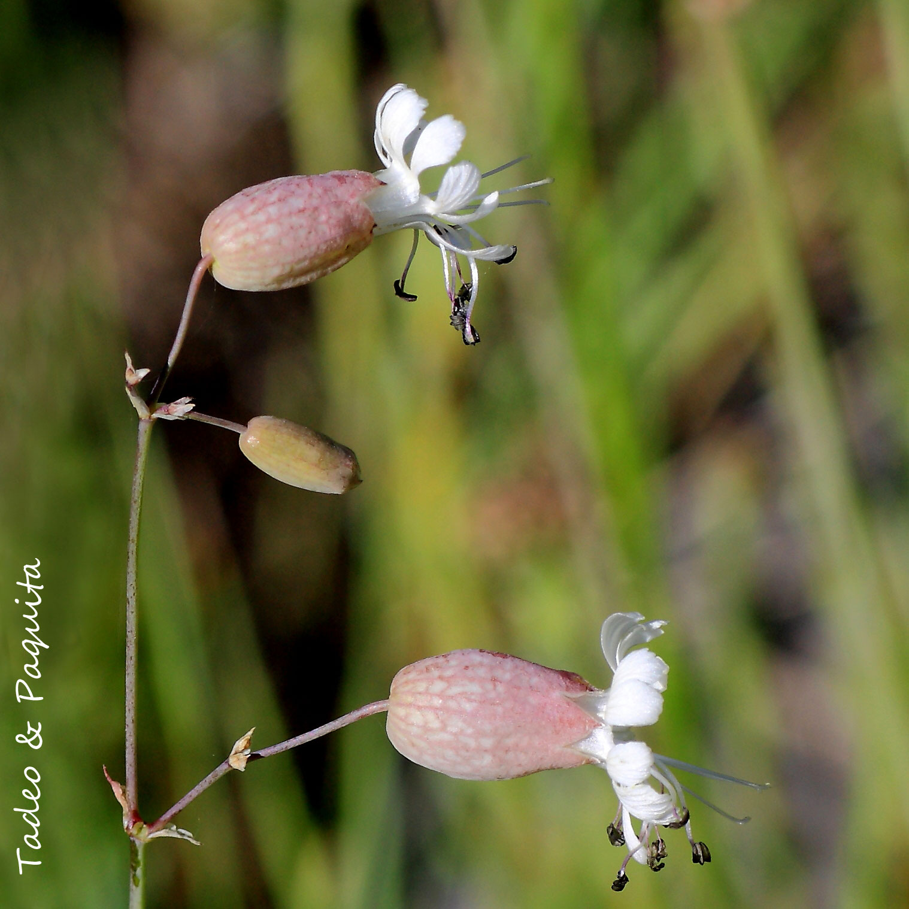

**Silene**  Saliva,baba.Alude s la viscosidad de alguna especie

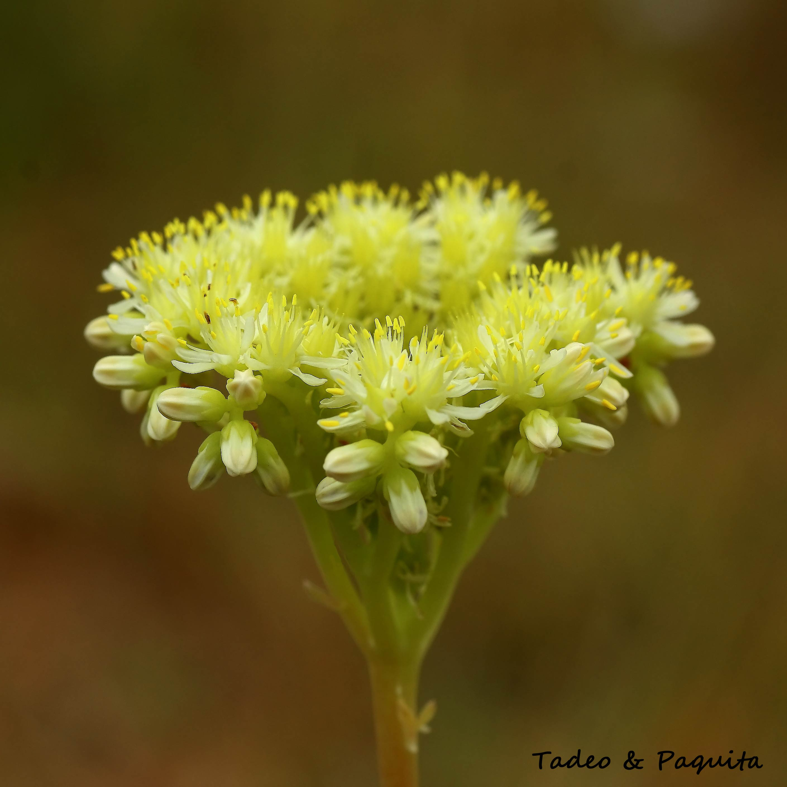

**Tragopodón**. Barba cabruna , barbón.

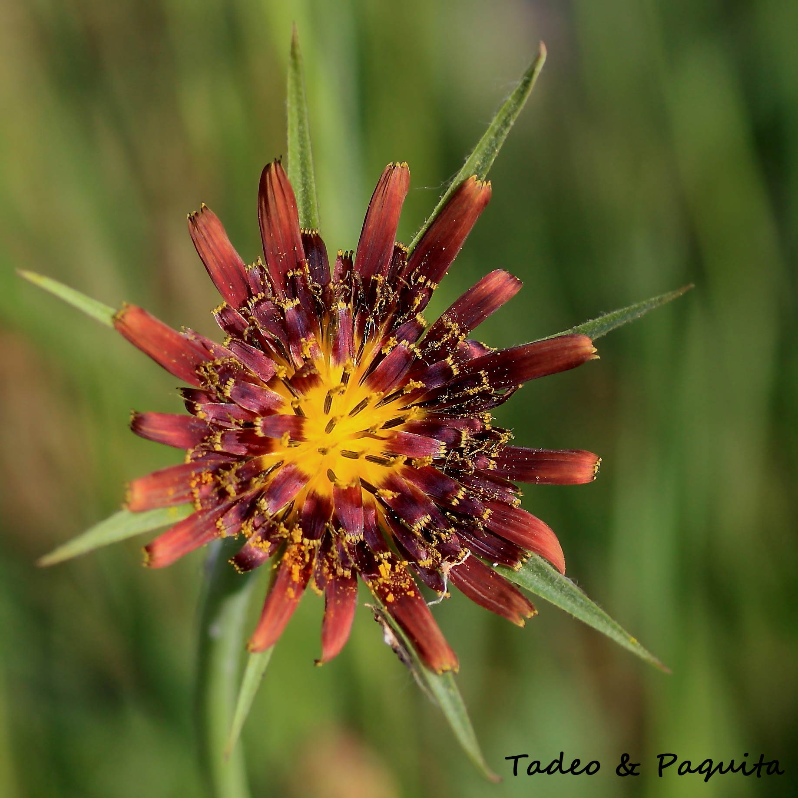

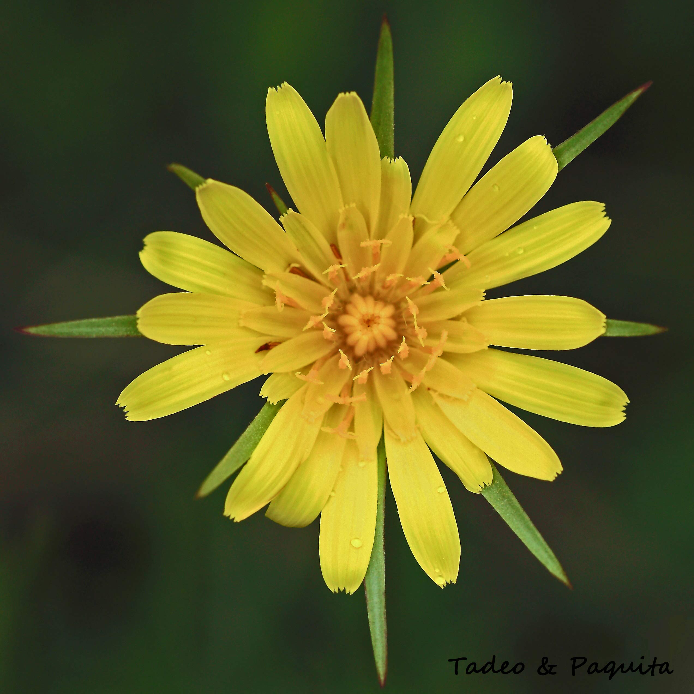

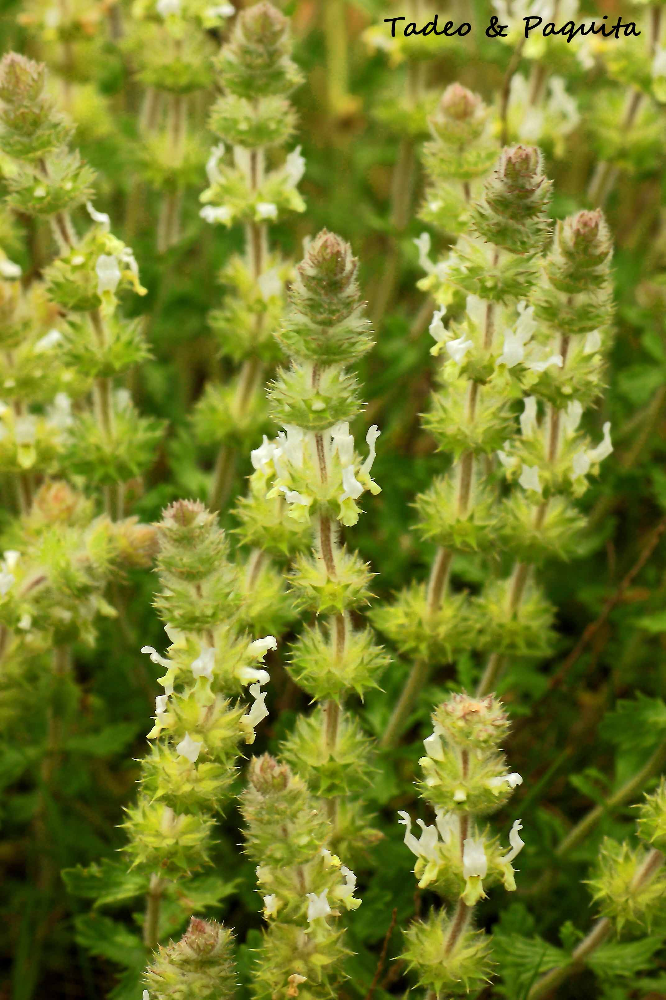

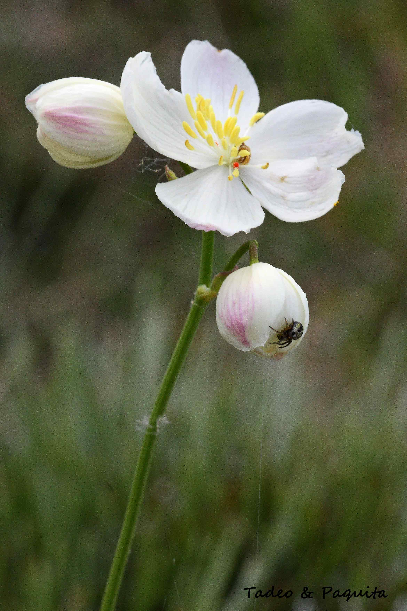
