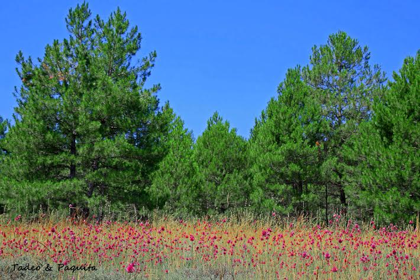

Por muy hermoso que sea un árbol o un arbusto también lo es su flor. Su función, es la de reproducirse y formar nuevas plantas,  siendo polinizadas por varios tipos de insectos pájaros y dispersadas por el viento.

Las distintas flore seran agrupadas por orden alfabètico, en diferentes entradas.

**Familias de las flores que componen el blog**

**Agavoideae**. Arboles, arbustos ,hierbas o plantas arrosetadas

.**Amarilidáceas.** Plantas herbáceas provistas de un bulbo.

**Aristolochiaceae.**  Hierbas y plantas leñosas, frecuentemente trepadoras

**Asfodelaceas.** Plantas y flores grasas. Sus coloridas flores son polinizadas por pájaros e insectos

 **Asteráceas** .Llamadas tambien Compuetas. Plantas o arbustos de hojas dispuestas en roseta basal, opuestas o alternas. Las flores son pequeñas y una de las familias con plantas mas grande y variadas.

Entre ellas se encuentran plantas comestibles( lechuca escarola) y medicinal (Manzanilla arnica)otras tambien en jardineria.

**Boraginaceae.** Plantas mayoritariamente herbáceas, sueles estar cubiertas de pelos rígidos y punzantes y cinco  membranas que forman  pliegues hacia su interior como si de dedos de un guante se tratara.

**Caprifoliacea.** Generalmente son arbustos o pequeños  ärboles, frecuentemente lianar  tara vez son hierbas.

**Cariofilaceas** Herbaceas, tallos erectos o colgantes,persentan nudos engrosados con hojas compuestas  simples y enteras.

**Cistáceas.**  Herbáceas o arbustos perennes tambien  anuales, Con hojas compuestas y algus veces simples. Sus flores en cimas o racimos regulares o hermafroditas.

_**Convolvulaceae**_, la familia de la campánulas o gloria de la mañana, tambien correguelas . la mayoría son plantas trepadoras

**Euphorbiaceae.**  Familia de las mas variables y distribuida por todo el mundo.

**Fabaceas**. Reune arboles, arbustos y hierbas , perennes o anuales.

**Gencianáceas.**  Plantas herbáceas, anuales y perennes, y algunos arbustos, con frecuencia rizomatosos. Hojas opuestas por lo general, sin estípulas. Flores bisexuales, regulares, dispuestas en cimas

**Geraniaceae.** Herbaceas o arbustivas. Algunas especie puede ser aromatica.

**Iridaceae.** Mayoritariamente plantas herbaceas, normalmente con rizomas y organoscomo bulbos y cormos. Flores bisexuales.

**Ranunculácea**. Plantas herbaceas tallos muy ramificados y a veces volubles

**Rosaceas.** Plantas generalmente perennes, desde herbáceas a arbóreas. Hojas alternas

**Liliaceae** Plantas peremnes. Se caracterizan por una gran heterogeneidad de formas, a veces herbaceas provistas de vulvos, o rizomas.

**Plantaginaceae**. Conocida por sus especies ornamentales.

**Primulaceae**. Plantas perennes que forman una roseta de hojas al final del invierno, y florecen al iniciarse el buen tiempo en primavera.

**Umbelíferas.**  Familia de plantas dicotiledóneas con los tallos estriados y vacíos por dentro, de hojas con pecíolos envainadores, flores sin sépalos y dispuestas en umbela.»La zanahoria, el apio y el perejil pertenecen a las umbelíferas»
