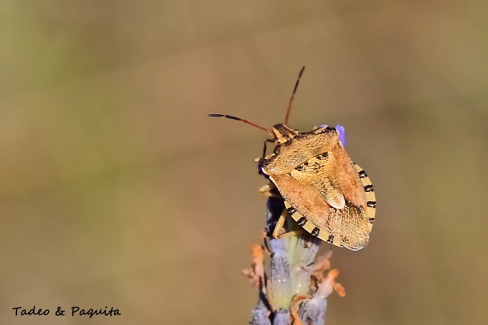
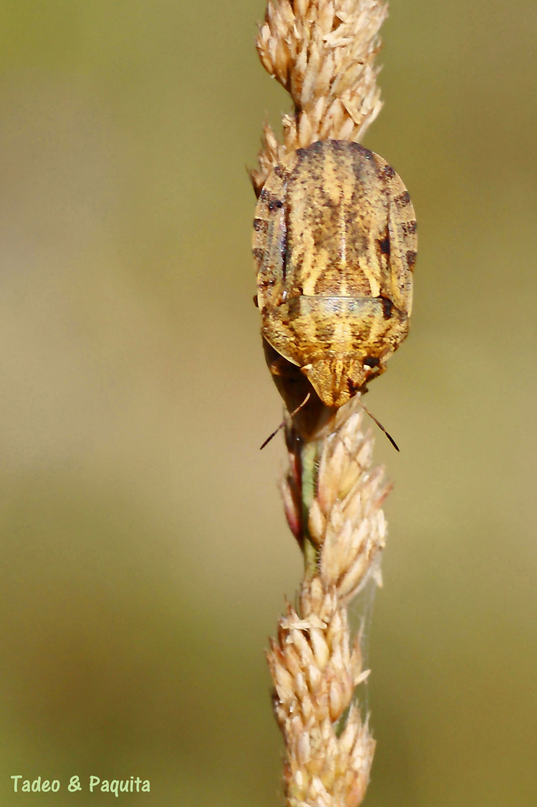
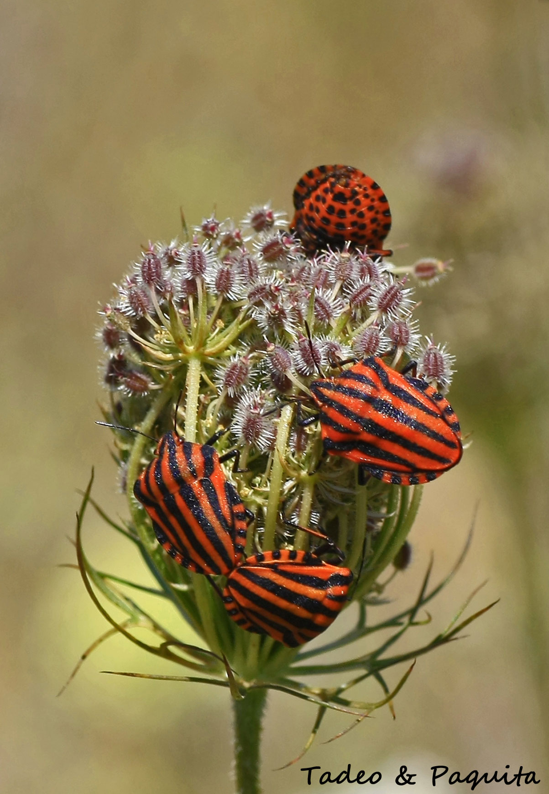
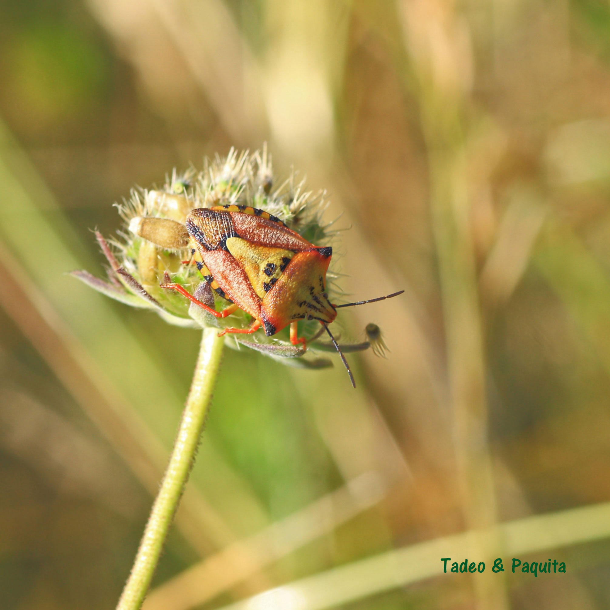
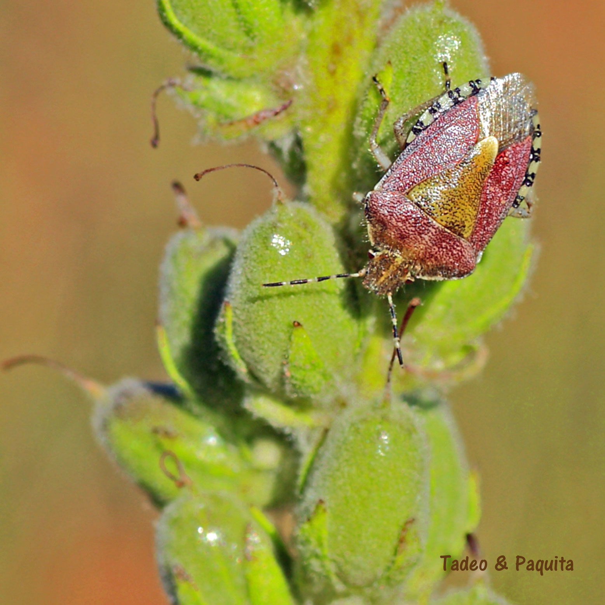
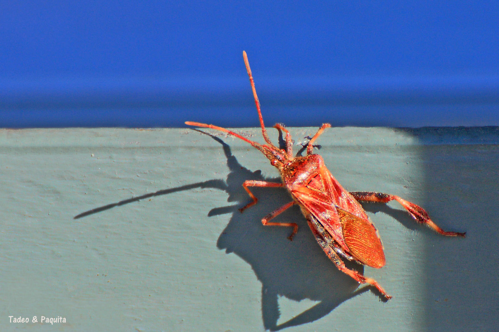

**Hemípteros**.

Los chinches de las plantas poseer alas que están divididas por una mitad basal dura y la otra mitad membranosa. Su aparato bucal es de tipo chupador con 4 estiletes que según las especies chupan savia o  sangre, como en el caso de chinches de cama que produce enfermedades.

Aunque hay especies depredadoras o parásitas, la mayoría se alimenta de las plantas gramosas, de las que sustraen la savia y por esta causa los vegetales se debilitan, tienen problemas de floración y de desarrollo de sus frutos.

Los chinches _(de pudó_) tienen pocos depredadores porque acumulan en su cuerpo el  compuesto de mal sabor que encuentran en las plantas lechosas que sustraen generalmente en el revés de las hojas. Su coloración  brillante anaranjada rojiza y negra  sirve  para  avisar que saben mal.

Graphosoma lineatum

**Leptoglossus occidenntalis**. He localizado este insecto como  especie invasora, Esta chinche  norteamericana, amenaza los pinos al destruir las semillas de sus piñas, su aparato bucal es un picador a través del cual con una especie de pajita succiona la savia de las piñas tiernas. Las grandes patas traseras aplastadas en forma de hoja que posee, son propias de las especies americanas. se encuentran en España por primera vez en 2004 en Gerona, avanzan rápido, ya casi  son más abundantes que las especies autóctonas.

