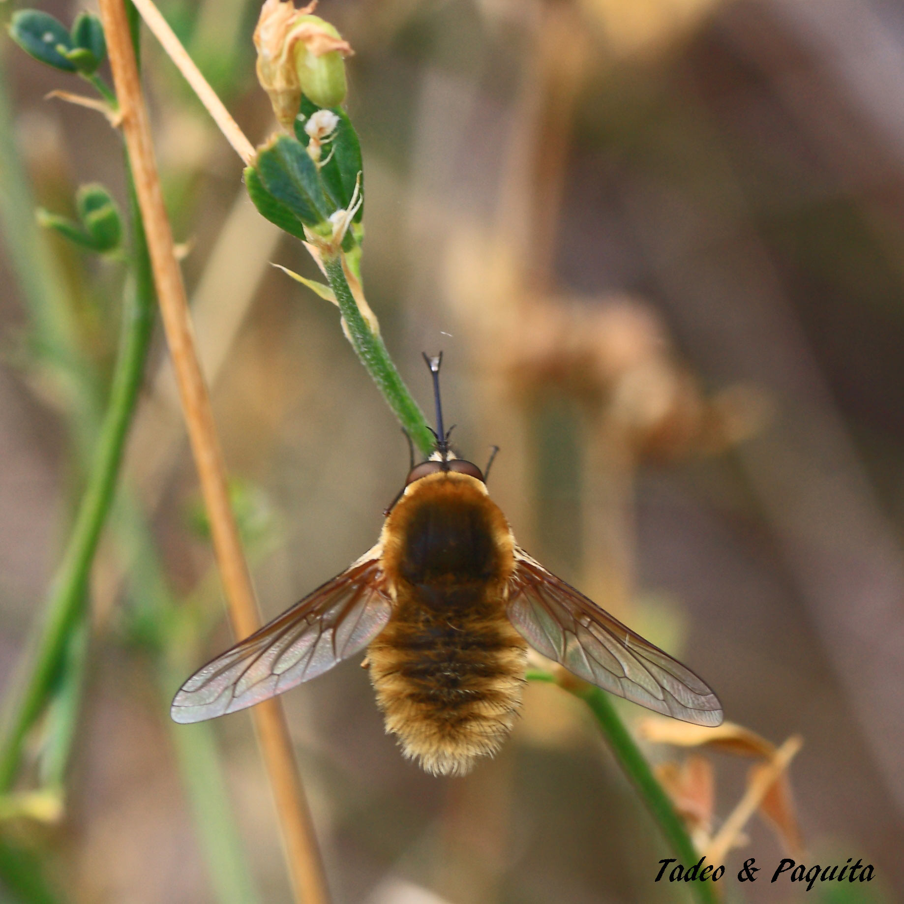
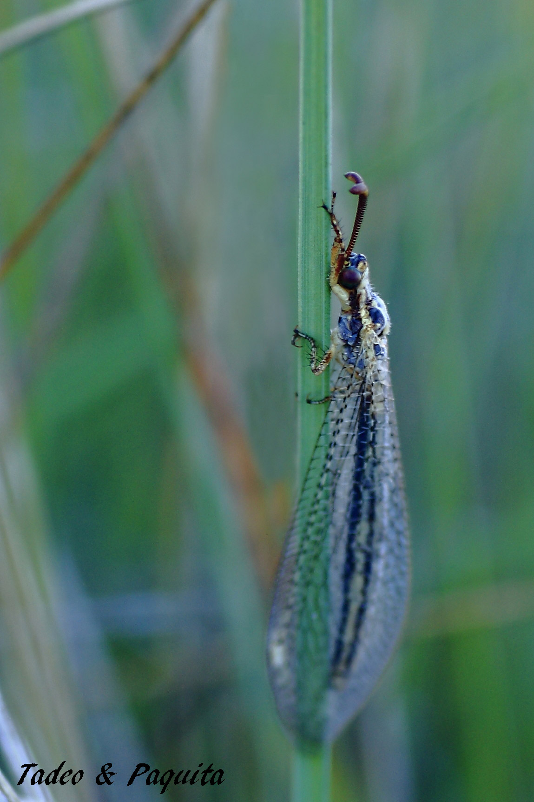

**Las   abejas, avispas y hormigas** llamadas himenópteros  son insectos sociables, y un admirable ejemplo de organización. La mayoría de las especies de este orden son muy útiles para el hombre, ya sea como polinizadores o controladores biológicos de plagas.

**Abeja**

La abeja de la miel,(abella) forma sociedades numerosas y duraderas. La sociedad está formada por la reina y sus hijas, que realizan todo el trabajo, hacen la colmena con cera, en cuyas celdas la reina va depositando los huevos. La fecundación de la reina tiene lugar una sola vez  y conserva la fertilidad toda su vida. La reina llega a poner hasta 2.000 huevos diarios a lo largo de su vida que dura de tres a cinco años. Las obreras son las que decidirán si en una celda el huevo originará un macho o zángano, o bien una obrera o hembra.  Algunos individuos son vigilantes  y protegen las colonias.

Cuando la colonia de abejas se encuentra superpoblada, una reina y algunas obreras forman un enjambre. Mientras las abejas exploradoras buscan un lugar para establecer la nueva colonia el enjambre descansa.

**Bombus**

Al grupo de las abejas pertenecen los abejorros Bombus, también alimentan a sus larvas con polen y miel, pero es una sociedad que no duda utilizar la agresión física por parte de la reina dominante.

**Avispas**

**Vespes**. Las sociedades de himenópteros  avispas,(vespes) están formadas por la madre y su descendencia todas hijas. Los machos aparecen cuando la sociedad está madura y solo tienen la función de fecundar a las hembras, tras lo cual ellos mueren. Son alimentados por las obreras.

Las  sociedades de las avispas  son temporales, deshaciéndose en otoño, antes machos y hembras asexuadas realizan el vuelo nupcial para la fecundación. Los machos mueren y las reinas pasa el invierno en letargo, hasta la primavera que se inicia un nuevo nido.

Las avispas alfareras,  son una subfamilia de las avispas comunes, es solitaria y depredadora,  se alimentan atacando a las arañas que tejen telarañas y orugas. Se llama así porque construye su nido con barro en forma de vasija o tubos de órgano que adhieren a tallos o muros. Se producen dos o tres generaciones al año.

**Hormigas**

**Formiges.** Las hormigas son especies sociables. El tamaño y la forma varían de una especie a otra. Una de sus características son las antenas articuladas y la protuberancia que poseen en el delgado pedículo que conecta el tórax con el abdomen. Su sociedad también está formada por la reina madre (aquí pueden haber varias reinas) y sus hijas forman nidos muy numerosos. Son animales terrestres, hacen sus nidos en el suelo y también en los troncos de los arboles. A diferencia de los otros himenópteros, las obreras carecen de alas.

**Hormigas leon. Neurópteros.**

Las llamadas hormigas león, son de la orden Neurópteros que significa (alas con nervios) deben su nombre   a que  sus presas mayoritariamente son hormigas. Las larvas tienen aspecto feroz, y la forma de atrapar a sus víctimas también lo es, viven enterradas  entre la arena en forma de embudo y  los pequeños insectos  que  caen en él  no pueden escapar y son atrapados por sus mandibúlas.

Adultas semejan libélulas, pero no tienen su capacidad de vuelo, y se distinguen por sus largas y robustas antenas
