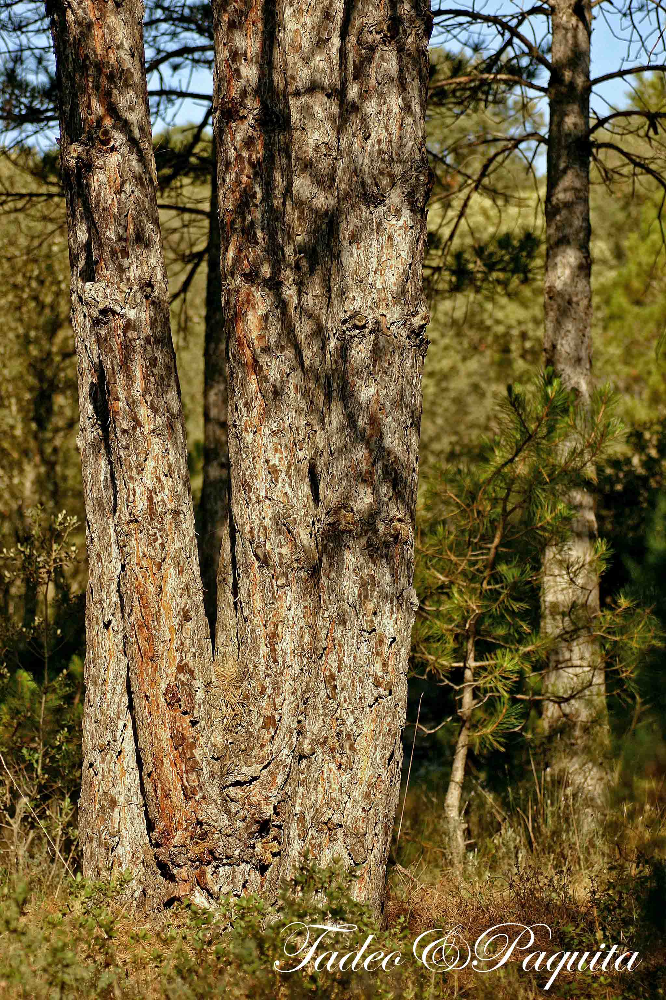

Los árboles, son los seres vivos que alcanzan la  edad

mas avanzada. Pueden ser árboles, arbustos y plantas trepadoras. El arce, vive disperso entre hayas y robles. Su madera es dura, salpicada de manchas, tiene las hojas sencillas, lobuladas y angulosas. No se ven  muchos por esta zona salvo cerca de los margenes de La Rambla Celumbres entre las rocas. Cuando llega el otoño, su color dorado de distintas tonalidades  de ocres, lo hacen inconfundible.

Aquí se aprecian en poco espacio,los arboles mas comunes de la zona. Sabinas enanas, a su lado el enebro, carrascas y al fondo los pinos

. **Pino albar.**

Por las dos márgenes de la Rambla Celumbres,  y a poca distancia unos de otros, se ven pinos laricios y pinos albar. Estos últimos, están en la falda de la Roca Parda y la Roca Roja, se puede caminar muy bien por el bosque, tiene ausencia de arbustos, están alineados, rectos, y en otoño se pueden encontrar hongos y setas.  Su corteza es grisácea y la parte superior marrón anaranjado.

**Pino laricio.**

La variedad del pino laricio  tiene la corteza blanquecina, la madera más densa y resistente, y más cantidad de resina. El ejemplar de la foto tiene cinco trocos que están unidos en la base (mirando fotografías he encontrado tres generaciones de mi familia posando al lado del árbol, desde la infancia siempre me ha parecido que esta igual) e incluso por la misma Rambla hay ejemplares de tres o dos trocos también unidos en la base, posiblemente el biotopo de la zona sea el motivo.

")

 **_Encina. Carrasca._**

Es un árbol corpulento, de crecimiento lento. Sus hojas son perennes, espinosas, también pueden ser dentadas o de margen liso. Las flores son de dos tipos masculinas y femeninas. Los dos tipos de flores están en el mismo árbol. Las flores masculinas producen el polen, las femeninas con su polinización se transforman en la bellota.  La madera de la encina es dura y nudosa, difícil de trabajar.  Antiguamente se utilizaba para obtener carbón. _La_ carrasca, tiene las hojas ovadas más anchas que la encina y las bellotas generalmente dulces.

")

La bellota es el fruto de la encina carrasca  y del roble. Está protegida por una caperuza o cúpula leñosa. Machacando su fruto se obtiene harina con la que algunos pueblos se alimentaban.

**Roble**

Sus hojas caducas son pequeñas  y coriáceas, cubiertas de densos pelos estrellados por la parte inferior, y al margen con pequeños dientes regulares y agudos. Se caracterizan  por sus flores amentos masculinos largos y péndulos y sus flores femeninas solitarias. Su fruto, es una bellota parecida a la de la encina pero con el cabillo que le une a la rama mucho más largo

Querqus faginea .El roble tiene mecanismos de defensa contra los parásitos.

**Las agallas** o abogallas son estructura o  crecimientos del tejido  de tipo tumoral, que produce la planta ante un parásito, aislándolo así del resto de la planta. Las agallas además suministran alimento y refugio a los parásitos, generalmente larvas de insectos a los que les permite vivir en los periodos de caída de las hojas en  otoño e invierno.

**Quejigo.**

Es un arbusto, aunque en condiciones óptimas, puede alcanzar bastante  altura. Su corteza es muy rugosa y de color pardo, crecen muy juntos formando una maraña vegetal a veces difícil de cruzar. Es de tipo semiperennifolio con hojas marcescentes, es decir, las antiguas se mantienen en las ramas hasta la aparición de las nuevas en primavera. Las hojas tienen forma elíptica con borde dentado y siempre son brillantes por la cara y grisáceas por el revés. Las bellotas maduran en septiembre y se disponen en grupos.

**Avellano**

**Avellaner**. Es un arbusto en que las flores nacen antes que las hojas. En el mismo árbol, separadas, las flores masculinas y femeninas. Su hoja es caduca, alterna, simple, no lobulada y dentada. Su fruto forma parte de los cuatro mendicantes, junto con los higos, las almendras, y uvas pasas. Se llaman así porque las cuatro órdenes; franciscanos, agustinos, dominicos y carmelitas, solo aceptan en ofrenda estos frutos.

El fruto es un tipo de almendra que se consume fresca ,tostada y para la elaboración de pastas y turrones..

 **Olmo.**

**Om**.  Es un árbol de hoja caduca, hojas relativamente pequeñas y recias, de color verde oscuras. Las flores son rojizas y están reunidas en pequeños grupos. Los frutos están constituidos por una semilla rodeada de un ala delgada y membranosa de color verde claro. El olmo depende del viento para la polinización y para la dispersión de los frutos.  Crecen en los márgenes de las ramblas y ríos, y normalmente  hace brisa, sus hojas se mueven con un inconfundible susurro.

 **Serbal**

**Serves**_._ El serbal tiene hojas dentadas, de elegante contorno, vive sobre todo en los robledales de la montaña media. Árbol muy común en las masías. Sus frutos son las serbas redondeadas, harinosas y muy ásperas pero comestibles si se dejan sobremadurar extendidos sobre cañizos. Es un fruto astringente.

