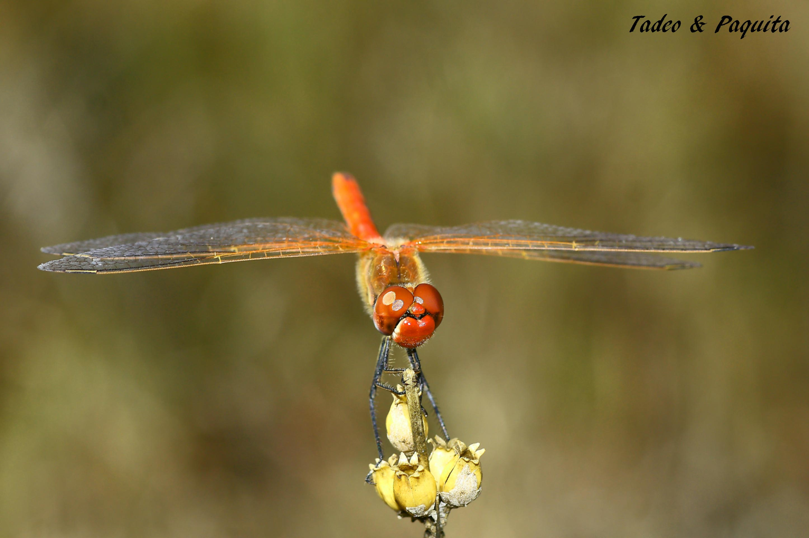
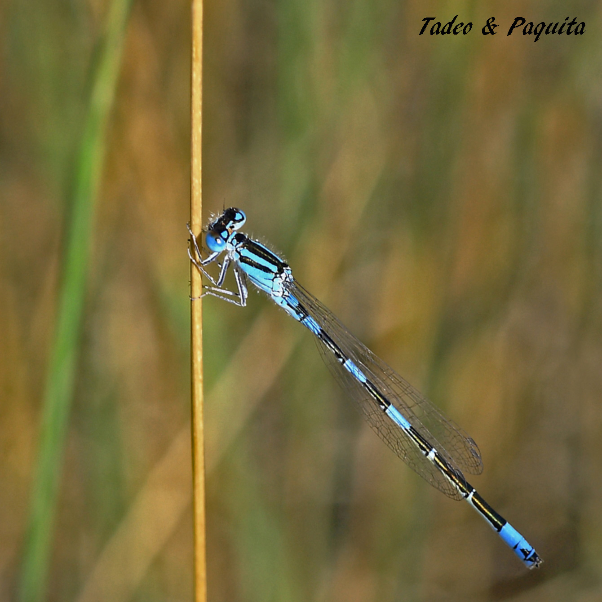
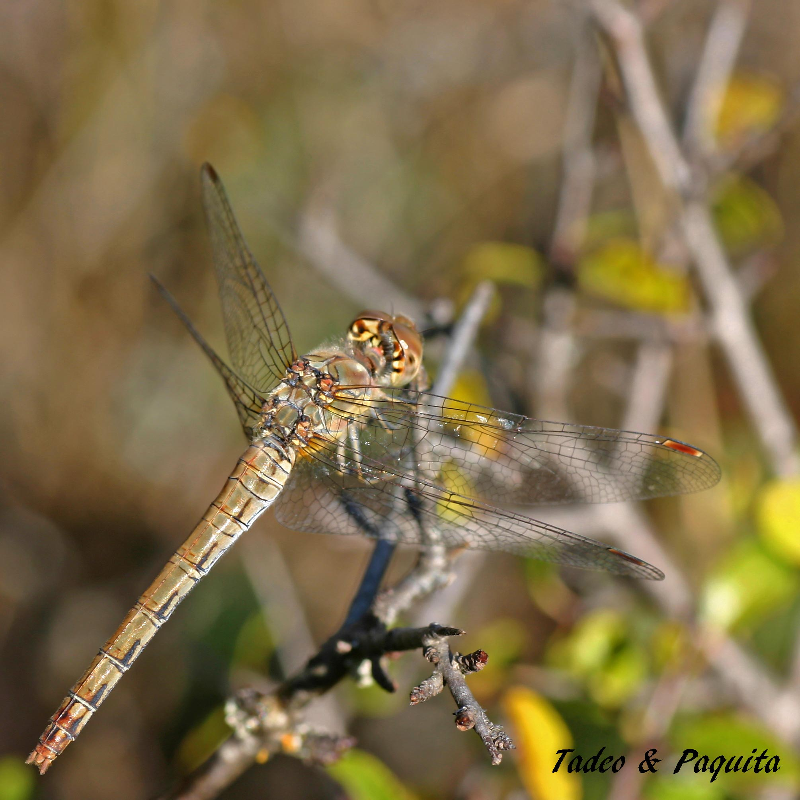
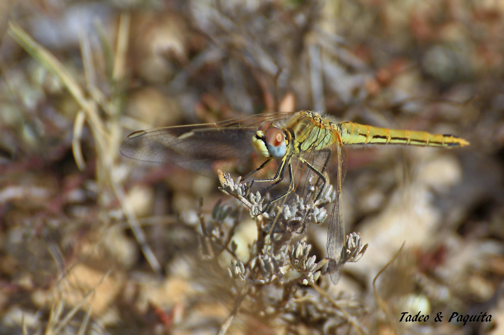
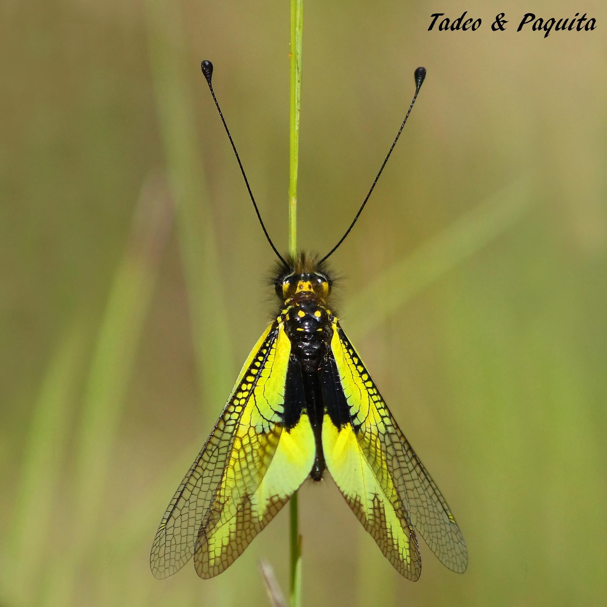
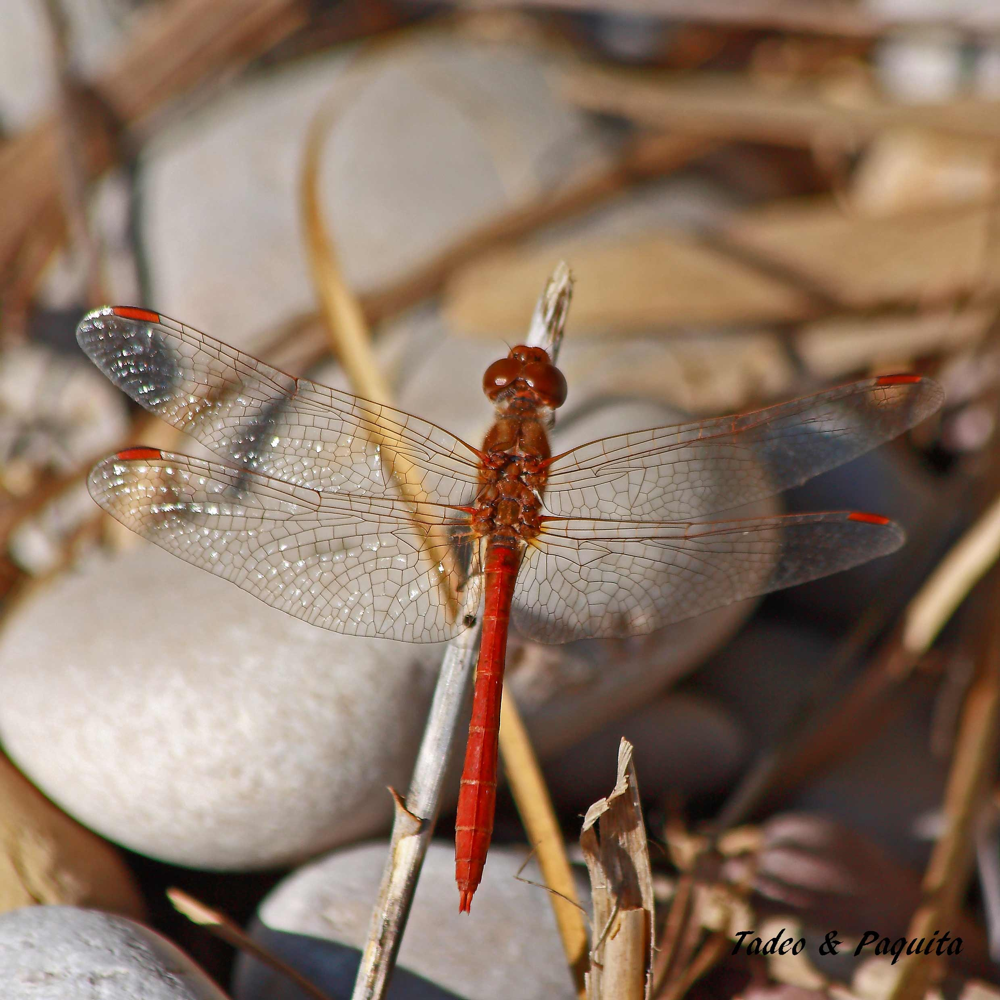
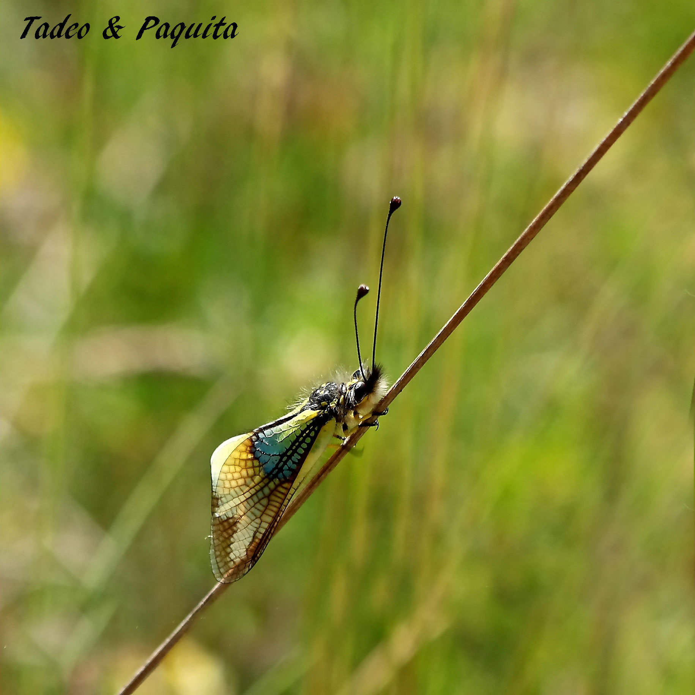
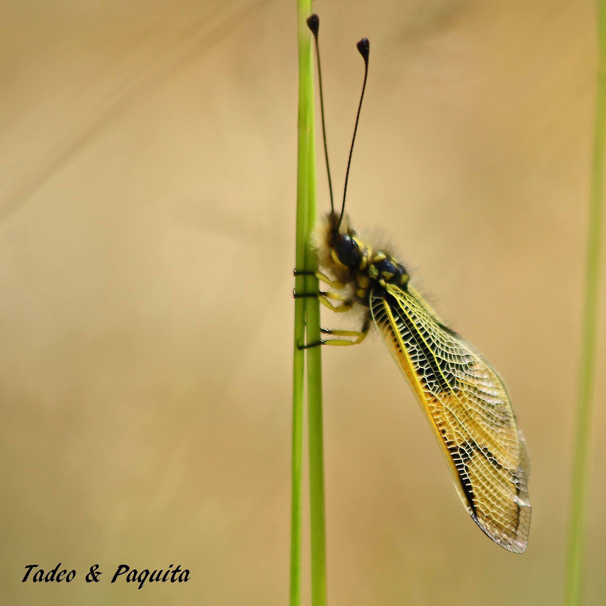

Las libelulas,son insectos que en época estival,nos obsequian con sus esplendidos reflejos metálicos de sus cuerpos y la delicadeza de las alas iridiscentes. Su hábitat natural se encuentra en las cercanías de los lagos, ríos, charcos y tierras pantanosas, sus larvas y  ninfas son acuáticos. Son grandes pero a causa de su vuelo las confundimos con los caballitos del diablo de menor tamaño.

**Caballitos del diablo azul.**

Las alas anteriores de las libélulas son mayores que las posteriores; **los caballitos del diablo tienen ambos pares del mismo tamaño.** Los ojos de las libélulas son  extraordinariamente grandes y compuestos de  muchas facetas y tienden a extenderse por encima de su cabeza; **la de los caballitos del diablo parece sentadas sobre unos resaltes.** Cuando reposan las libélulas tienen las alas extendidas y **los caballitos las tienen plegadas en sentido vertical al soporte donde están parados**

El vuelo de las libélulas es sorprendente, a veces como un helicóptero, hacia atrás, en línea recta, abajo y hacia los lados,  con elegancia y gracia, como un bailarín.

En estos insectos las ceremonias nupciales son muy singulares: aparecen como competiciones, en las que el macho precede siempre a la hembra y se aferra por el orso con las pinzas.

Estas fotografias estan hechas en la Rambla Celumbres, cuando llueve por la Roca Parda y la Roca Roja en cantidad  el agua proto se filtra y alimenta las capas freáticas mas profundas, pero siempre quedan (_tolls_) o agua estancada durante unos dias . En ese espacio habitan las libélulas durante un tiempo.

