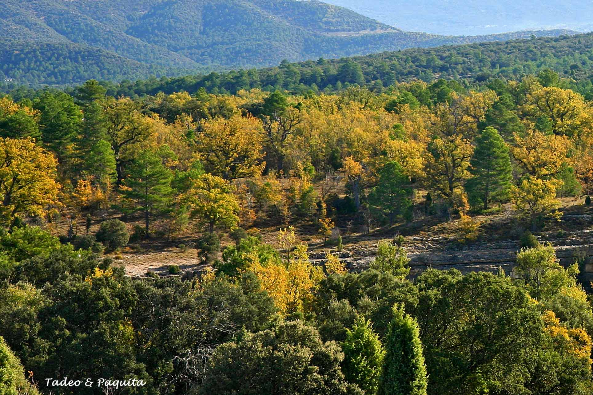
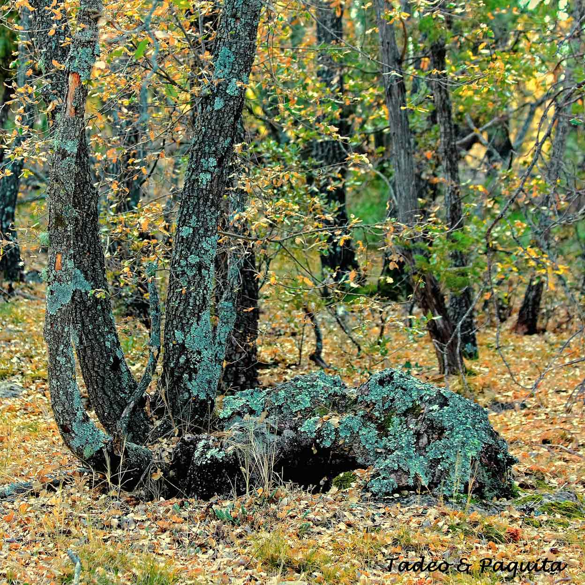
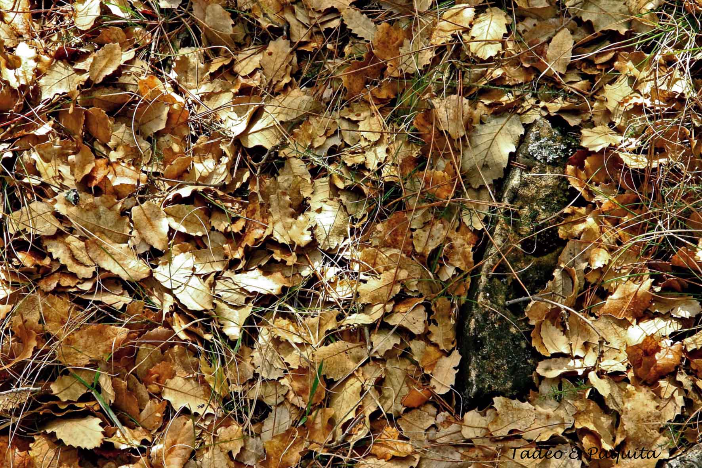
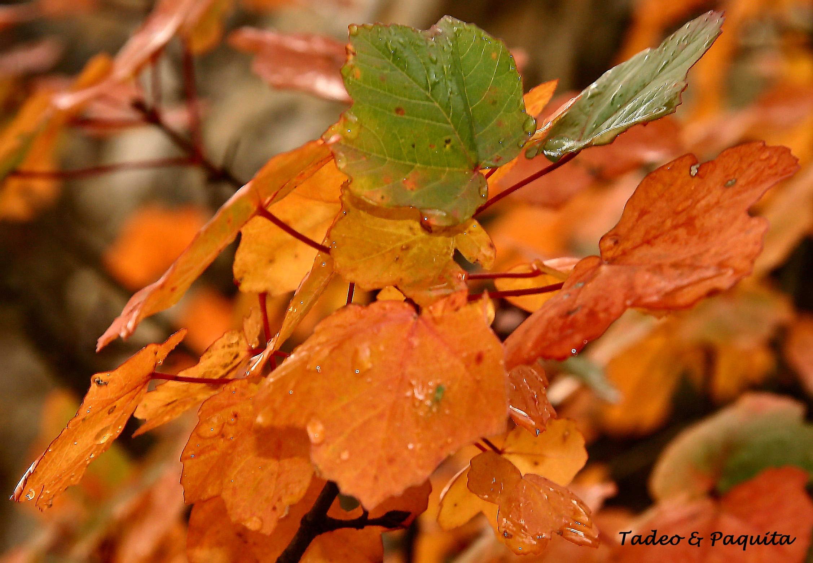
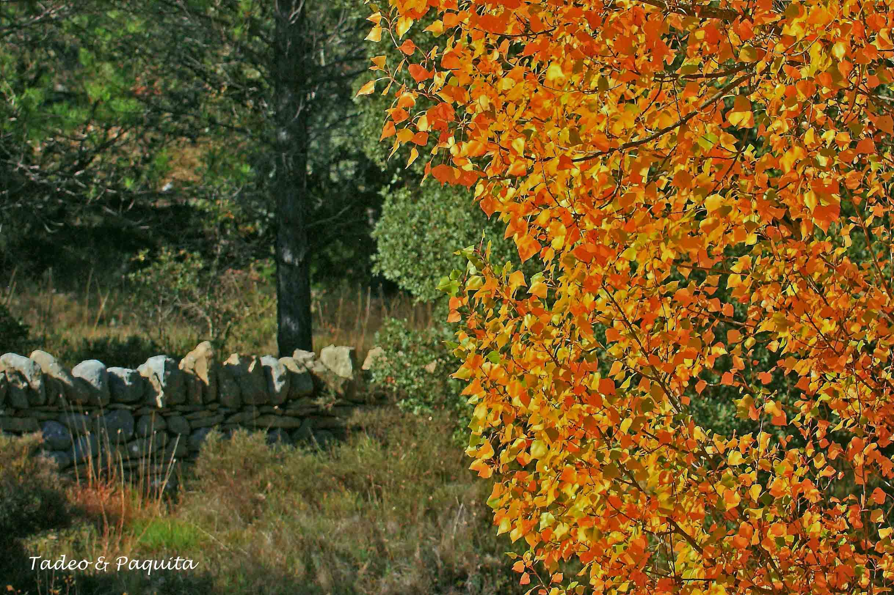
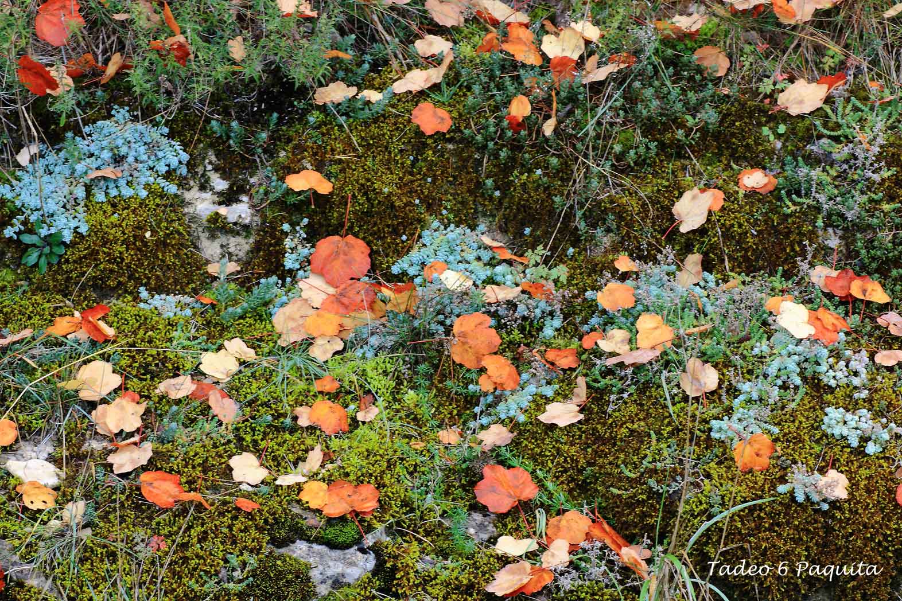
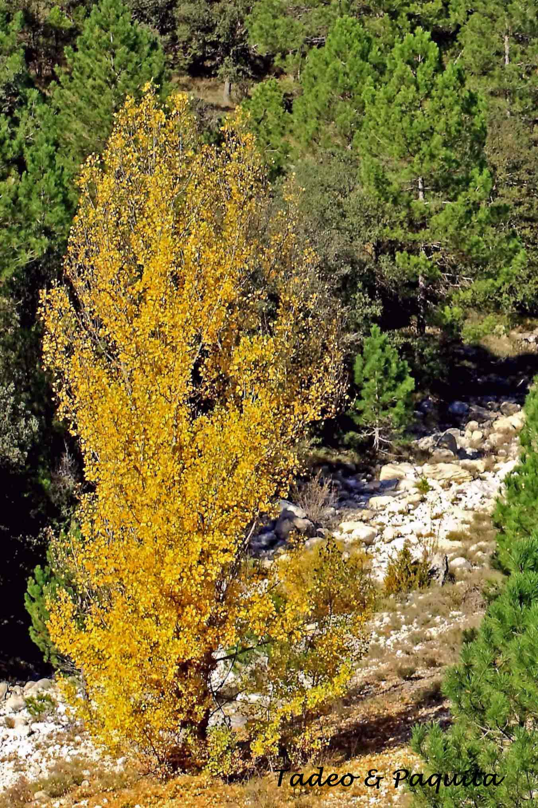
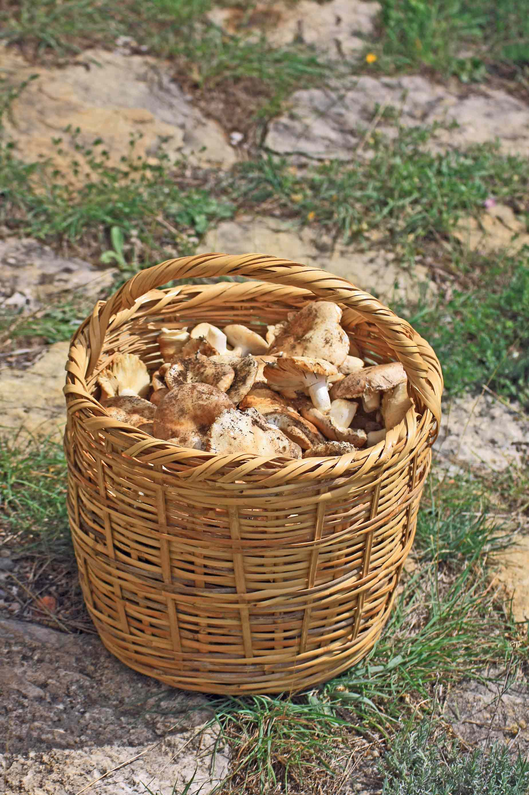
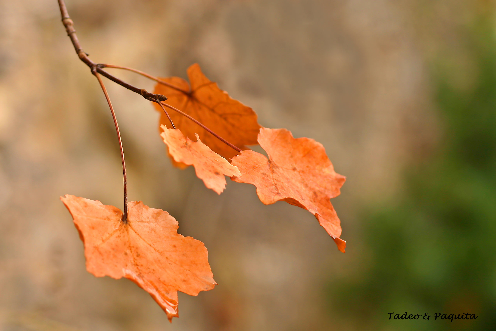

Al mismo tiempo que empieza la primavera en el hemisferio sur, nosotros damos la bienvenida  al otoño en el hemisferio norte. En el equinoccio, los polos se encuentran ala misma distancia del sol, y los días tienen la misma duración.

Este año 2015, el otoño ha empezado el día 23 de septiembre, hasta dentro de 89 días en que empezara el invierno.

Es la estación en que se recogen las cosechas de maíz,  uva, también de membrillos con los que elaborar mermelada, es  tiempo de hongos con su gran variedad, también de sementera,  hay que preparar la tierra para su recolección en primavera.

Las aves inician su migración, y los árboles con los  distintos colores de sus hojas sean caducas o perennes, nos ofrecen una pincelada  de colores variados e inconfundibles, del verde intenso del verano, al  amarillo, naranja y ocres en el otoño,  de una belleza singular, que se repite cada año, siendo siempre la misma y siempre distinta.

